== Basics: Themes, styles, components, and layouts

Start with a brief overview of the core ideas in Codename One. This chapter revisits them in more detail as it goes on.

[[basics-section,Basics Of Codename One]]
=== Components

Every button, label, or other element on the screen in a Codename One application is a https://www.codenameone.com/javadoc/com/codename1/ui/Component.html[Component]. This is a simplified version of the class hierarchy:

.The Core Component Class Hierarchy
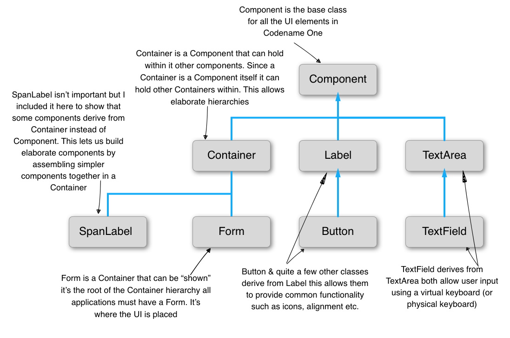

The https://www.codenameone.com/javadoc/com/codename1/ui/Form.html[Form] is a special `Component`. It's the root component shown to the user. `Container` is a `Component` type that can hold other components. That lets you create elaborate hierarchies by nesting `Container` instances.

[[component-uml]]
.Component UML
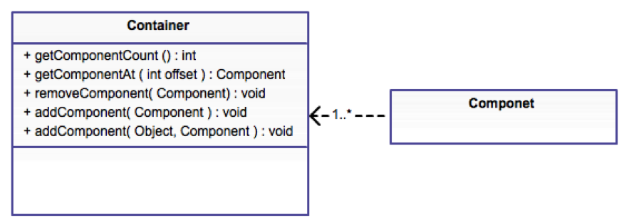

A Codename One application is effectively a series of forms, but one `Form` can be visible at a time. The form contains everything on the screen. Under the hood, the `Form` has a few separate parts:

[id=StructureOfForm, reftext={chapter}.{counter:figure}]
.Structure of a Form
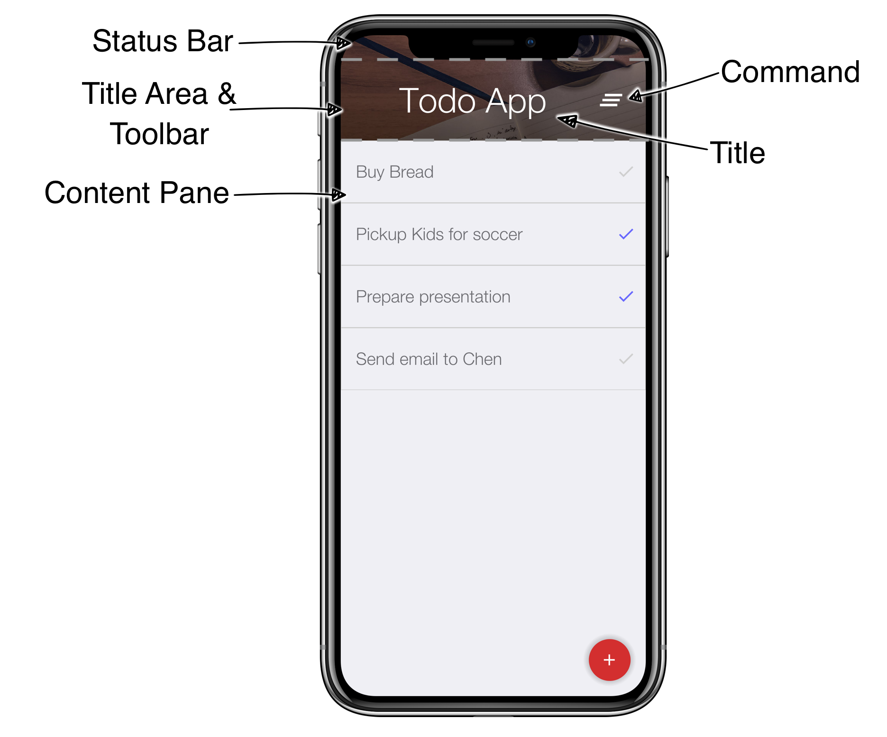

* Content Pane - this is the body of the `Form`. When you add a `Component` to the `Form`, it goes into the content pane. The content pane scrolls vertically by default.

* Title Area - you can't add directly to this area. The title area is managed by the `Toolbar` class. `Toolbar` sits at the top of the form and handles the title design. The title area has two parts:

** Title of the `Form` and its commands (the buttons on the right and left of the title)

** Status Bar - on iOS, the top area leaves room for the notch, battery, clock, and similar indicators. Without that space, those elements would overlap the title.

Now that the structure is clear, open the Java file `TodoApp.java` in the project you created. You should see the lines that set up the UI in the `start()` method:

==== Layout managers

A layout manager decides the size and location of components within a `Container`. Every `Container` has a layout manager. The default layout manager is `FlowLayout`.

To understand layouts, first understand a basic concept about `Component`: each component has a "`preferred size.`" That's the size a component wants to occupy. For example, a `Label` uses the exact size needed to fit the label text, icon, and padding.

.Understanding Preferred Size
****
The https://www.codenameone.com/javadoc/com/codename1/ui/Component.html[Component] class contains many useful methods. One of the most important is `calcPreferredSize()`, which recalculates the size a component wants when something changes.

NOTE: By default Codename One invokes the `getPreferredSize()` method rather than `calcPreferredSize()` directly. +
`getPreferredSize()` invokes `calcPreferredSize()` and caches the value.

The preferred size depends on internal constraints such as font size, border sizes, and padding.

When a layout manager positions and sizes the component, it **MIGHT** take the preferred size into account. It can also ignore it entirely.

For example, https://www.codenameone.com/javadoc/com/codename1/ui/layouts/FlowLayout.html[FlowLayout] always gives components their exact preferred size, while https://www.codenameone.com/javadoc/com/codename1/ui/layouts/BorderLayout.html[BorderLayout] resizes the center component by default and the other components along one axis.

You can define a group of components to have the same preferred width or height by using the `setSameWidth`
and `setSameHeight` methods, for example:

Codename One has a `setPreferredSize` method that lets developers explicitly request a component size. But, that caused many problems. For example, preferred size should change with device orientation or similar operations. The API also encouraged accidental hardcoding of UI values such as forcing pixel sizes. As a result, the method was deprecated.

Use `setSameWidth` and `setSameHeight` when you need sizing alignment. Use `setHidden` when you need to hide a component. As a last resort, override `calcPreferredSize`.
****

A layout manager places a component based on its own logic and the preferred size, sometimes called the "`natural size.`" A `FlowLayout` walks the components in the order they were added and sizes them one after another. When it reaches the end of the row, it moves to the next row.

.Use `FlowLayout` for simple things
TIP: `FlowLayout` is great for simple cases, but it has issues when components change size dynamically, such as a text field. In those cases, it can choose bad line breaks and take up too much space.

.Layout Manager Primer Part I
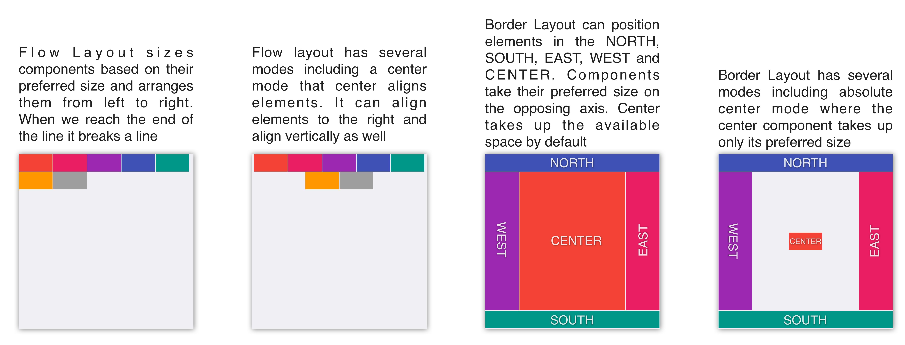

.Layout Manager Primer Part II
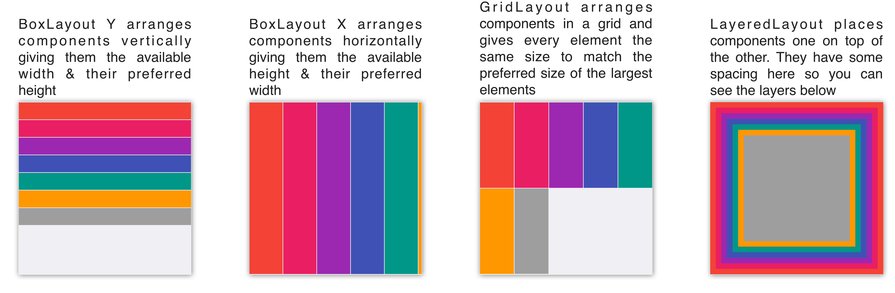

Scrolling doesn't work well for all layout types because the positioning algorithm within a layout can break. Scrolling on the Y axis works well for `BoxLayout Y`, which is why it was picked for the `TodoForm`:

.Scrolling in Layout Managers
[options="header"]
|===
| Layout            | Scrollable
| Flow Layout       | Possible on Y axis only
| Border Layout     | Scrolling is blocked
| Box Layout Y      | Scrollable only on the Y axis
| Box Layout X      | Scrollable only on the X axis
| Grid Layout       | Scrollable
| LayeredLayout     | Not scrollable (usually)
|===

.Nesting Scrollable Containers (((Hierarchy)))
****
Only one element can be scrollable within the hierarchy. Otherwise, if you drag your finger over the `Form`, Codename One can't know which element you want to scroll. By default, the form's content pane scrolls on the Y axis unless you disable it explicitly. Setting the layout to `BorderLayout` disables scrolling implicitly.

It's fine to use non-scrollable layouts such as `BorderLayout` inside a scrollable container. In the TodoApp, for example, `TodoItem` uses `BorderLayout` inside a scrollable `BoxLayout` `Form`.
****

Layouts can be divided into two distinct groups:

* Constraint Based - `BorderLayout` (and a few others such as `GridBagLayout`, `MigLayout`, and `TableLayout`)
* Regular - All the other layout managers

When you add a `Component` to a `Container` with a regular layout you do so with a simple add method:

[source,java,title='Adding to a Regular Container']
----
include::../demos/common/src/main/java/com/codenameone/developerguide/snippets/generated/BasicsJava002Snippet.java[tag=basics-java-002,indent=0]
----

This works great for regular layouts but might not for constraint based layouts. A constraint based layout accepts another argument. For example: `BorderLayout` needs a location for the `Component`:

This line assumes you have an `import static com.codename1.ui.CN.*;` in the top of the file. In `BorderLayout` (which is a constraint based layout) placing an item in the `NORTH` places it in the top of the `Container`.

TIP: The `CN` class is a class that contains many static helper methods and functions. It's specifically designed for static import in this way to help keep your code terse

.Static Global Context
****
The `CN` class is a thin wrapper around features in `Display`, `NetworkManager`, `Storage`, `FileSystemStorage` etc. It also adds common methods and constants from several other classes so Codename One code feels more terse for example, you can do:

[source,java]
----
include::../demos/common/src/main/java/com/codenameone/developerguide/snippets/generated/BasicsJava004Snippet.java[tag=basics-java-004,indent=0]
----

TIP: That's optional, if you don't like static imports you can just write `CN.` for every element

From that point on you can write code that looks like this:

Instead of:

The same applies for most network manager calls e.g.:

Instead of:

Some things were changed so you won't have too many conflicts for example, `Log.p` or `Log.e` would have been problematic so you now have:

Instead of `Display.getInstance().getCurrent()` you now have `getCurrentForm()` since `getCurrent()` is too generic. For most methods you should just be able to remove the `NetworkManager` or `Display` access and it should "just work."

The motivation for this is threefold:

- Terse code
- Small performance gain
- Cleaner API without some baggage in `Display` or `NetworkManager`

Some of your samples in this guide might rely on that static import being in place. This helps you keep the code terse and readable in the code listings.
****

===== Terse syntax

Almost every layout allows you to `add` a component using many variants of the add method:

[source,java,title='Versions of add']
----
include::../demos/common/src/main/java/com/codenameone/developerguide/snippets/generated/BasicsJava010Snippet.java[tag=basics-java-010,indent=0]
----

<1> Regular add

<2> `addAll` accepts many components and adds them in a batch

<3> `add` returns the parent `Container` instance so you can chain calls like that

In the race to make code "`tighter`" you can make this even shorter. Most layout managers have their own custom terse syntax style for example:

To sum this up, you can use layout managers and nesting to create elaborate UI's that implicitly adapt to different screen sizes and device orientation.

===== Flow Layout

[[flow-layout]]
.Flow Layout
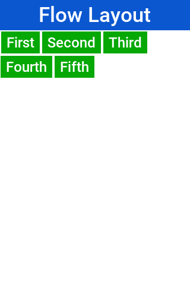

link:https://www.codenameone.com/javadoc/com/codename1/ui/layouts/FlowLayout.html[Flow layout] lets the components "flow" horizontally and break a line when reaching the edge of the container. It's the default layout manager for containers. Because it's so flexible it's also problematic as it can result in wrong preferred size values for the parent https://www.codenameone.com/javadoc/com/codename1/ui/Container.html[Container]. This can create a reflow issue, as a result recommend using flow layout for trivial cases. Avoid it for things such as text input etc. As the size of the text input can vary in runtime:

[source,java]
----
include::../demos/common/src/main/java/com/codenameone/developerguide/snippets/generated/BasicsJava012Snippet.java[tag=basics-java-012,indent=0]
----

Flow layout also supports terse syntax shorthand such as:

[source,java]
----
include::../demos/common/src/main/java/com/codenameone/developerguide/snippets/generated/BasicsJava013Snippet.java[tag=basics-java-013,indent=0]
----

Flow layout can be aligned to the left (the default), to the <<flow-layout-center,center>>, or to the <<flow-layout-right,right>>. It can also be vertically aligned to the top (the default), <<flow-layout-center-middle,middle (center)>>, or bottom.

[[flow-layout-center]]
.Flow layout aligned to the center
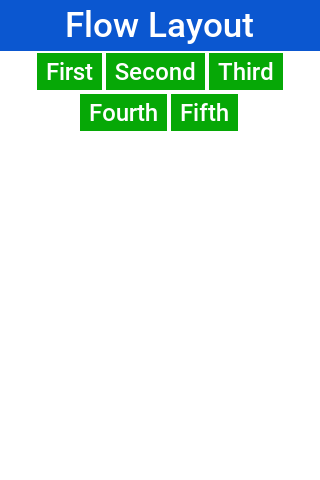

[[flow-layout-right]]
.Flow layout aligned to the right
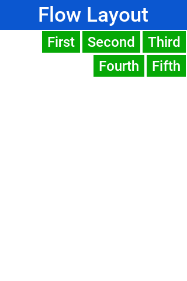

[[flow-layout-center-middle]]
.Flow layout aligned to the center horizontally & the middle vertically
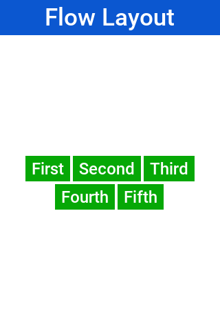

Components within the flow layout get their natural preferred size by default and aren't stretched in any axis.

TIP: The natural sizing behavior is often used to prevent other layout managers from stretching components. For example: if you have a border layout element in the south and you want it to keep its natural size instead of adding the element to the south directly you can wrap it using `parent.add(BorderLayout.SOUTH, FlowLayout.encloseCenter(dontGrowThisComponent))`.

===== Box Layout

https://www.codenameone.com/javadoc/com/codename1/ui/layouts/BoxLayout.html[BoxLayout] places elements in a row (`X_AXIS`) or column (`Y_AXIS`) according to box orientation. Box is a simple and predictable layout that serves as the "workhorse" of component lists in Codename One.

You can create a box layout Y using something like this:

[source,java]
----
include::../demos/common/src/main/java/com/codenameone/developerguide/snippets/generated/BasicsJava014Snippet.java[tag=basics-java-014,indent=0]
----

Which results in <<box-layout-y,this>>

[[box-layout-y]]
.BoxLayout Y
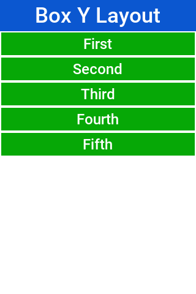

Box layout also supports a shorter terse notation which you use here to <<box-layout-x,show the X axis box>>:

[source,java]
----
include::../demos/common/src/main/java/com/codenameone/developerguide/snippets/generated/BasicsJava015Snippet.java[tag=basics-java-015,indent=0]
----

[[box-layout-x]]
.BoxLayout X
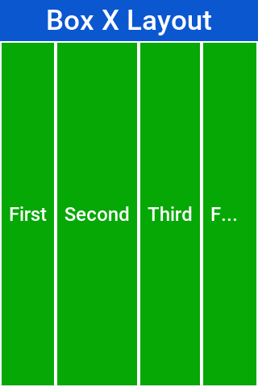

The box layout keeps the preferred size of its destination orientation and scales elements on the other axis. Specifically `X_AXIS` will keep the preferred width of the component while growing all the components vertically to match in size. Its `Y_AXIS` counterpart keeps the preferred height
while growing the components horizontally.

This behavior is useful since it allows elements to align as they would all have the same size.

Sometimes the growing behavior in the X axis is undesired, for these cases you can use the `X_AXIS_NO_GROW` variant.

.BoxLayout X_AXIS_NO_GROW

.`FlowLayout` vs. `BoxLayout.X_AXIS`
TIP: When applicable recommend `BoxLayout` over `FlowLayout` as it acts more consistently in all situations. Another advantage of `BoxLayout` is the fact that it grows and thus aligns the components in a consistent column or row

===== Border Layout

.Border Layout
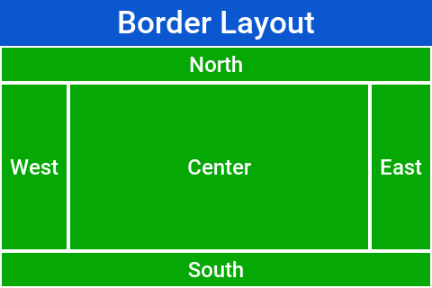

link:https://www.codenameone.com/javadoc/com/codename1/ui/layouts/BorderLayout.html[Border layout] is unique. `BorderLayout` is a constraint-based layout that can place up to five components in one of the five positions: `NORTH`, `SOUTH`,
`EAST`, `WEST` or `CENTER`:

[source,java]
----
include::../demos/common/src/main/java/com/codenameone/developerguide/snippets/generated/BasicsJava016Snippet.java[tag=basics-java-016,indent=0]
----

.The Constraints are Included in the `CN` class
TIP: You can use the static import of the `CN` class and then the syntax can be `add(SOUTH, new Label("South"))`

The layout always stretches the `NORTH`/`SOUTH` components on the X-axis to fill the container and the `EAST`/`WEST` components on the Y-axis. The center component is stretched to fill the remaining area by default. For example, the `setCenterBehavior` allows you to manipulate the behavior of the center component so it's placed in the center without stretching.

For example:

[source,java]
----
include::../demos/common/src/main/java/com/codenameone/developerguide/snippets/generated/BasicsJava017Snippet.java[tag=basics-java-017,indent=0]
----

Results in:

.Border Layout with CENTER_BEHAVIOR_CENTER
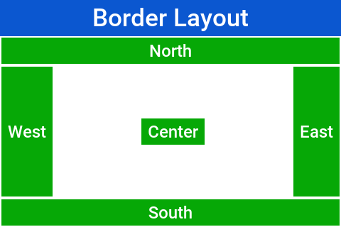

.Scrolling is Disabled in Border Layout
NOTE: Because of its scaling behavior scrolling a border
layout makes no sense. `Container` implicitly blocks scrolling on a border layout, but it can scroll its parents/children

For RTL the EAST and WEST values are implicitly reversed as shown in this image:

.Border Layout in RTL mode
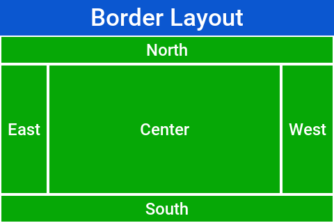

.RTL and Bidi
****
RTL (Right To Left) or Bidi (bi-directional) are common terms used for languages such as Hebrew, Arabic etc. These languages are written from the right to left direction hence all the UI needs to be "`reversed.`" Bidi denotes the fact that while the language is written from right to left, the numbers are still written in the other direction hence two directions...
****

.Preferred Size Still Matters
IMPORTANT: The preferred size of the center component doesn't matter in border layout but the preferred size of the sides is. For example: If you place a large component in the `SOUTH` it will take up the entire screen and won't leave room for anything

===== Grid Layout

https://www.codenameone.com/javadoc/com/codename1/ui/layouts/GridLayout.html[GridLayout] accepts a predefined grid (rows/columns) and grants all components within it equal size based on the dimensions of the largest components.

TIP: The main use case for this layout is a grid of icons for example: like one would see in the iPhone home screen

If the number of `rows * columns` is smaller than the number of components added a new row is implicitly added to the grid.
For example, if the number of components is smaller than available cells (won't fill the last row) blank spaces will
be left in place.

// vale-skip: Microsoft.ComplexWords/TooWordy — 'an additional row' reads correctly; 'an more row' is ungrammatical.
In this example you can see that a 2×2 grid is used to add 5 elements, this results in an additional row that's implicitly
added turning the grid to a 3×2 grid implicitly and leaving one blank cell:

[source,java]
----
include::../demos/common/src/main/java/com/codenameone/developerguide/snippets/generated/BasicsJava018Snippet.java[tag=basics-java-018,indent=0]
----

.Grid Layout 2×2
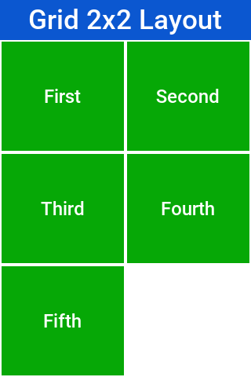

When you use a 2×4 size ratio you would see elements getting cropped as you do here. The grid layout uses the grid size first and doesn't pay too much attention to the preferred size of the components it holds.

.Grid Layout 2×4
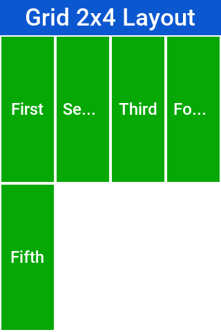

Grid also has an autoFit attribute that can be used to automatically calculate the column count based on
available space and preferred width. This is useful for working with UI's where the device orientation
might change.

// vale-skip: Microsoft.Auto: "auto-fit" is a literal CSS Grid keyword and matches the API option name; the unhyphenated form would refer to a different concept.
A terse syntax for working with a grid also exists in two versions, one that uses the "auto-fit" option and
// vale-skip: Microsoft.Auto: "auto-fit" is a literal CSS Grid keyword and matches the API option name; the unhyphenated form would refer to a different concept.
another that accepts the number of columns. Here's a sample of the terse syntax coupled with auto-fit followed by screenshots
of the same code in two orientations:

[source,java]
----
include::../demos/common/src/main/java/com/codenameone/developerguide/snippets/generated/BasicsJava019Snippet.java[tag=basics-java-019,indent=0]
----

.Grid Layout autofit portrait
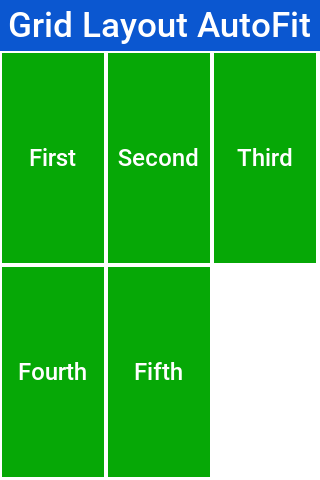

.Grid Layout autofit landscape
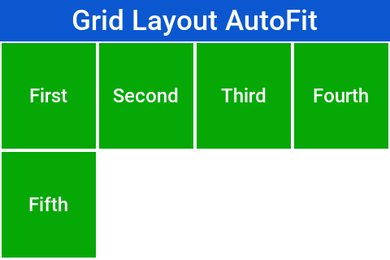

[[table-layout-section]]
==== Table Layout

The https://www.codenameone.com/javadoc/com/codename1/ui/table/TableLayout.html[TableLayout] is an elaborate **constraint based** layout manager that can arrange elements in rows/columns while defining constraints to control complex behavior such as spanning, alignment/weight etc.

.Note the Different Package for `TableLayout`
NOTE: The `TableLayout` is in the `com.codename1.ui.table` package and not in the layouts package. +
This is because `TableLayout` was originally designed for the https://www.codenameone.com/javadoc/com/codename1/ui/table/Table.html[Table] class.

Despite being constraint based the `TableLayout` isn't strict about constraints and will implicitly add a constraint when one is missing. This is unlike the `BorderLayout` which will throw an exception in this case.

WARNING: Unlike `GridLayout` `TableLayout` won't implicitly add a row if the row/column count is wrong

[source,java]
----
include::../demos/common/src/main/java/com/codenameone/developerguide/snippets/generated/BasicsJava020Snippet.java[tag=basics-java-020,indent=0]
----

.2×2 TableLayout with 5 elements, notice that the last element is missing
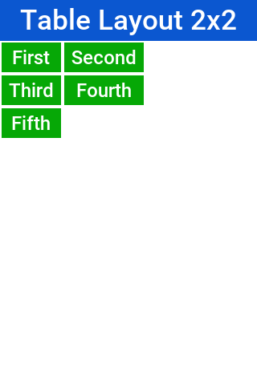

`TableLayout` supports the ability to grow the last column which can be enabled using the `setGrowHorizontally` method. You can also use a shortened terse syntax to construct a `TableLayout` but since the `TableLayout` is a constraint based layout you won't be able to use its full power with this syntax.

The default usage of the `encloseIn` method below uses the `setGrowHorizontally` flag:

[source,java]
----
include::../demos/common/src/main/java/com/codenameone/developerguide/snippets/generated/BasicsJava021Snippet.java[tag=basics-java-021,indent=0]
----

.`TableLayout.encloseIn()` with default behavior of growing the last column
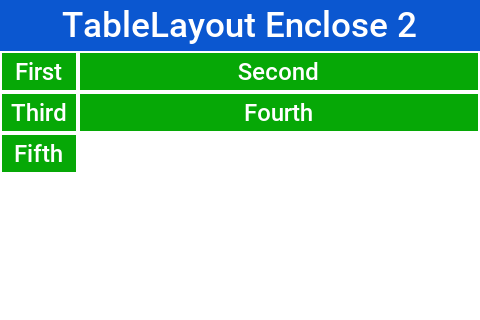

===== The full potential

`TableLayout` is a beast, to truly appreciate it you need to use the constraint syntax which allows you to span, align and set width/height for the rows and columns.

`TableLayout` works with a https://www.codenameone.com/javadoc/com/codename1/ui/table/TableLayout.Constraint.html[Constraint] instance that can communicate your intentions into the layout manager. Such constraints can include more than one attribute for example: span and height.

WARNING: `TableLayout` constraints can't be reused for more than one component

The constraint class supports the following attributes

.Constraint Properties
|====================
| `column` | The column for the table cell. This defaults to -1 which will place the component in the next available cell
| `row` | Like column, defaults to -1 as well
| `width` | The column width in percentages, -1 will use the preferred size. -2 for width will take up the rest of the available space
| `height` | Like width but doesn't support the -2 value
| `spanHorizontal` | The cells that should be occupied horizontally defaults to 1 and can't exceed the column count - current offset.
| `spanVertical` | Like spanHorizontal with the same limitations
| `horizontalAlign` | The horizontal alignment of the content within the cell, defaults to the special case -1 value to take up all the cell space can be either `-1`, `Component.LEFT`, `Component.RIGHT` or `Component.CENTER`
| `verticalAlign` | Like horizontalAlign can be one of `-1`, `Component.TOP`, `Component.BOTTOM` or `Component.CENTER`
|====================

TIP: You need to set `width`/`height` to one cell in a column/row

The <<table-layout-constraint-sample,table layout constraint sample>> tries to show some unique things you can do with constraints.

[[table-layout-constraint-sample]]

The constraint sample below spans the title across all three columns and spans the notes row across two columns:

[source,java]
----
include::../demos/common/src/main/java/com/codenameone/developerguide/snippets/generated/BasicsJava022Snippet.java[tag=basics-java-022,indent=0]
----

[[full-code-tablelayout-constraint]]

[[table-layout-constraints]]
.TableLayout constraints can be used to create elaborate UI's
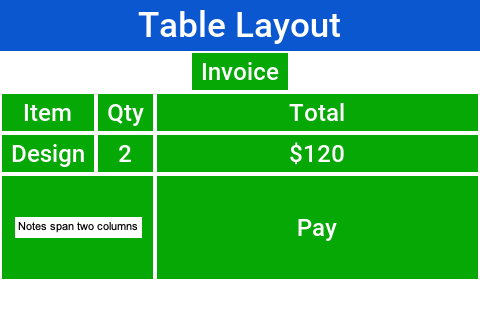

===== TextMode Layout

`TextModeLayout` is a unique layout manager. It acts like `TableLayout` on Android and like `BoxLayout.Y_AXIS` in other platforms. Internally it delegates to one of these two layout managers so in a sense it doesn't have as much functionality of its own.

For example: this is a sample usage of `TextModeLayout`:

[source,java]
----
include::../demos/common/src/main/java/com/codenameone/developerguide/snippets/generated/BasicsJava024Snippet.java[tag=basics-java-024,indent=0]
----

.TextModeLayout on iOS
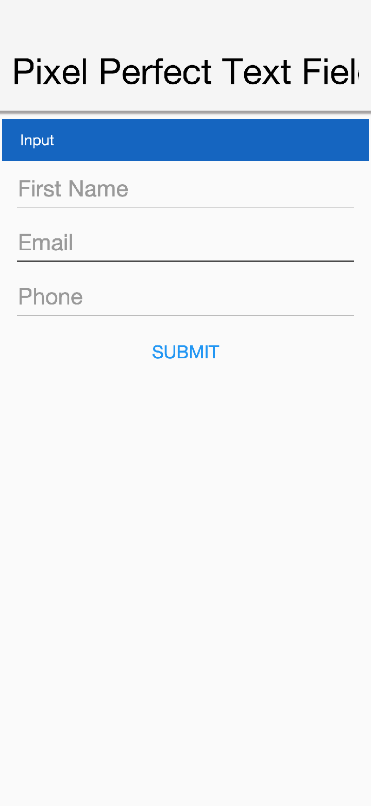

.TextModeLayout on Android with the same code
image::img/pixel-perfect-text-field-android-codenameone-font.png[TextModeLayout on Android with the same code,scaledwidth=30%]

As you can see from the code and samples above there is a lot going on under the hood. On Android you want a layout that's like `TableLayout` so you can "`pack`" the entries. On iOS you want a box layout Y kind of layout but you also want the labels/text to align...

The `TextModeLayout` isn't a layout as much as it's a delegate. When running in the Android mode (which you refer to as the "`on top`" mode) the layout is almost an exact synonym of `TableLayout` and in fact delegates to an underlying `TableLayout`. In fact there is a `public final` table instance within the layout that you can refer to directly...

One small difference exists between the `TextModeLayout` and the underlying `TableLayout`: your choice to default to align entries to `TOP` with this mode.

TIP: Aligning to TOP is important for error handling for `TextComponent` in Android otherwise the entries "`jump`"

When working in the non-android environment you use a `BoxLayout` on the Y axis as the delegate. One thing you do here differs from a default box layout: grouping. Grouping allows the labels to align by setting them to the same width, internally it invokes `Component.setSameWidth()`. Since text components hide the labels there is a special `group` method there that can be used. For example, this is implicit with the `TextModeLayout` which is pretty cool.

`TextModeLayout` was created specifically for the `TextComponent` and `InputComponent` so check out the section about them in the components chapter.

==== Layered Layout

When used without constraints, the https://www.codenameone.com/javadoc/com/codename1/ui/layouts/LayeredLayout.html[LayeredLayout] places the components in order one on top of the other and sizes them all to the size of the largest component. This is useful when trying to create an overlay on top of an existing component. For example: an "x" button to allow removing the component.

.The X on this button was placed there using the layered layout code below
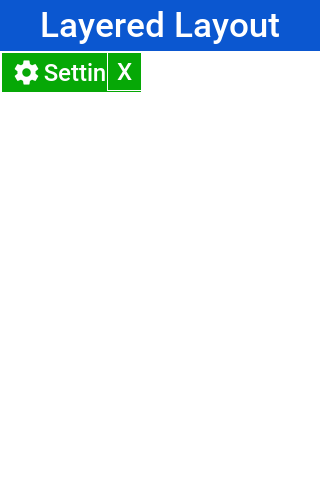

The code to generate this UI is slightly complex and contains few relevant pieces. The truly relevant piece is this block:

[source,java]
----
include::../demos/common/src/main/java/com/codenameone/developerguide/snippets/generated/BasicsJava026Snippet.java[tag=basics-java-026-layered,indent=0]
----

You're doing three distinct things here:

. You're adding a layered layout to the form
. You're creating a layered layout and placing two components within. This would be the equivalent of creating a `LayeredLayout` `Container` and invoking `add` twice
. You use `FlowLayout` to position the `X` close button in the right position

NOTE: When used without constraints, the layered layout sizes all components to the exact same size one on top of the other. It requires that you use another container within; to position the components correctly

This is the full source of the example for completeness:

[source,java]
----
include::../demos/common/src/main/java/com/codenameone/developerguide/snippets/generated/BasicsJava026Snippet.java[tag=basics-java-026,indent=0]
----

Forms have a built in layered layout that you can access through `getLayeredPane()`, this allows you to overlay elements on top of the content pane.

The layered pane is used internally by components such as https://www.codenameone.com/javadoc/com/codename1/components/InteractionDialog.html[InteractionDialog], https://www.codenameone.com/javadoc/com/codename1/ui/AutoCompleteTextField.html[AutoComplete] etc.

TIP: Codename One also includes a GlassPane that resides on top of the layered pane. Its useful if you want to "draw" on top of elements but is harder to use than layered pane

[[insets-and-reference-components]]
===== Insets and reference components

https://www.codenameone.com/javadoc/com/codename1/ui/layouts/LayeredLayout.html[LayeredLayout] supports https://www.codenameone.com/javadoc/com/codename1/ui/layouts/LayeredLayout.LayeredLayoutConstraint.Inset.html[insets] for its children. This effectively allows you to position child components precisely where you want them, relative to their container or siblings. This functionality forms the under-pinnings of the GUI Builder's <<auto-layout-mode,Auto layout mode>>.

As an example, suppose you wanted to position a button in the lower right corner of its container. This can be achieved with https://www.codenameone.com/javadoc/com/codename1/ui/layouts/LayeredLayout.html[LayeredLayout] as follows:

[source,java]
----
include::../demos/common/src/main/java/com/codenameone/developerguide/snippets/generated/BasicsJava027Snippet.java[tag=basics-java-027,indent=0]
----

The result is:

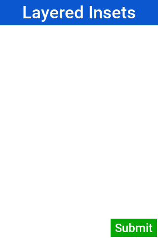

The thing new here is this line:

[source,java]
----
include::../demos/common/src/main/java/com/codenameone/developerguide/snippets/generated/BasicsJava027Snippet.java[tag=basics-java-027-insets,indent=0]
----

This is called after `btn` has already been added to the container. It says that you want its insets to be "auto" on the top and left, and `0` on the right and bottom. This *insets* string follows the CSS notation of `top right bottom left` (that's: start on top and go clockwise), and the values of each inset may be provided in pixels (px), millimetres (mm), percent (%), or the special "auto" value. Like CSS, you can also specify the insets using a 1, 2, or 3 values. For example:

. `"1mm"` - Sets 1mm insets on all sides.
. `"1mm 2mm"` - Sets 1mm insets on top and bottom; 2mm on left and right.
. `"1mm 10% 2mm"` - Sets 1mm on top, 10% on left and right, and 2mm on bottom.
. `"1mm 2mm 1px 50%"` - Sets 1mm on top, 2mm on right, 1px on bottom, and 50% on left.

===== `auto` insets

The special "auto" inset indicates that it's a flexible inset. If all insets are set to "auto," then the component will be centered both horizontally and vertically inside its "bounding box."

NOTE: The "inset bounding box" is the containing box from which a component's insets are measured. If the component's insets aren't linked to any other components, then its inset bounding box will be the inner bounds (that's: taking padding into account) of the component's parent container.

If one inset is fixed (that's: defined in px, mm, or %), and the opposite inset is "auto," then the "auto" inset will allow the component to be its preferred size. If you want to position a component to be centered vertically, and 5mm from the left edge, you could do:

[source,java]
----
include::../demos/common/src/main/java/com/codenameone/developerguide/snippets/generated/BasicsJava028Snippet.java[tag=basics-java-028,indent=0]
----

Resulting in:

.Button vertically centered 5mm from left edge
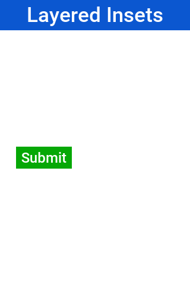

Move it to the right edge with:

[source,java]
----
include::../demos/common/src/main/java/com/codenameone/developerguide/snippets/generated/BasicsJava029Snippet.java[tag=basics-java-029,indent=0]
----

===== `%` insets

Percent (%) insets are calculated about the inset bounding box. A 50% inset is measured as 50% of the length of the bounding box on the inset's axis. For example: A 50% inset on top would be 50% of the height of the inset bounding box. A 50% inset on the right would be 50% of the width of the inset bounding box.

===== Insets, margin, and padding

A component's position in a layered layout is determined as follows: (Assume that `cmp` is the component that you're positioning, and `cnt` is the container (In pseudo-code):

[source]
----
x = cnt.paddingLeft + cmp.calculatedInsetLeft + cmp.marginLeft
y = cnt.paddingTop + cmp.calculatedInsetTop + cmp.marginTop
w = cnt.width - cnt.verticalScroll.width - cnt.paddingRight - cmp.calculatedInsetRight - cmp.marginRight - x
h = cnt.height - cnt.horizontalScroll.height - cnt.paddingBottom - cmp.calculatedInsetBottom - cmp.marginBottom - y
----

IMPORTANT: The `calculatedInsetXXX` values here will be the same as the corresponding provided inset if the inset has no reference component. If it does have a reference component, then the calculated inset will depend on the position of the reference component.

If no inset is specified, then it's assumed to be 0. This ensures compatibility with designs that were created before layered layout supported insets.

===== Component references: Linking components together

If all you need to do is position a component relative to its parent container's bounds, then mere insets provide you with enough vocabulary to achieve this. But most UIs are more complex than this and require another concept: reference components. Often you will want to position a component relative to another child of the same container. This is also supported.

For example, suppose you want to place a text field in the center of the form (both horizontally and vertically), and have a button placed beside it to the right. Positioning the text field is trivial (`setInset(textField, "auto")`), but there is no inset that you can provide that would position the button to the right of the text field. To do your goal, you need to set the text field as a reference component of the button's left inset, which "links" the button's left inset to the text field. Here is the syntax:

[source,java]
----
include::../demos/common/src/main/java/com/codenameone/developerguide/snippets/generated/BasicsJava031Snippet.java[tag=basics-java-031,indent=0]
----

This would result in:

.Button's left inset linked to text field
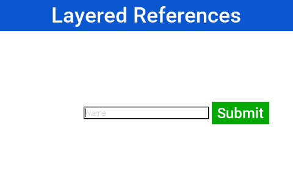

The two active lines here are the last two:

[source,java]
----
include::../demos/common/src/main/java/com/codenameone/developerguide/snippets/generated/BasicsJava031Snippet.java[tag=basics-java-031-reference,indent=0]
----

NOTE: The reference position is defined as the distance, expressed as a fraction of the reference component's length on the inset's axis, between the reference component's leading (outer) edge and the point from which the inset is measured. A reference position of 0 means that the inset is measured from the leading edge of the reference component. A value of 1.0 means that the inset is measured from the trailing edge of the reference component. A value of 0.5 means that the inset is measured from the center of the reference component. Etc. Any floating point value can be used, though the most common values are 0 and 1.

The definition above may make reference components and reference position seem more complex than they are. Some examples:

. **For a top inset**:
.. referencePosition == 0 => the inset is measured from the top edge of the reference component.
.. referencePosition == 1 => the inset is measured from the bottom edge of the reference component.
. **For a bottom inset**:
.. referencePosition == 0 => the inset is measured from the *bottom* edge of the reference component.
.. referencePosition == 1 => the inset is measured from the *top* edge of the reference component.
. **For a left inset**:
.. referencePosition == 0 => the inset is measured from the *left* edge of the reference component.
.. referencePosition == 1 => the inset is measured from the *right* edge of the reference component.
. **For a right inset**:
.. referencePosition == 0 => the inset is measured from the *right* edge of the reference component.
.. referencePosition == 1 => the inset is measured from the *left* edge of the reference component.

.Layers In Codename One
****
Codename One allows placing components one on top of the other and you commonly use layered layout to do that. The form class has a built-in `Container` that resides in a layer on top of the content pane of the form.

When you add an element to a form it implicitly goes into the content pane. But, you can use `getLayeredPane()` and add any `Component` there. Such a `Component` will appear above the content pane. Notice that this layer resides below the title area (on the Y axis) and won't draw on top of that.

When Codename One introduced the layered pane it was instantly useful. But, its popularity caused conflicts. Two separate pieces of code using the layered pane could collide with one another. Codename One solved it with `getLayeredPane(Class c, boolean top)`. This method allocates a layer for a specific class within the layered pane. This way if two different classes use this method instead of the `getLayeredPane()` method they won't collide. Each will get its own container in a layered layout within the layered pane seamlessly. The `top` flag indicates whether you want the layer to be the top most or bottom most layer within the layered pane (assuming it wasn't created already). This allows you to place a layer that can appear above or below the already installed layers.

You only make use of the layered pane in this book but there are two more layers on top of it. The form layered pane is identical to the layered pane but spans the entire height of the `Form` (including the title area). As a result the form layered pane is slower as it needs to handle some special cases to support this functionality.

The glass pane is the top most layer, unlike the layered pane it's purely a graphical layer. You can only draw on the glass pane with a `Painter` instance and a `Graphics` object. You can't add components into that layer.
****

.The Layered Pane
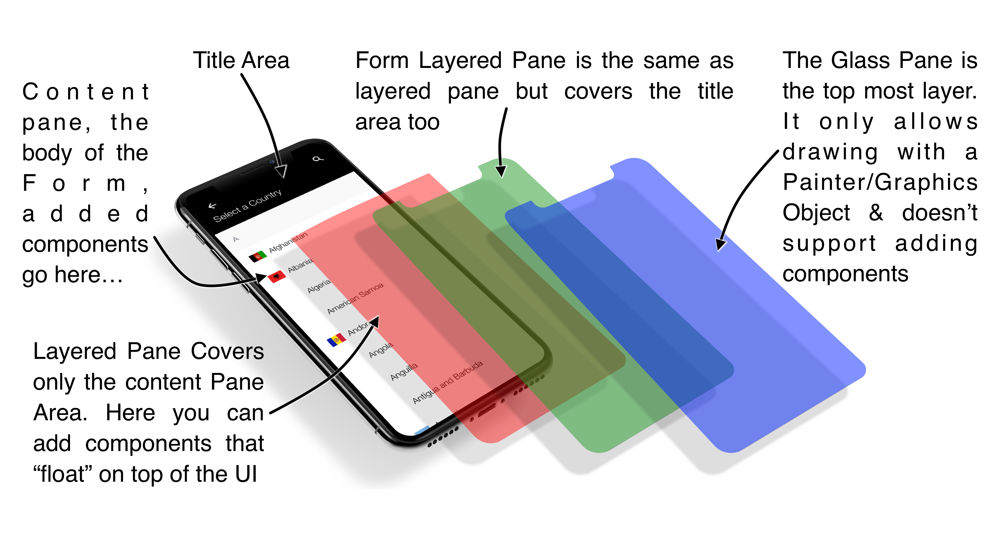

==== GridBag Layout

https://www.codenameone.com/javadoc/com/codename1/ui/layouts/GridBagLayout.html[GridBagLayout] was introduced to simplify the process of porting existing Swing/AWT code with a more familiar API. The API for this layout is problematic as it was designed for AWT/Swing where styles were unavailable. As a result it has its own insets API instead of using elements such as padding/margin.

Your recommendation is to <<table-layout-section,use Table>> which is as powerful but has better Codename One integration.

To show `GridBagLayout` you ported http://docs.oracle.com/Java SE/tutorial/uiswing/layout/gridbag.html[the sample from the Java tutorial] to Codename One:

[source,java]
----
include::../demos/common/src/main/java/com/codenameone/developerguide/snippets/generated/BasicsJava033Snippet.java[tag=basics-java-033,indent=0]
----

Notice that because of the way gridbag works you didn't provide any terse syntax API for it although it should be possible.

.GridbagLayout sample from the Java tutorial running on Codename One
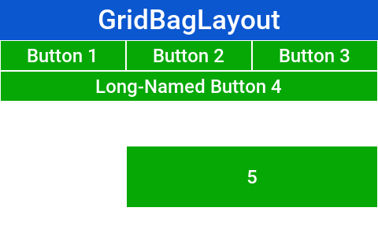

==== Group Layout

https://www.codenameone.com/javadoc/com/codename1/ui/layouts/GroupLayout.html[GroupLayout] is a layout that would be familiar to the users of https://netbeans.org/features/java/swing.html[the NetBeans GUI builder (Matisse)]. Its a layout manager that's hard to use for manual coding but is powerful for some elaborate use cases. Although `MiGLayout` and `LayeredLayout` might be superior options.

It was originally added during the LWUIT days as part of an internal try to port Matisse to LWUIT. It's still useful to this day as developers copy and paste Matisse code into Codename One and produce elaborate layouts with drag.

Since the layout is based on an older version of `GroupLayout` some things need to be adapted in the code or you should use the special "compatibility" library for Matisse to get better interaction. You also recommend tweaking Matisse to use import statements instead of full package names, that way if you use `Label` changing the awt import to a Codename One import will make it use work for Codename One's `Label`.

Unlike any other layout manager `GroupLayout` adds the components into the container instead of the standard API. This works for GUI builder code but as you can see from this sample it doesn't make the code readable:

[source,java]
----
include::../demos/common/src/main/java/com/codenameone/developerguide/snippets/generated/BasicsJava034Snippet.java[tag=basics-java-034,indent=0]
----

.GroupLayout Matisse generated UI running in Codename One
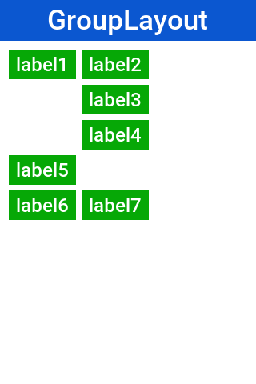

If you're porting newer Matisse code there are simple changes you can do:

- Change `addComponent` to `add`
- Change `addGroup` to `add`
- Remove references to `ComponentPlacement` and reference `LayoutStyle` directly

==== Mig Layout

https://www.codenameone.com/javadoc/com/codename1/ui/layouts/mig/MigLayout.html[MigLayout] is a popular cross-platform layout manager that was ported to Codename One from Swing.

WARNING: MiG is still considered experimental so proceed with caution! +
The API was deprecated to serve as a warning of its experimental status.

The best reference for MiG would probably be its http://www.miglayout.com/QuickStart.pdf[quick start guide (PDF link)]. As a reference you ported one of the samples from that PDF to Codename One:

[source,java]
----
include::../demos/common/src/main/java/com/codenameone/developerguide/snippets/generated/BasicsJava035Snippet.java[tag=basics-java-035,indent=0]
----

.MiG layout sample ported to Codename One
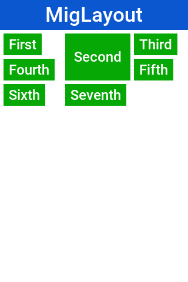

It should be reasonably easy to port MiG code but you should notice the following:

- MiG handles a lot of the spacing/padding/margin issues that are missing in Swing/AWT. With Codename One styles you have the padding and margin which are probably a better way to do a lot of the things that MiG does
- The `add` method in Codename One can be changed as shown in the sample above.
- The constraint argument for Codename One `add` calls appears before the `Component` instance.

=== Themes and styles

Next you need to introduce you to 3 important terms in Codename One: Theme, Style, and UIID.

Themes are similar conceptually to CSS, in fact they can be created with CSS syntax as this guide covers soon. The various Codename One ports ship with a native theme representing the appearance of the native OS UI elements. Every Codename One application has its own theme that derives the native theme and overrides behavior within it.

If the native theme has a button defined, you can override properties of that button in your theme. This allows you to customize the look while retaining some native appearances. This works by merging the themes to one big theme where your application theme overrides the definitions of the native theme. This is pretty like the cascading aspect of CSS if you're familiar with that.

Themes consist of a set of UIID definitions. Every component in Codename One has a UIID associated with it. UIID stands for User Interface Identifier. This UIID connects the theme to a specific component. A UIID maps to CSS classes if you're familiar with that concept. For example, Codename One doesn't support the complex CSS selector syntax options as those can impact runtime performance.

For example: see this code where:

This is a text field component (user input field) but it will look like a `Label`.

Effectively you told the text field that it should use the UIID of `Label` when it's drawing itself. It's common to do tricks like that in Codename One. For example: `button.setUIID("Label")` would make a button appear like a label and allow you to track clicks on a `Label`.

The UIID's translate the theme elements into a set of `Style` objects. These `Style` objects get their initial values from the theme but can be further manipulated after the fact. To make the text field's foreground color red you could use this code:

The color is in hexadecimal `RRGGBB` format so `0xff00` would be green and `0xff0000` would be red.

`getAllStyles()` returns a `Style` object but why do you need "`all`" styles?

Each component can have one of 4 states and each state has a `Style` object. This means you can have 4 style objects per Component:

* *Unselected:* used when a component isn't touched and doesn't have focus. You can get that object with `getUnselectedStyle()`.

* *Selected:* used when a component is touched or if focus is drawn for non-touch devices. You can get that object with `getSelectedStyle()`.

* *Pressed:* used when a component is pressed. Notice it's applicable to buttons and button subclasses. You can get that object with `getPressedStyle()`.

* *Disabled:* used when a component is disabled. You can get that object with `getDisabledStyle()`.

The `getAllStyles()` method returns a special case `Style` object that lets you set the values of all 4 styles from one class so the code before would be equivalent to invoking all 4 `setFgColor` methods. For example, `getAllStyles()` works for setting properties not for getting them!

.don't use `getStyle()` for manipulation
WARNING: `getStyle()` returns the current `Style` object which means it will behave inconsistently. The paint method uses `getStyle()` as it draws the current state of the `Component` but other code should avoid that method. Use the specific methods instead: `getUnselectedStyle()`, `getSelectedStyle()`, `getPressedStyle()`, `getDisabledStyle()` and `getAllStyles()`

As you can see, it's a bit of a hassle to change styles from code which is why the theme is so appealing.

==== Theme

A theme allows you to define the styles externally through a set of UIID’s (User Interface ID’s). Themes can be authored directly in CSS and then compiled into the Codename One resource file, which keeps styling concerns separate from application logic.

The theme is stored in the `theme.res` file in the project.

You load the theme file using this line of code in the `init(Object)` method in the main class of the application:

[source,java,title='Theme Loading Code']
----
include::../demos/common/src/main/java/com/codenameone/developerguide/snippets/generated/BasicsJava038Snippet.java[tag=basics-java-038,indent=0]
----

In a CSS project this file is generated automatically from the stylesheet. Legacy applications that still edit the resource file by hand can continue to do so, but new projects should prefer the CSS workflow described below.

This code is shorthand for resource file loading and for the installation of theme. You could technically have more than one theme in a resource file at which point you could use `initNamedTheme()` instead. The resource file is a special file format that includes inside it many features:

* Themes
* Images
* Localization Bundles
* Data files

[[working-with-css-themes]]
==== Working with CSS themes

Modern Codename One projects ship with a `src/main/css/theme.css` file (or an equivalent stylesheet). Editing this file allows you to define UIIDs using standard CSS syntax together with Codename One–specific extensions such as `cn1-derive` for inheritance and the `#Constants` block for theme constants. Each time you build or run the project, the build tool compiles the CSS into the `theme.res` resource file automatically. Saving the CSS while the simulator is running will also trigger a refresh so you can iterate on styling.

Because the CSS compiler produces the final resource file, you should treat the generated `theme.res` as an output artifact and keep your changes in the CSS source. Images referenced from CSS rules (for example: background images or multi-images) should be placed alongside the stylesheet so that they're picked up by the compiler. More details about the supported selectors and properties are covered in the dedicated CSS chapter later in this guide.

=== GUI builder

The GUI builder arranges components visually: you drag them onto a canvas, position them, and edit their properties in an inspector, without writing the layout code by hand. It's a desktop application that the Codename One Maven plugin launches, so it works the same way whichever IDE you use for the surrounding Java code. Forms designed in the builder use auto layout mode by default, which positions and resizes components on the canvas using `LayeredLayout` behind the scenes.

==== Hello world

Two goals do the work:

- `cn1:create-gui-form` generates a new GUI form: the `.gui` XML file plus the matching Java source.
- `cn1:guibuilder` opens the GUI builder on the project.

Both goals accept a `className` parameter that points at the fully qualified class name of the form. From the root of a multi-module Codename One project, create a new form like this:

[source,bash]
----
include::../demos/common/src/main/snippets/developer-guide/basics.sh[tag=basics-bash-001,indent=0]
----

This generates two files inside the `common` module:

. `common/src/main/guibuilder/com/example/MyForm.gui`
. `common/src/main/java/com/example/MyForm.java`

NOTE: If you run the goal from inside the `common` submodule the files are written directly under that module's `src/main/...` directory. By default the goal creates a `Form`; pass `-DguiType=Dialog` or `-DguiType=Container` to generate one of the other types, and pass `-DautoLayout=false` to opt out of auto layout mode.

To open the form in the GUI builder:

[source,bash]
----
include::../demos/common/src/main/snippets/developer-guide/basics.sh[tag=basics-bash-002,indent=0]
----

Projects generated from the archetype also carry a ready-made shortcut for this: a *CN1 GUI Builder* run configuration in IntelliJ IDEA, an *Open in GUI Builder* action in NetBeans, a *GUI Builder* launch configuration in Eclipse, and a *Tools > GUI Builder* entry in the Visual Studio Code Maven favourites. They all run the same goal.

The full goal reference, including every parameter, lives in <<create-gui-form>> and <<guibuilder>> in the Maven goals appendix.

TIP: The GUI builder runs on JDK 17 or newer. If Maven itself runs on an older JDK the goal stops with a message telling you so, rather than failing inside the editor.

==== The workspace

.The GUI builder editing a form created with `cn1:create-gui-form`
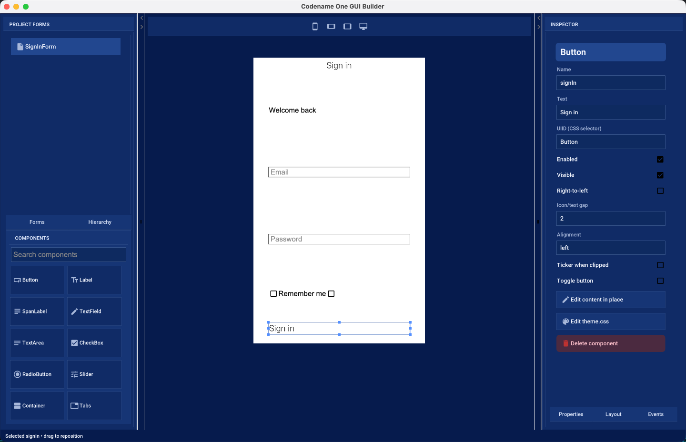

The window has three columns:

- *Project forms and palette* -- on the left. The upper half lists every `.gui` file in the project under the *Forms* tab, and the component tree of the form you are editing under the *Hierarchy* tab. Picking a component from the tree is often easier than hitting it on the canvas, particularly when it's behind something else. The lower half is the component palette, with a search field for finding a component by name.

- *Design canvas* -- in the middle. This is a live Codename One rendering of your form, styled by the project's own `theme.css`, so what you see is what the application draws. The buttons above the canvas switch it between phone portrait, phone landscape, tablet, and a full-width desktop canvas.

- *Inspector* -- on the right. It shows the selected component under three tabs: *Properties*, *Layout*, and *Events*.

The toolbar carries *Save*, *Undo*, *Redo* and *Refresh* on the left, and *CSS* and *Code* on the right. Changes are written to the `.gui` file when you press *Save*.

The two dividers between the columns can be dragged, so you can give the canvas more room while positioning components and give the inspector more room while filling in properties.

==== Designing a form

Drag a component from the palette onto the canvas to add it. As you drag, the builder highlights where the component would land: the container that would receive it, and, in auto layout mode, guides showing the edges it would line up with. Dropping outside a valid target leaves the form unchanged.

Select a component by clicking it on the canvas or by picking it in the *Hierarchy* tab. A selected component shows resize handles; drag its body to move it, or a handle to resize it. Hold Shift while clicking to select several components at once, which is what the alignment actions in the top-left corner of the canvas operate on: they align edges, centres or baselines, match widths or heights, or disconnect a component from the relationships it has picked up.

Double-click a component that displays text -- or long-press it -- to edit that text in place, without going to the inspector.

The *Properties* tab holds what the component is: its name, its text, the UIID that connects it to a CSS selector, and the settings that belong to its type, such as the input constraint of a text field or the range of a slider. The *Layout* tab holds where it sits: its position in its parent, the layout manager of a container, and, for auto layout, its alignment reference and its horizontal and vertical size policies. The *Events* tab binds an event, such as a button press, to a method in the companion Java source.

[[auto-layout-mode]]
==== Auto layout mode

New forms use auto layout mode. In this mode you place components where you want them rather than accepting the positions a layout manager dictates.

.All forms designed in auto layout mode use `LayeredLayout`
NOTE: Auto layout mode is built on the inset support in `LayeredLayout`. Component positioning uses <<insets-and-reference-components,insets and reference components>>, not absolute coordinates.

An inset can be fixed (stated in millimetres, pixels or a percentage) or flexible, and it can be measured from the parent or from a sibling component. That's what makes a form designed on one canvas size still work on another: a component pinned to the bottom of the form stays there on a taller screen, and a component pinned below its neighbour follows that neighbour when it moves.

The builder chooses insets for you as you drag, and it prefers a relationship with a nearby component over a distance from the edge of the form. The *Layout* tab shows the choice it made and lets you change it:

- *Alignment reference* -- the component this one is positioned against, or the nearest component if you haven't chosen one.
- *Horizontal size policy* and *Vertical size policy* -- whether the component keeps its preferred size, keeps a fixed size, fills its parent, or matches the size of its reference component.

Resize the canvas with the device buttons above it after every few changes. A form that looks right on one canvas can fall apart on another, and switching between phone portrait and desktop is the quickest way to find out before a device does.

==== Nested containers and other layouts

A form doesn't have to be one flat surface. Drag a *Container* from the palette to group components together, then use the *Container layout* picker in the *Layout* tab to give it whichever layout manager suits that part of the form: box, border, flow, grid, table, or layered again. Components dragged into that container are then arranged by it, and the drop guides change to match -- a box layout shows where in the sequence the component would go, a border layout shows which region would receive it, and a table layout shows the cell.

Containers can be nested as deeply as you need, and a component can be dragged out of one container and into another; the builder rewrites its constraints for the layout it lands in.

==== The theme and the companion source

The *CSS* button opens the project stylesheet inside the builder.

.Editing the project stylesheet; the canvas re-renders as you type
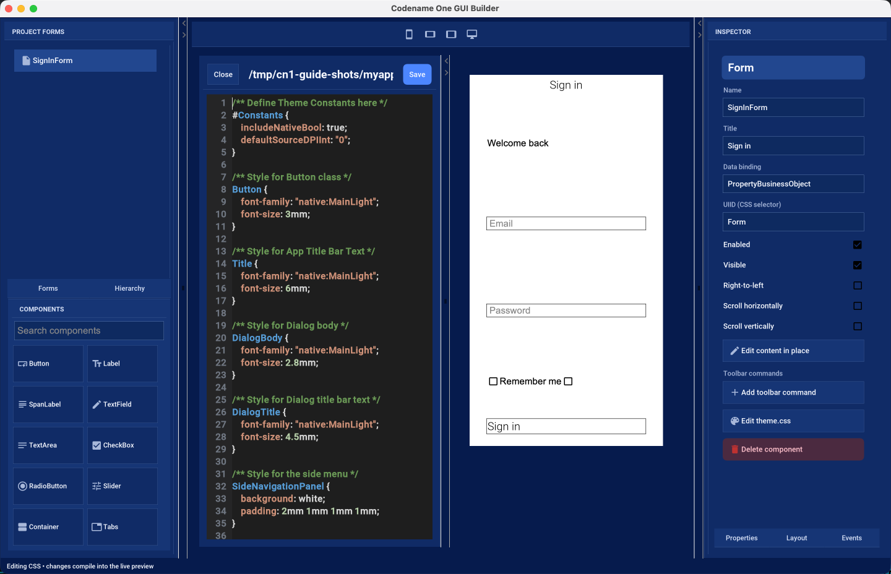

The stylesheet is compiled and applied to the canvas as you edit it, so a color or a font change is visible immediately on the form you are designing. This is the same `src/main/css/theme.css` the application builds with, described in <<working-with-css-themes,Working with CSS themes>>.

The *Code* button opens the companion Java source.

.The companion Java source, generated from the form
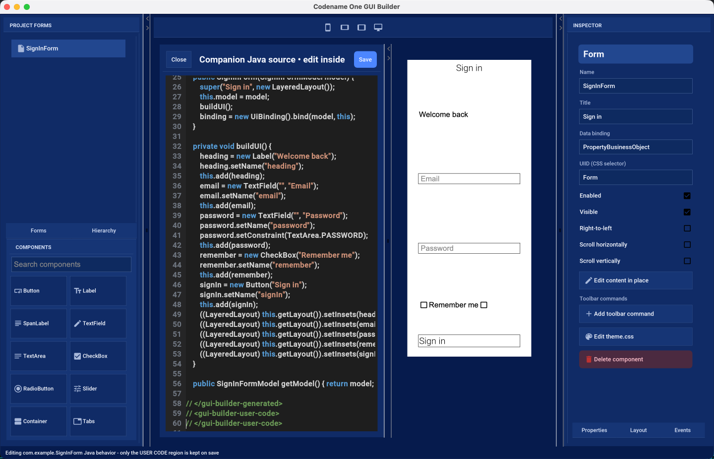

Everything between the `// <gui-builder-generated>` and `// </gui-builder-generated>` markers is written by the builder from the `.gui` file and is replaced whenever the form is saved. The region between the `// <gui-builder-user-code>` markers is yours: event handlers and anything else you add there is preserved across saves. The editor makes the distinction visible, and the status line reminds you which region takes your changes.

Forms scaffolded by older versions of `cn1:create-gui-form` used a different marker style. Opening such a form in the builder converts the file to the format above and keeps the methods you had written.

==== What's stored on disk

A form is two files that belong together:

- `common/src/main/guibuilder/<package>/<Name>.gui` -- the XML description of the component tree. This is the file the builder reads and writes, and the one to keep under version control.
- `common/src/main/java/<package>/<Name>.java` -- the companion Java source.

IMPORTANT: The two files are connected by name. If you rename or move one, rename or move the other to match, or the builder can no longer pair them.

The `.gui` file is plain XML and readable enough to review in a diff:

[source,xml]
----
include::../demos/common/src/main/snippets/developer-guide/basics.xml[tag=basics-xml-001,indent=0]
----

You can edit it by hand, but reopen the form afterwards: the builder doesn't watch the file while it's running.
