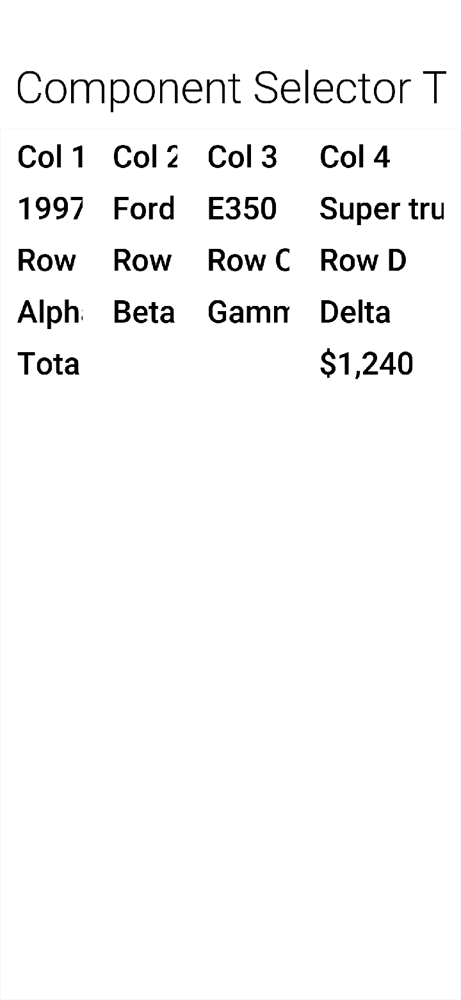

== Component selector

The `ComponentSelector` class is a new class that brings the power of jQuery to Codename One. While it isn't *actually* jQuery, it's influenced by it. If you're not familiar with jQuery, here is the 10 second intro.

jQuery is a JavaScript library, created by John Resig in 2006, that has become a staple of browser-based UI development. As of March 2017, over 70% of web sites are using jQuery. The initial problem that jQuery solved was browser incompatibility issues. It provided a consistent API for most useful DOM methods so that the developer didn't have to spend all their days and nights fighting with browser compatibility issues. In a way, it did for Javascript, what Codename One does for mobile apps.

The other thing that jQuery did, was provide an elegant way to select and manipulate DOM elements (that is, HTML tags in a web page). It enabled developers to form sets of elements using a CSS-like syntax, and to operate on all elements of those sets, as if they were single elements, and they provided a fluent API to enable developers to chain multiple calls together, and delay onset of carpel tunnel for at least a few extra years.

With the new `ComponentSelector` class, you've adopted the following aspects of jQuery:

1. **CSS-like Selection Sytax** - Support for a CSS-like syntax for "selecting" Components to be included in a set.
2. **Fluent API** - The API is fluent, meaning you can chain multiple method calls together and reduce typing.
3. **Working on Sets** - Methods of this class operate on sets of components as if they are a single component. As you'll see, this can be incredibly powerful.
4. **Effects** - Support for common effects on components such as fadeIn(), fadeOut(), slideDown(), and slideUp().

=== Motivation by example

The following snippet creates a button, that, when pressed, will fade itself and all its sibling components out, and then fade them back in.

[source,java]
----
import static com.codename1.ui.ComponentSelector.$;

// ...

Button slideUp = $(new Button("Slide Up")) // <1>
    .setIcon(FontImage.MATERIAL_EXPAND_LESS) // <2>
    .addActionListener(e->{ // <3>
        $(e) // <4>
            .getParent() // <5>
            .find(">*") // <6>
            .slideUpAndWait(1000) // <7>
            .slideDownAndWait(1000); // <8>
    })
    .asComponent(Button.class); // <9>
----
<1> - Creates a new Button and wraps it in a `ComponentSelector` so that you can use ComponentSelector's fluent API to change the button.
<2> - Sets the icon on the button
<3> - Adds an action listener to the button
<4> - Wraps the source of the action event (which is the button) in a ComponentSelector so you can use fluent API.
<5> - Gets button's parent component. (Actually it's a set of components, size=1)
<6> - Gets all the direct children of the button's parent container.
<7> - Hides all the children of the button's parent (that is, the button and siblings) using a slide-up effect. Duration is 1000ms. Blocks until complete.
<8> - Shows the button and its siblings using a slide-down effect.
<9> - Returns the button itself to assign to the `slideUp` local variable.

NOTE: For people like Shai who don't like the jQuery `$` syntax used for method names, you can or use the `select()` method as an alias for `$()`.

Take a close look at that example, and imagine implementing that functionality the "old" way. It actually gets pretty hairy. Hopefully that example is enough to get you interested in using ComponentSelector.

Now let's go into some details of how it works and how to use it.

=== Selecting components

The first thing you'll want to do with ComponentSelector, is to select the components that will be in your set. You can do this in many ways:

1. You can use the CSS selector syntax. For example, `$("Label, Button, #MyCalendar")` = The set of all components on the current form with UIID=Label, or UIID=Button, or Name=MyCalendar.
2. You can explicitly wrap one or more components. For example, `$(myButton, myLabel, myCalendar)` = A set with 3 components, `myButton`, `myLabel`, and `myCalendar`.
3. You can change an existing set to create a new one. For example, `$("Label").add("Button", true).add($("#MyCalendar"));` = the same set formed in 1 above. (Labels, Buttons, and components with Name=MyCalendar)

==== Specifying the roots for queries

You can specify the roots for a query to limit the scope of the search. If you don't provide a root, then the current form will be used as a root. If there is no current form yet, then a RuntimeException will be thrown. it's always a good idea to provide a root if you've one.

For example, `$(`Label`, myContainer)` = The set of components with UIID="Label" inside the `myContainer`. This will scour the full subtree of `myContainer` for components that match the provided selector.

You can provide multiple roots as well. For example, `$("Label", myContainer, anotherContainer)` = The set of components with UIID="Label" inside either `myContainer` or `anotherContainer`.

You could also provide set of components, and by extension a ContainerSelector (since it implements `java.util.Set<Component>`) as the roots. For example, `$("CalendarDay", $("Calendar"))` = The set of all components with UIID "CalendarDay" inside containers with UIID=`Calendar`.

Finally, ComponentSelector provides a `find()` method that implicitly uses the current set as the roots. For example, `$("Calendar").find("CalendarDay")` is equivalent to `$("CalendarDay", $("Calendar"))`.

==== Selector syntax

far You've glossed over the selector syntax by saying it's `like CSS`. Though it's *like* CSS selectors, it's necessarily different to accommodate the differences between Codename One's component model and Javascript's DOM. Rather than go into a technical language definition, You'll use some examples to illustrate the capabilities of your syntax.

. `$("Label")` - The set of all components on the form with UIID "Label"
. `$("#MyField")` - The set of all components on the form with Name `MyField`.
. `$(".some-tag")` - The set of all components on the form with the tag "some-tag." (You'll discuss tags below).
. `$("Label#MyField")` - The set of all components on the form with both UIID=`Label` and Name=`MyField`.
. `$("Label#MyField.some-tag")` - The set of all components on the form with UIID=`Label`, Name=`MyField`, and tag "some-tag."
. `$("*")` - The set of all components on the form.
. `$(".some-tag.some-other-tag")` - All components with both tags "some-tag" and "some-other-tag"
. `$("#MyContainer *")` - All components contained in the subtree whose root has Name=`MyContainer`. The "MyContainer" wouldn't be included in this set. Only its descendants.
. `$("#MyContainer > *")` - Direct children of components with Name=`MyContainer`. (The "MyContainer" component would not be included in this set. Only its children.)
. `$("#MyContainer > * > Label")` - Direct grandchildren of components with Name=`MyContainer`. Only grand children with UIID="Label" are included.

==== Tags

Some examples above mention the use of "tags." Tags are analogous to "classes" in CSS. The goal was to provide the same kind of functionality as CSS classes, but in Java the term "class" is a little busy, so the term "tag" is used instead. You can add as many tags to a component as you like. You can then use those tags to assist in your queries. Tags are added using the `addTags()` method, and they are removed using the `removeTags()` method.

Here is an example that uses tags to implement table striping so that even rows are a different color than odd rows in a table.

[source,java]
----
TableLayout tl = new TableLayout(numRows, numCols);
Container table = new Container(tl);
int rowNum = 0;
int colNum = 0;
for (String[] row : data) {
    colNum = 0;
    for (String cell : row) {
        table.add(
            tl.createConstraint(rowNum, colNum),
            $(new Button(cell))
                .setUIID("Label")
                .addTags(rowNum % 2 == 0 ? "even":"odd")
                .asComponent()
        );
        colNum++;
    }
    rowNum++;
}
$(".even", table)
    .setBgColor(0xcccccc)
    .setBgTransparency(255);
----

In the above example you add a tag to each label when you add it to the table or either "even" or "odd." You then use the "even" in your ComponentSelector to set the background color and transparency of all labels in even rows. In this example, you actually build the table and set the striping in the same place, but consider the situation when the table is constructed by another API. This approach would allow the API to provide more extensibility by tagging the elements and allowing the library user to decide how to style the even and odd rows.

=== Modifying styles

ComponentSelector includes wrappers for most of the methods of `com.codename1.ui.plaf.Style` so that you can change the styles of selected components using a fluent API. This was demonstrated a little bit in the table striping example (`setBgColor()` and `setBgTransparency()` were called on even rows of the table). it's worth going over this in a little more detail though as Codename One styles have "state." For example, For the snippet of code:

[source,java]
----
$(".even", table)
    .setBgColor(0xcccccc)
    .setBgTransparency(255);
----

Were you setting these values on the "selected" style, the "unselected" style, the "disabled" style, "ALL" styles? In fact you were setting these values on the "current" style. That is, the call to `setBgColor()` caused something like the following loop to happen on all the components in the set:

[source,java]
----
for (Component c : evenComponents) {
    c.getStyle().setBgColor(0xcccccc);
}
----

If a component was in "selected" state, then this would changed the selected style. If it was in pressed state, then it would change the "pressed" style. Etc... What if you wanted to specifically change the styles in the "pressed" state. Then you would call `selectPressedStyle()` prior calling your style mutation methods. For example, [source,java]
----
$(".even", table)
    .selectPressedStyle()
    .setBgColor(0xcccccc)
    .setBgTransparency(255);
----

Or, ComponentSelector supports a "state" pseudo-selector that will initialize the selected style so that you don't have to call `selectXXXStyle()` before making changes. For example, The following snippet is equivalent to the previous:

[source,java]
----
$(".even:pressed", table)
    .setBgColor(0xcccccc)
    .setBgTransparency(255);
----

The following "state" pseudo-selectors are available:

. `:pressed` - Selects the "pressed" style
. `:selected` - Selects the "selected" style
. `:unselected` - Selects the "unselected" style
. `:disabled` - Selects the "disabled" style
. `:all` - Selects the ALLStyles proxy for each component (so that you can target all styles together)
. `:*` - Same as `:all`

If you want to access `Style` objects directly, you can use one of:

. `getPressedStyle()` - Returns a proxy style with all the pressed styles of components in the set.
. `getSelectedStyle()`
. `getUnselectedStyle()`
. `getDisabledStyle()`
. `getAllStyles()`

=== Effects and transitions

As mentioned above, and demonstrated in the first example of this article, ComponentSelector provides a simple way to add eye-candy to your apps. It implements the `fadeIn()`, `fadeOut()`, `slideUp()`, and `slideDown()` methods and their `AndWait()` derivations for showing and hiding components in your UI with style. You no longer have any excuse *not* to use a transition for showing and hiding elements in your UIs. Using a transition always feels nicer to the user.

Also to these basic effects, ComponentSelector wraps all the existing animation functionality of the Component and Container classes but with proper accommodations for animating multiple elements simultaneously.

For example, Consider this example, that shows a button that replaces itself and all siblings with replacement labels, and then replaces them back.

[source,java]
----
Button replace = $(new Button("Replace Fade/Slide"))
    .setIcon(FontImage.MATERIAL_REDEEM)
    .addActionListener(e->{
        $(e).getParent()
            .find(">*")  // <1>
            .replaceAndWait(c->{ // <2>
                return $(new Label("Replacement")) // <3>
                    .putClientProperty("origComponent", c) // <4>
                    .asComponent();
            }, CommonTransitions.createFade(1000)) // <5>
            .replaceAndWait(c->{
                Component orig = (Component)c.getClientProperty("origComponent");
                if (orig != null) {
                    c.putClientProperty("origComponent", null);
                    return orig; // <6>
                }
                return c;

            }, CommonTransitions.createCover(CommonTransitions.SLIDE_HORIZONTAL, false, 1000)); // <7>

    })
    .asComponent(Button.class);
----
<1> Finds all siblings of the source button
<2> Call `replaceAndWait()` with a mapping function to define the component that should replace each component. This will replace each component in the set with a replacement component in its respective container. This will also return a new ComponentSelector with the set of replacement components.
<3> In your "mapper" callback, you will return a new Label component to replace each existing component.
<4> You store the original component in the replacement's client properties so that you can swap it back afterwards.
<5> You use the "Fade" transition for the replacement.
<6> In the second `replaceAndWait()` call's mapper method, you return the original component which you retrieved from the replacement's client properties.
<7> You use a cover transition for the replacement.

=== Component method wrappers

Most mutator methods in `Component` and `Container` include a corresponding wrapper method in `ComponentSelector`. Some more common component subclasses have corresponding wrappers as well. For example, `addActionListener(event)` will add the event to all Buttons in the set. `setText(txt)` will set the text on all labels, text areas, and buttons. If there are other commonly used methods that you would like to see included in ComponentSelector, let's know, but you think you'll find the current state to be comprehensive.

==== Tree navigation

`Component` and `Container` include a few tree navigation methods. For example, `Component.getParent()` returns the parent container of the current component. In cases like this, where `ComponentSelector` wraps such a method, it will return a set of corresponding components resulting from calling those methods on the components in the current set.

For example, `$(comp1, comp2).getParent()` will include both the parent of `comp1` and `comp2` (and if they have the same parent, then the set will include a single element.

This can get interesting when you start combining these methods. For example, `$(comp1, comp2).getParent().getComponentAt(10)` will be the set of components that are the 11th children of `comp1` and `comp2`'s parents. If neither of their parents have that many children, then it will be an empty set. If one of them has that many, then it will be a set of size 1.

=== More demos

you've posted a demo app that demonstrates a few of the things that you discuss https://github.com/shannah/cn1-component-selector-demo[here]. The file containing most relevant source code is https://github.com/shannah/cn1-component-selector-demo/blob/master/src/com/codename1/tests/stylebuilder/StyleBuilderDemo.java[here].

you've also posted a short screencast of the demo app on youtube:

video::Cue0fnJdB4U[youtube]

