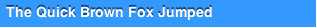
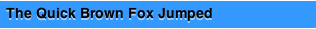
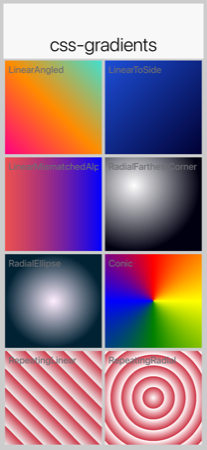
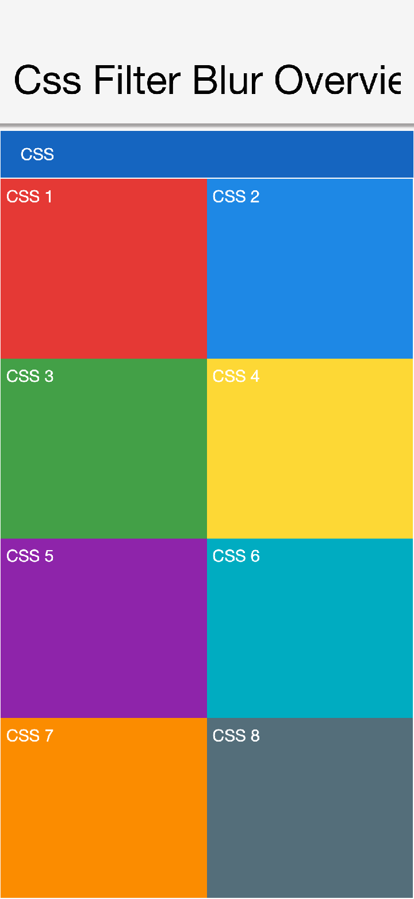
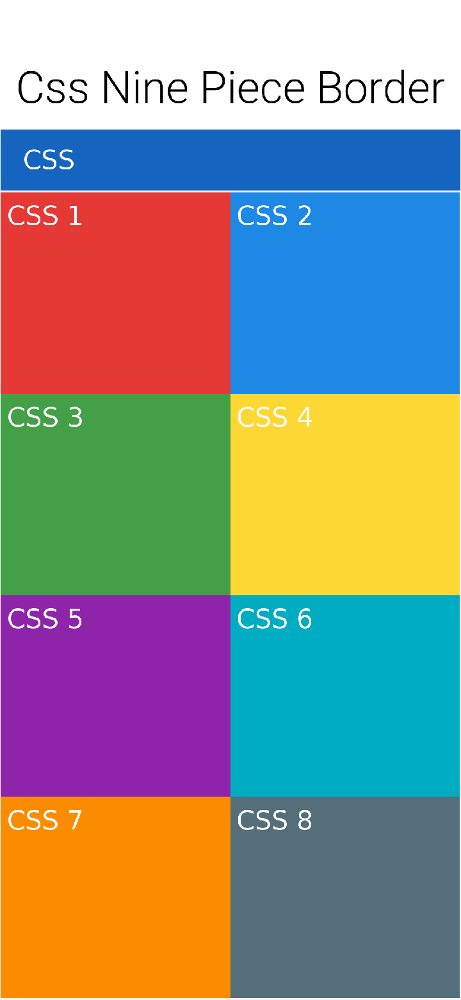

== CSS

In this chapter this guide covers theming with CSS in Codename One.

.CSS Changes don't Require a Recompile
TIP: You can change the CSS values while the simulator is running and the changes will reflect in the simulator within a few seconds

=== Activating CSS

Codename One applications always use the resource file. The CSS support compiles a file in CSS syntax to a Codename One resource file and adds it to the application. In runtime the CSS no longer exists and the file acts like a regular theme file.

New Maven projects enable CSS by default with `codename1.cssTheme=true` in `common/codenameone_settings.properties`. Add that property manually if you are migrating an older project where CSS support is disabled.

Once enabled your `theme.res` file will regenerate from a CSS file that resides under the `css` directory. Changes you make to the CSS file will instantly update the simulator as you save. But, there are some limits to this live update so sometimes a simulator restart would be necessary.

=== Supported CSS selectors

Since Codename One stylesheets are meant to be used with Codename One component hierarchies instead of XML/HTML documents, selectors work a little differently.

. All selectors (with some specific exceptions discussed below) are interpreted as UIIDs.
. Only 4 predefined CSS classes are supported:
 * `.pressed`: Targets the component when in "Pressed" state.
 * `.selected`: Targets the component when in "Selected" state.
 * `.unselected`: Targets the component when in "Unselected" state.
 * `.disabled`: Targets the component when in "Disabled" state.
+
If no class is specified, then the selector targets "all" states of the given component.

The following are a few possible selectors you can include in your stylesheet.

. `Button`: Defines styles for the "Button" UIID.
. `Button.pressed`: Defines styles for the "Button" UIID's "pressed" state.
. `Button, TextField, Form`: Defines styles for the `Button`, `TextField`, and "Form" UIIDs.

The following example creates a simple button with a border, and text aligned center. By default the button will have a transparent background, but when it's pressed, it will have a gray background:

[source,css]
----
include::../demos/common/src/main/css/guide-snippets-theme.css[tag=css-css-001,indent=0]
----

==== Inheriting properties using `cn1-derive`

The following example defines a custom Button style named "MyButton" that inherits all the styles of Button but changes the background color to blue:

[source,css]
----
include::../demos/common/src/main/css/guide-snippets-theme.css[tag=css-css-002,indent=0]
----

=== Special selectors

==== `#device`

The `#Device` selector allows you to define which device resolutions this CSS file should target. Mutli-images generated from this style-sheet will be included variants for device resolutions in the range `(min-resolution, max-resolution)` as defined in this section. By default all resolutions are generated:

[source,css]
----
include::../demos/common/src/main/css/guide-snippets-theme.css[tag=css-css-003,indent=0]
----

==== `#constants`

The `#Constants` selector allows you to specify theme constants.

For example:

[source,css]
----
include::../demos/common/src/main/css/guide-snippets-theme.css[tag=css-css-004,indent=0]
----

In the above example, the constants referring to an image name as a string requires that the image exists in one of the following locations:

* `res/<cssfilename>/<imageName>`
* `../res/<cssfilename>/<imageName>`
* `../../res/<cssfilename>/<imageName>`

It must also have been defined as a background image in some selector in this CSS file.

==== `Default`

The `Default` selector is special in that it will set properties on the theme's "default" element. The default element is a special UIID in Codename One from which all other UIIDs in the same theme are derived. This is a good place to set things like default fonts or background-colors.

=== Standard CSS properties

* `padding` (and variants)
* `margin` (and variants)
* `border` (and variants)
* `border-radius`
* `background` (Usage <<background, below>>)
* `background-color`
* `background-repeat`
* `background-image`
* `border-image`
* `border-image-slice`
* `font` (Usage is covered in the following font section)
* `font-family` (Usage is covered in the following font section)
* `font-style` (Usage is covered in the following font section)
* `font-size` (Usage is covered in the following font section)
* `@font-face` (Usage is covered in the following font section)
* `color`
* `text-align`
* `text-decoration`(Usage <<text-decoration, below>>)
* `opacity`
* `box-shadow`
* `width` ( used for generating background-images and borders)
* `height` ( used for generating background-images and borders)

=== Custom properties

`cn1-source-dpi`::
// vale-skip: proselint.Very: 'Very High Res' is a labelled DPI bucket in the Codename One multi-image API, not generic intensifier prose.
Used to specify source DPI for multi-image generation of background images. Accepted values: `0` (Not multi-image), `120` (Low res), `160` (Medium Res), `320` (Very High Res), `480` (HD), Higher than `480` (2HD). If not specified, the default value will be the value of the `defaultSourceDPIInt` theme constant, if specified, or `480`, if not specified.
`cn1-background-type`::
Used to explicitly specify the background-type that should be used for the class.
`cn1-9patch`::
Used to explicitly specify the slices used when generating 9-piece borders. **Deprecated - Use `border-image` and `border-image-slice` for 9-piece borders.**
`cn1-derive`::
Used to specify that this UIID should derive from an existing UIID.

=== CSS variables

As of CodenameOne 7.0, you can use variables in your CSS file via the `var()` CSS function. For example:

[source,css]
----
include::../demos/common/src/main/css/guide-snippets-theme.css[tag=css-css-005,indent=0]
----

The `var()` function can be used inside property values. That is, You can't use it in property names or selectors.

The `var()` grammar follows the browser CSS form:

[source,css]
----
include::../demos/common/src/main/css/guide-snippets-theme.css[tag=css-css-006,indent=0]
----

The `<custom-property-name>` must begin with two dashes (`--`).

The `<declaration-value>` is the fallback value that will be used if the variable hasn't been defined in the CSS file. The fallback value may include commas.

**Examples**

.Example defining and using a CSS variable
[source,css]
----
include::../demos/common/src/main/css/guide-snippets-theme.css[tag=css-css-007,indent=0]
----

.Example using a fallback value
[source,css]
----
include::../demos/common/src/main/css/guide-snippets-theme.css[tag=css-css-008,indent=0]
----

See the https://developer.mozilla.org/en-You/docs/Web/CSS/var[MDN docs] for more details about the CSS variable spec.

=== CSS properties

This section isn't as comprehensive as it should be due to the breadth of CSS.

[[text-decoration]]
==== Text-decoration

[cols="2*"]
|===
|underline
|Underlines text. For example, `text-decoration: underline;`

|overline
|Overlines text. For example, `text-decoration: overline;`

|line-through
|Strikes through text. For example, `text-decoration: line-through;`

|none
|No text decoration. For example, `text-decoration: none;`

|cn1-3d
a|3D text. For example, `text-decoraton: cn1-3d;` 

|cn1-3d-lowered
a|3D lowered text. For example, `text-decoration: cn1-3d-lowered;` 

|cn1-3d-shadow-north
|3D text with north shadow. For example, `text-decoration: cn1-3d-shadow-north;` 
|===

For other CSS font settings see link:Fonts[the Fonts section]

[[border]]
==== Border

This library supports the https://developer.mozilla.org/en-You/docs/Web/CSS/border[border property] and most of its variants (for example, https://developer.mozilla.org/en-You/docs/Web/CSS/border-width[border-width], https://developer.mozilla.org/en-You/docs/Web/CSS/border-style[border-style], and https://developer.mozilla.org/en-You/docs/Web/CSS/border-color[border-color]. It will try to use native Codename One styles for generating borders if possible. If the border definition is too complex, it will fall-back to generating a 9-piece image border at compile-time. This has the effect of making the resulting resource file larger, but will produce good runtime performance, and a look that's faithful to the provided CSS.

The algorithm used to determine whether to use a native border or to generate a 9-piece image, is complex, but the following guidelines may help you if you wish to design borders that can be rendered natively in CN1:

* Non-pixel units `border-width`. (Except with the `cn1-round-border` and `cn1-pill-border` styles)
* Using the `border-radius` directive.
* Using `box-shadow` (Unless using `cn1-round-border` or `cn1-pill-border` styles)
* Using a background gradient in combination with a border or any kind
* Using a different `border-width`, `border-style`, or `border-color` for different sides of the border
* Using a `filter`

TIP: You can open the resulting theme file in the designer and inspect it to see if an image was generated

Generating the image triggers slower CSS compilation and a larger binary, so tune the CSS so it avoids this fallback.

===== Round borders

Rounded borders can be achieved in a few different ways. The easiest methods are:

* **The `cn1-round-border` style**. This will render a circular round border in the background **natively**. That is, this doesn't require generation of an image border
* **The `cn1-pill-border` style**. This will render a pill-shaped border in the background natively. This also doesn't require generation of an image border
* **The `border-radius` property**. This will round the corners of the border. If the style can be achieved using the `RoundRectBorder` in CodenameOne, then it will use that border. If not, this will cause the style to be generated as an image border

**Examples using `cn1-round-border`**

[source,css]
----
include::../demos/common/src/main/css/guide-snippets-theme.css[tag=css-css-009,indent=0]
----

**Examples using `cn1-pill-border`**

[source,css]
----
include::../demos/common/src/main/css/guide-snippets-theme.css[tag=css-css-010,indent=0]
----

**Examples using `border-radius`**

[source,css]
----
include::../demos/common/src/main/css/guide-snippets-theme.css[tag=css-css-011,indent=0]
----

`cn1-pill-border` and `cn1-round-border` don't support the standard CSS `box-shadow` property. This is because the `box-shadow` property parameters don't map onto the shadow parameters for the Codename One `RoundBorder` class. To get shadows on the `cn1-pill-border`, you should use one or more of the following CSS properties:

* `cn1-box-shadow-spread`: Accepts values in any scalar unit (for example, px, mm, cm, etc.). This maps directly to the border's https://www.codenameone.com/javadoc/com/codename1/ui/plaf/RoundBorder.html#shadowSpread-int-boolean-[shadowSpread] property.
* `cn1-box-shadow-h`: Accepts values in real values or integers (not a scalar unit). This maps directly to the border's https://www.codenameone.com/javadoc/com/codename1/ui/plaf/RoundBorder.html#shadowX-float-[shadowX] property.
* `cn1-box-shadow-v`: Accepts values in real values or integers (not a scalar unit). This maps directly to the border's https://www.codenameone.com/javadoc/com/codename1/ui/plaf/RoundBorder.html#shadowY-float-[shadowY] property.
* `cn1-box-shadow-blur`: Scalar value. Maps to the border's https://www.codenameone.com/javadoc/com/codename1/ui/plaf/RoundBorder.html#shadowBlur-float-[shadowBlur] property.
* `cn1-box-shadow-color`: The shadow color
* `cn1-box-shadow-inset`: Set to `inset` to render an inner shadow instead of the default outer shadow spread.

Using the regular CSS `box-shadow` in conjunction with `border-radius` will cause a 9-piece border to be generated rather than mapping to the `RoundRectBorder`. If, but, you use the `cn1-box-*` properties for the shadow instead, it will use the RoundRectBorder—assuming that no other styles are specified that trigger an image border to be generated.

Codename One also exposes per-corner elliptical radius controls that map to the `RoundBorder`'s X/Y radii. You can set them directly with `cn1-border-top-left-radius-x` / `cn1-border-top-left-radius-y` (and the equivalent `top-right`, `bottom-left`, and `bottom-right` pairs) to fine tune horizontal and vertical curvature independently. The CSS parser automatically populates these properties when you use standard `border-radius` syntax, including the longhand declarations and the `border-radius: <x-radii> / <y-radii>` shorthand:

[source,css]
----
include::../demos/common/src/main/css/guide-snippets-theme.css[tag=css-css-012,indent=0]
----

In the example above, the four horizontal radii (`2mm 4mm 6mm 1mm`) populate the `cn1-border-*-radius-x` properties clockwise from the top-left corner. The four values after the slash fill the matching `cn1-border-*-radius-y` entries. Setting `cn1-box-shadow-inset: inset;` converts the shadow into an inset glow that follows the same elliptical curvature.

[[background]]
==== Background

The `background` property supports most standard https://developer.mozilla.org/en-You/docs/Web/CSS/background[CSS values] for setting the background color, or background image.

WARNING: 9-piece Image borders always take precedence over background settings in Codename One. If your background directive seems to have no effect, it's likely because the theme has specified a 9-piece image border for the UIID. You can disable the image border using a directive like `border: none`

===== Background images

See link:Images[Images]

===== Gradients

The full CSS gradient range is natively supported: `linear-gradient`, `radial-gradient`, `conic-gradient`, `repeating-linear-gradient`, and `repeating-radial-gradient` — all with arbitrary angles, unlimited multi-stop colors (with optional position hints), and full radial shape/extent control. The compiled theme resource file carries a compact descriptor and the gradient is rendered at runtime by the platform-native graphics API (Java2D on JavaSE, `LinearGradient`/`RadialGradient`/`SweepGradient` on Android, Core Graphics / Core Image on iOS).

.CSS gradient functions rendered side-by-side from the framework's screenshot test (top to bottom: linear at an arbitrary angle, linear `to <side>`, linear with mismatched alphas, radial `farthest-corner`, radial ellipse, conic, repeating-linear, repeating-radial).

**`linear-gradient`**

Any angle in degrees, radians, or `turn`, or the canonical `to <side>` / `to <side1> <side2>` directions. Two or more stops, each with optional position percentage; positions left blank between fixed anchors are autodistributed:

[source,css]
----
include::../demos/common/src/main/css/guide-snippets-theme.css[tag=css-css-013,indent=0]
----

**`radial-gradient`**

Full CSS radial syntax: `circle` or `ellipse`, any of the four extent keywords (`closest-side` / `closest-corner` / `farthest-side` / `farthest-corner`, defaulting to `farthest-corner`), explicit radii as percentages, an optional `at <position>` clause with side keywords or percentages, and two or more multi-stop colors:

[source,css]
----
include::../demos/common/src/main/css/guide-snippets-theme.css[tag=css-css-014,indent=0]
----

**`conic-gradient`**

Sweep / pie-style gradient. Optional `from <angle>` (CSS convention: 0° points up, sweep is clockwise) and `at <position>` prefix, followed by the stop list:

[source,css]
----
include::../demos/common/src/main/css/guide-snippets-theme.css[tag=css-css-015,indent=0]
----

**`repeating-linear-gradient` / `repeating-radial-gradient`**

Identical syntax to their non-repeating counterparts. The stop pattern tiles outward to fill the bounding box, ideal for stripes and rings:

[source,css]
----
include::../demos/common/src/main/css/guide-snippets-theme.css[tag=css-css-016,indent=0]
----

===== filter and backdrop-filter

CSS `filter` and `backdrop-filter` accept a chain of functions. Two storage forms land on the corresponding `Style`:

* `blur(<length>)` → `filterBlurRadius` / `backdropFilterBlurRadius` (a single pixel value).
* `brightness`, `contrast`, `grayscale`, `hue-rotate`, `invert`, `opacity`, `saturate`, `sepia` → `filterColorMatrix` / `backdropFilterColorMatrix` (a 4×5 color matrix; a multi-function chain composes into a single matrix in CSS order):

[source,css]
----
include::../demos/common/src/main/css/guide-snippets-theme.css[tag=css-css-017,indent=0]
----

.`filter: blur()` applied at a graphics primitive level — the framework's screenshot test renders RGB stripes and a gradient, then blurs both via `Graphics.gaussianBlur(...)`. Component-level paint-time integration of `filter:` declarations is in progress; until it lands, set the radius / matrix on a `Style` and consume them via the corresponding `Graphics` primitives manually.

`filter` applies to the component's own painted content; `backdrop-filter` applies to whatever is painted behind. The radii / matrices are also exposed on `Style` (`getFilterBlurRadius()`, `getFilterColorMatrix()`, `getBackdropFilterBlurRadius()`, `getBackdropFilterColorMatrix()`) so they can be set programmatically. Hardware blur is used where available (Core Image on iOS, RenderScript/RenderEffect on Android, JHLabs `GaussianFilter` on JavaSE simulator); ports without a fast path fall back to a software Gaussian.

[[cn1-background-type]]
==== cn1-background-type

It also supports some special Codename One values, which are identifiers with a "cn1-" prefix. The following special values are available. They map to the standard Codename One values you discussed in the theming chapter:

* `cn1-image-scaled`
* `cn1-image-scaled-fill`
* `cn1-image-scaled-fit`
* `cn1-image-tile-both`
* `cn1-image-tile-valign-left`
* `cn1-image-tile-valign-center`
* `cn1-image-tile-valign-right`
* `cn1-image-tile-halign-top`
* `cn1-image-tile-halign-center`
* `cn1-image-tile-halign-bottom`
* `cn1-image-align-bottom`
* `cn1-image-align-left`
* `cn1-image-align-right`
* `cn1-image-align-center`
* `cn1-image-align-top-left`
* `cn1-image-align-top-right`
* `cn1-image-align-bottom-left`
* `cn1-image-align-bottom-right`
* `cn1-image-border`
* `cn1-none`
* `cn1-round-border`
* `cn1-pill-border`

[[Images]]
=== Images

Images are supported as both "inputs" of the stylesheet, and as outputs to the compiled resource file. "Input" images are specified via the `background-image` property in a selector. "Output" images are always saved as multi-images inside the resource file.

==== Image DPI and device densities

To appropriately size the image, the CSS compiler needs to know what the source density of the image is. For example, if an image is 160×160 pixels with a source density of 160dpi (that is, medium density - or the same as an iPhone 3G), then the resulting multi-image will be sized at 160×160 for medium density devices and 320×320 on high density devices (for example, iPhone 4S Retina) - which will result in the same perceived size to the user of 1×1 inch.

However, if the image has a source density of 320dpi, then the resulting multi-image would be 80×80 pixels on medium density devices and 160×160 pixels on high density devices.

Some images have this density information embedded in the image itself so that the CSS processor will know how to resize the image. But, it's better to explicitly document your intentions by including the `cn1-source-dpi` property as follows:

[source,css]
----
include::../demos/common/src/main/css/guide-snippets-theme.css[tag=css-css-018,indent=0]
----

NOTE: `cn1-source-dpi` values are meant to fall into threshold ranges. Values less than or equal to 120, are interpreted as low density. 121 - 160 are medium density (iPhone 3GS). 161 - 320, high density (iPhone 4S). 321 - 480 == HD. 481 and higher == 2HD. In general, you should try to use images that are one of these DPIs exactly: 160, 320, or 480, then images will be scaled up or down to the other densities accordingly.

==== Multi-Images vs regular images

By default all images are imported as multi-images (unless you define the `defaultSourceDPIInt` theme constant). If you want to import an image as a "regular" image, you can set `cn1-source-dpi` to `0`. For example:

[source,css]
----
include::../demos/common/src/main/css/guide-snippets-theme.css[tag=css-css-019,indent=0]
----

[NOTE]
====
You can change the default source DPI for the whole stylesheet by adding `defaultSourceDPIInt: 0` to the theme constants. For example:

[source,css]
----
include::../demos/common/src/main/css/guide-snippets-theme.css[tag=css-css-020,indent=0]
----

Most application templates in https://www.codenameone.com/initializr[Codename One Initializr] include this constant by default.

====

==== Multi-Images as inputs

If you've already generated images in all the appropriate sizes for all densities, you can provide them in the same file structure used by the Codename One XML resource files: The image path is a directory that contains images named after the density that they're intended to be used for. The possible names include:

* `verylow.png`
* `low.png`
* `medium.png`
* `high.png`
* `veryhigh.png`
* `560.png`
* `hd.png`
* `2hd.png`
* `4k.png`

For example, Given the CSS directives:

[source,css]
----
include::../demos/common/src/main/css/guide-snippets-theme.css[tag=css-css-021,indent=0]
----

The files would look like:

----
css/
 +--- mycssfile.css
 +--- images/
       +--- mymultiimage.png/
             +--- verylow.png
             +--- low.png
             +--- medium.png
              ... etc.
----

NOTE: Multi-image inputs are supported for local URLs. You can't use remote (for example, `http://`) urls with multi-image inputs

==== Image constants

Theme constants can be images. The convention is to suffix the constant name with "Image" so that it will be treated as an image. Also to the standard `url()` notation for specifying a constant image, you can provide a simple string name of the image, and the CSS processor will try to find an image by that name specified as a background image for one of the styles. If it can't find one, it will look inside a special directory named "res" (located in the same directory as the CSS stylesheet), inside which it will look for a directory named the same as the stylesheet, inside which it will look for a directory with the specified multi-image. This directory structure is the same as used for Codename One's XML resources directory.

For example, In the CSS file "mycssfile.css":

----
radioSelectedFocusImage: "Radio_btn_Press.png";
----

Will look for a directory located at `res/mycssfile.css/Radio_btn_Press.png/` with the following images:

* `verylow.png`
* `low.png`
* `medium.png`
* `high.png`
* `veryhigh.png`
* `560.png`
* `hd.png`
* `2hd.png`
* `4k.png`

It will then create a multi-image from these images and include them in the resource file.

=== Image recipes

==== Import multiple images in single selector

It's quite useful to be able to embed images inside the resource file that's generated from the CSS stylesheet so that you can access the images using the `Resources.getImage()` method in your app and set it as an icon on a button or label. In this case, it's easier to create a dummy style that you don't intend to use and include multiple images in the background-image property like so:

[source,css]
----
include::../demos/common/src/main/css/guide-snippets-theme.css[tag=css-css-022,indent=0]
----

Then in Java, you might do something like:

[source,java]
----
include::../demos/common/src/main/java/com/codenameone/developerguide/snippets/generated/CssJava001Snippet.java[tag=css-java-001,indent=0]
----

==== Loading images from URLs

You can also load images from remote URLs. The compiled guide fixture uses a local asset so the build is deterministic and doesn't depend on network access; application CSS can use the same `url(...)` syntax with an HTTPS URL:

[source,css]
----
include::../demos/common/src/main/css/guide-snippets-theme.css[tag=css-css-023,indent=0]
----

==== Generating 9-Piece Image borders

9-Piece image borders can be created using the `image-border` and `image-border-slice` properties.

For example:

[source,css]
----
include::../demos/common/src/main/css/guide-snippets-theme.css[tag=css-css-024,indent=0]
----

In the above example you omitted the `border-image-slice` property, so it defaults to "40%," which means that the image is sliced 40% from the top, 40% from the bottom, 40% from the left, and 40% from the right.

If you want more specific "slice" points, you can add the `border-image-slice` property. For example:

[source,css]
----
include::../demos/common/src/main/css/guide-snippets-theme.css[tag=css-css-025,indent=0]
----

==== Image backgrounds

Component backgrounds in Codename One are a common source of confusion for newcomers because there are 3 different properties that can be used to define what a component's background looks like, and they have priorities:

. Background Color - You can specify an RGB color to be used as the background for a component.
. Background Image - You can specify an image to be used as the background for a component. Codename One includes settings to define how the image is treated, for example, scale/fill, tile, etc. If a background image is specified, it will override the background color setting - unless the image has transparent regions.
. Image Border - You can define a 9-piece image border which will effectively cover the entire background of the component. If an image border is specified, it will override the background image of the component.

A common scenario you may run into is trying to set the background color of a component and seeing no change when you preview the form, because the style had an image background defined - which overrides the background color change.

The potential for confusion is mitigated somewhat, but still exists when using CSS. You can make your intentions explicit by adding the `cn1-background-type` property to your style. Possible values include:

* `cn1-image-scaled`
* `cn1-image-scaled-fill`
* `cn1-image-scaled-fit`
* `cn1-image-tile-both`
* `cn1-image-tile-valign-left`
* `cn1-image-tile-valign-center`
* `cn1-image-tile-valign-right`
* `cn1-image-tile-halign-top`
* `cn1-image-tile-halign-center`
* `cn1-image-tile-halign-bottom`
* `cn1-image-align-bottom`
* `cn1-image-align-left`
* `cn1-image-align-right`
* `cn1-image-align-center`
* `cn1-image-align-top-left`
* `cn1-image-align-top-right`
* `cn1-image-align-bottom-left`
* `cn1-image-align-bottom-right`
* `cn1-image-border`
* `cn1-none`
* `none`

===== Example setting background Image to scale fill

[source,css]
----
include::../demos/common/src/main/css/guide-snippets-theme.css[tag=css-css-026,indent=0]
----

=== Image compression

CN1 resource files support both PNG and JPEG images, but PNG is the default. Multi-images that are generated by the CSS compiler will be PNG if they include alpha transparency, and JPEG otherwise. This is to try to reduce the file size as much as possible while not sacrificing quality.

=== Fonts

This library supports the https://developer.mozilla.org/en/docs/Web/CSS/font[font], https://developer.mozilla.org/en/docs/Web/CSS/font-size[font-size], https://developer.mozilla.org/en/docs/Web/CSS/font-family[font-family], https://developer.mozilla.org/en/docs/Web/CSS/font-style[font-style], https://developer.mozilla.org/en/docs/Web/CSS/font-weight[font-weight], and https://developer.mozilla.org/en/docs/Web/CSS/text-decoration[text-decoration] properties, as well at the https://developer.mozilla.org/en/docs/Web/CSS/@font-face[@font-face] CSS "at" rule for including TTF/OTF fonts.

==== `font-family`

By default, https://www.codenameone.com/blog/good-looking-by-default-native-fonts-simulator-detection-more.html[CN1's native fonts] are used. The appropriate native font is selected for the provided font-weight and font-style properties. You can also explicitly specify the native font you wish to use in the `font-family` property. For example:

[source,css]
----
include::../demos/common/src/main/css/guide-snippets-theme.css[tag=css-css-027,indent=0]
----

If you omit the `font-family` directive altogether, it will use `native:MainRegular`. The following native fonts are available:

. `native:MainThin`
. `native:MainLight`
. `native:MainRegular`
. `native:MainBold`
. `native:MainBlack`
. `native:ItalicThin`
. `native:ItalicLight`
. `native:ItalicRegular`
. `native:ItalicBold`
. `native:ItalicBlack`

===== Using TTF fonts

If you want to use a font other than the built-in fonts, you'll need to define the font using the `@font-face` rule. For example:

[source,css]
----
include::../demos/common/src/main/css/guide-snippets-theme.css[tag=css-css-028,indent=0]
----

Then you'll be able to reference the font using the specified `font-family` in any CSS element. For example:

[source,css]
----
include::../demos/common/src/main/css/guide-snippets-theme.css[tag=css-css-029,indent=0]
----

The `@font-face` directive's `src` property will accept both local and remote URLs. The guide fixture below uses a local font so the demo build remains offline and repeatable; application CSS can replace the URL with an HTTPS font URL:

[source,css]
----
include::../demos/common/src/main/css/guide-snippets-theme.css[tag=css-css-030,indent=0]
----

In this case, it will download the `myfont.ttf` file to the same directory as the CSS file. From then on it will use that locally downloaded version of the font so that it doesn't have to make a network request for each build.

Fonts are automatically copied to the project's "src" directory when the CSS file is compiled so that they will be distributed with the app and available at runtime.

**GitHub URLs**

Fonts hosted on GitHub are accessible using a special `github:` protocol to make it easier to reference such fonts. The compiled guide fixture uses a bundled icon font for offline validation; application CSS can use the same rule shape with a `github:` URL.

[source,css]
----
include::../demos/common/src/main/css/guide-snippets-theme.css[tag=css-css-031,indent=0]
----

NOTE: If a third-party font repository moves or changes licensing, vendor the font into your project and reference it locally so builds stay reproducible.

==== `font-size`

It's best practice to size your fonts using millimetres (`rem`) (or another "real-world" measurement unit such as inches (`in`), centimetres (`cm`), millimetres (`mm`). This will allow the font to be sized appropriate for all display densities. If you specify size in pixels (`px`), it will treat it the same as if you sized it in points (`pt`), where 1pt == 1/72 inches (one seventy-second of an inch).

If you size your font in percentage units (for example, `150%`) it will set the font size relative to the medium font size of the platform. This is different than the standard behaviour of a web browser, which would size it relative to the parent element's font size.

NOTE: `font-size: 150%` is the same as `font-size: 1.5rem`.

You can use system fonts, true type fonts, and native fonts in your CSS stylesheet. True Type fonts need to be defined in a `@font-face` directive before they can be referenced. True-type fonts and native fonts have the advantage that you can specify their sizes in generic terms (for example, `small`, `medium`, `large`) and in more specific units such as millimeters (`mm`) or pixels (`px`).

.Normalizing Default Font Size
****
When trying to make a design look "good" across multiple platforms it can be difficult to deal with the differing default font sizes on different platforms. You may spend hours tweaking your UI to look perfect on iPhone X, only to find out that the fonts are too small when viewed on an android device. You've now added theme constants to explicitly set the default font size in "screen-independent-pixels."

Note
In this case, 1 screen-independent-pixel is defined as 1/160th of an inch on a device, and 1/96th of an inch on desktop. These values correspond to Android’s definition on device, and Windows' definition on the desktop.

If you add the following to your stylesheet, it will set the default font size to 18 screen-independent pixels (or 18/160th of an inch), which corresponds to the Android native default "medium" font size:

[source,css]
----
include::../demos/common/src/main/css/guide-snippets-theme.css[tag=css-css-032,indent=0]
----

TIP: A value of 18 here gives best results across devices.

On the desktop, you may find that 18 is too big. You can define a default font size for tablet and desktop using `defaultDesktopFontSizeInt` and `defaultTabletFontSizeInt` respectively. A `defaultDesktopFontSizeInt` value gives results that match the macOS default font size:

[source,css]
----
include::../demos/common/src/main/css/guide-snippets-theme.css[tag=css-css-033,indent=0]
----

****

.How density is determined per platform
****
The conversion from "screen-independent pixels" or `mm` to physical pixels uses the device's PPI. The two mobile ports compute it differently, which is worth keeping in mind when chasing per-platform sizing differences:

* *Android:* uses `density × 160` from `DisplayMetrics`, where `density` is the bucketed scale factor reported by Android (typically `1.0`, `1.5`, `2.0`, `3.0`, `3.5`, `4.0`). Because the buckets are coarse, a phone whose physical density falls between two buckets will report the lower one, so mm-based measurements may render slightly smaller than their nominal physical size.
* *iOS:* uses an explicit per-device PPI lookup keyed on the screen's pixel dimensions (for example, `460ppi` for iPhone 12 / 13 / 14 / 15 / 16, `458ppi` for the Plus and Pro Max models, `326ppi` for older 2× devices). This is exact for catalogued devices. Any iPhone whose resolution isn't in the table falls through to a default fallback (now `460ppi`, since Apple has held that density steady for every non-Plus iPhone since the iPhone 12).

Net result: the same `defaultFontSizeInt: 18` may render at slightly different absolute physical sizes on an iPhone vs. An Android device of similar physical size—typically the iOS rendering is the larger of the two when both are at the platform's default text size. If you need cross-platform pixel-perfect sizing, use platform overrides (`@iOS-platform-font-size`, etc., via media queries) rather than relying on the conversion math alone.

NOTE: When a new iPhone model ships with a resolution that isn't yet in the iOS PPI table, mm-based measurements will use the fallback `460ppi`, which is correct to within 1-2% for every modern iPhone. If you discover a model that should use a different value (for example a future Plus/Max device that returns to `458ppi`), file an issue so the table can be updated.
****

==== `text-decoration`

See link:Supported-Properties#text-decoration[the text-decoration section] in the "Supported Properties" page.

==== Some sample CSS directives

[source,css]
----
include::../demos/common/src/main/css/guide-snippets-theme.css[tag=css-css-034,indent=0]
----

=== Media queries

You can use media queries to target styles to specific platforms, devices, and device densities. The following media queries are supported:

. `platform-xxx` - Target a specific platform. For example, `platform-and`, `platform-ios`, `platform-mac`, `platform-win`.
. `density-xxx` - Target a specific device density. For example, `density--low`, `density-low`, `density-medium`, `density-high`, `density--high`, `density-hd`, `density-2hd`, and `density-560`.
. `device-xxx` - Target a specific device type. For example, `device-desktop`, `device-tablet`, `device-phone`, `device-tv` (Apple TV / Android TV), and `device-watch` (Apple Watch / Wear OS). The `device-tv` and `device-watch` variants are selected at runtime when `Display.isTV()` / `Display.isWatch()` returns `true`, letting you adapt styling for the 10-foot TV UI or the small wearable screen.

Also to the Codename One specific media tokens above, the CSS compilers also recognize standard dark-mode media queries using `prefers-color-scheme: dark`. Rules inside these blocks are compiled into `$Dark` UIIDs automatically (for example, `Button` becomes `$DarkButton`, `Button.selected` becomes `$DarkButton.selected`).

.Example: Dark-mode overrides with standard CSS media query syntax
[source,css]
----
include::../demos/common/src/main/css/guide-snippets-theme.css[tag=css-css-035,indent=0]
----

.Example: Different font colors on Android and iOS. On Android, labels will appear green. On iOS, they will appear red. On all other platforms, they will appear black:

[source,css]
----
include::../demos/common/src/main/css/guide-snippets-theme.css[tag=css-css-036,indent=0]
----

.Example: Different font colors based on device density. On lower densities, labels will be green. On higher densities, labels will be red.
----
Label {
    color: black;
}

@media density-very-low, density-low, density-medium, density-high {
    Label {
        color: green;
    }
}

@media density-very-high, density-h2, density-2hd, density-560 {
    Label {
        color: red;
    }
}
----

.Example: Different label colors based on device type.
----
Label {
    color: black;
}

@media device-desktop {
    Label {
        color: green;
    }
}

@media device-tablet, device-phone {
    Label {
        color: red;
    }
}
----

NOTE: When deploying your app using the JavaScript port, it will use a platform name derived from the "UserAgent" string in the browser, rather than the result of `Display.getPlatformName()`, which is used for other ports. When running on Android, then, the platform will be "and." When running on iOS, the platform will be "ios." Etc.

==== Compound media queries

You can combine multiple media queries together, separated by a comma. Queries of the same type are "OR"ed together. Queries of different types are "AND"ed together. For example if you have a media query that specifies two different device densities (for example, `density-low` and `density-high`) the query will match *both* devices with low density and high density. But, if the query specifies a device density and a platform (for example, `density-low` and `platform-and`), then it will match a device if it matches the platform *and* the density.

.Example: Targeting styles to Android devices with high density
[source,css]
----
include::../demos/common/src/main/css/guide-snippets-theme.css[tag=css-css-037,indent=0]
----

.Example: Targeting styles to iOS devices with high or low density
[source,css]
----
include::../demos/common/src/main/css/guide-snippets-theme.css[tag=css-css-038,indent=0]
----

.Example: Targeting Mac Desktop:

[source,css]
----
include::../demos/common/src/main/css/guide-snippets-theme.css[tag=css-css-039,indent=0]
----

==== Order or precedence

The order of precedence when applying styles differs slightly from the way styles would be applied in standard CSS. The order of precedence is as follows:

1. Styles defined inside `@media` blocks will always take precedence over styles defined outside of `@media` blocks.
2. `@media` blocks with more query matches will take precedence over blocks with fewer query matches. For example, A media block matching density, platform, and device will take precedence over a block that only matches the density and platform.
3. If the same style is defined in two media blocks which contain the same number of query matches, then the order precedence is `platform`, `device`, `density` in decreasing order. That is, the block that matches on platform will take precedence over the block that matches on density.
4. If the same style is defined in two media blocks with identical query matches, then the order of precedence is undefined.

==== Font scaling constants

Sometimes you may find that fonts are coming out too large or too small across the board on certain types of devices. You can use standard media queries to customize font sizes, but you can also use `font-scaling` constants to *scale* font sizes for the entire stylesheet based on platform, device, and/or density. Sometimes you may find this approach easier.

For example, consider the following simple stylesheet that defines a font size of 2mm on labels:

[source,css]
----
include::../demos/common/src/main/css/guide-snippets-theme.css[tag=css-css-040,indent=0]
----

During testing, perhaps you find that, on desktop, the fonts are a little bit too small. In this case, you can apply a font-scale constant that only applies to the desktop:

[source,css]
----
include::../demos/common/src/main/css/guide-snippets-theme.css[tag=css-css-041,indent=0]
----

Now, on most devices the Label style will have `3mm` fonts. However, on desktop, it will have `4.5mm` fonts.

The above would be equivalent to:

[source,css]
----
include::../demos/common/src/main/css/guide-snippets-theme.css[tag=css-css-042,indent=0]
----

.Example: Font-scaling based on device, platform, and density
[source,css]
----
include::../demos/common/src/main/css/guide-snippets-theme.css[tag=css-css-043,indent=0]
----

IMPORTANT: All matching `font-scale` constants will be applied to the styles. If you define 3 font-scale constants that all match the current runtime environment, they will all be applied. For example, If there are 3 matching font-scale constants with `2.0`, `3.0`, and `4.0`, then fonts will be scaled by 2*3*4=24!

