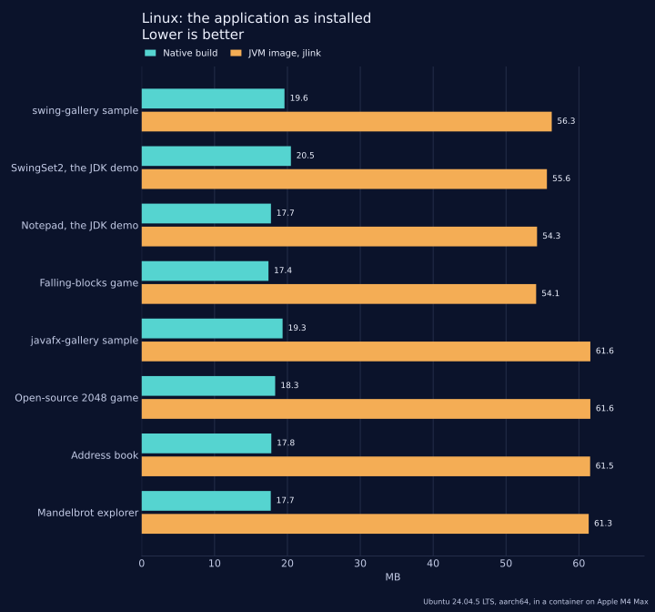
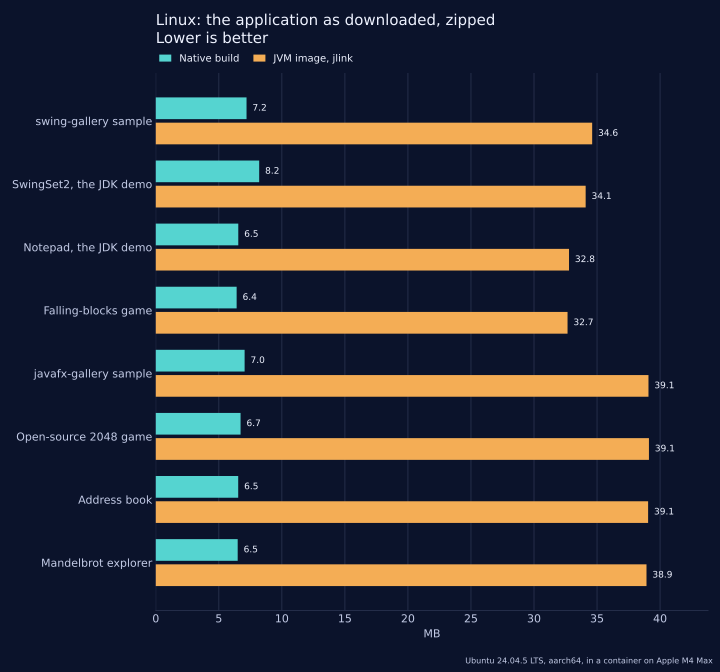
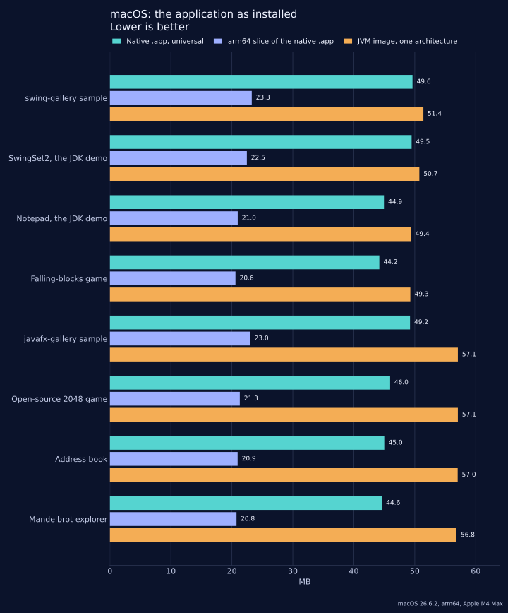
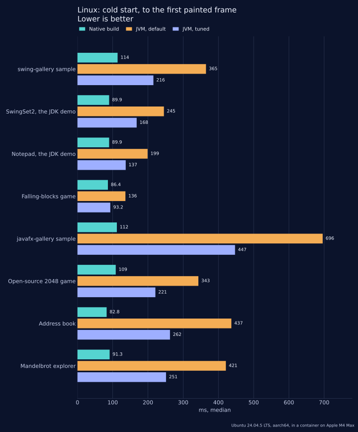
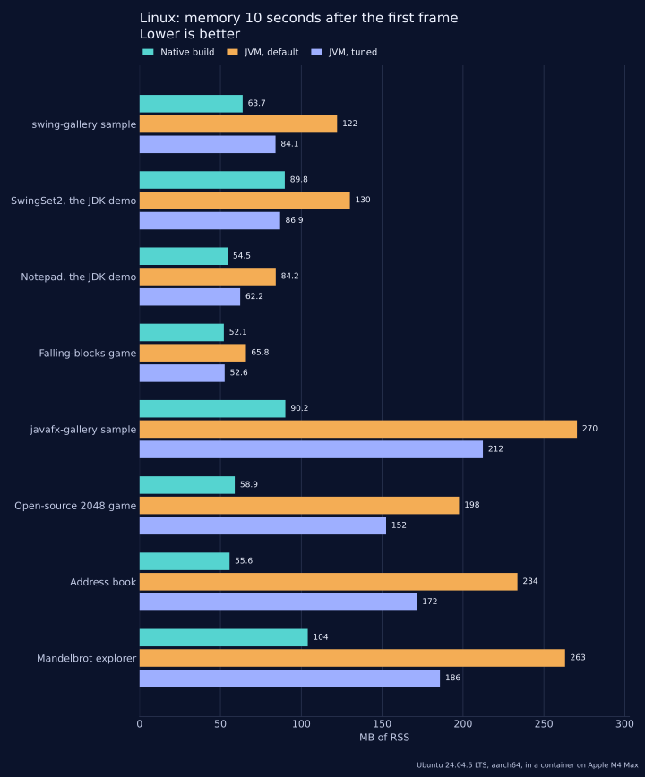

// Written by desktop-compat-benchmarks.py from measured results. Change the results and run it again;
// an edit made here is lost. Desktop-Interop.asciidoc includes this file once, whole.

.Linux: the distributed application (MB)
[cols="<3,<1,>1,>1,>1,>1,>1,>1,>1",options="header"]
|===
|Application |Toolkit |`jlink` image |`jlink` image, zipped |`jpackage` image, zipped |Native build |Native build, zipped |JVM image / native build |JVM zip / native zip

|`swing-gallery` sample |Swing |56.3 |34.6 |34.8 |19.6 |7.2 |2.9x |4.8x

|SwingSet2, the JDK demo |Swing |55.6 |34.1 |34.2 |20.5 |8.2 |2.7x |4.2x

|Notepad, the JDK demo |Swing |54.3 |32.8 |32.9 |17.7 |6.5 |3.1x |5.0x

|Falling-blocks game |Swing |54.1 |32.7 |32.8 |17.4 |6.4 |3.1x |5.1x

|`javafx-gallery` sample |JavaFX |61.6 |39.1 |39.2 |19.3 |7.0 |3.2x |5.5x

|Open-source 2048 game |JavaFX |61.6 |39.1 |39.3 |18.3 |6.7 |3.4x |5.8x

|Address book |JavaFX |61.5 |39.1 |39.2 |17.8 |6.5 |3.5x |6.0x

|Mandelbrot explorer |JavaFX |61.3 |38.9 |39.0 |17.7 |6.5 |3.5x |6.0x
|===

The `jlink` image is the application with the smallest Java runtime that runs it: the application's jars and the modules `jlink` found it to need. The native build is one executable file with nothing beside it. Both rely on the desktop libraries of the system, X11 and, for the native build and for JavaFX, GTK; neither column counts them.

Against the `jlink` image as installed the native build is smaller in 8 applications, of the 8 measured. Its best result is 3.5x for Mandelbrot explorer (17.7 MB against 61.3 MB).

Against the zipped `jlink` image the native build is smaller in 8 applications, of the 8 measured. Its best result is 6.0x for Mandelbrot explorer (6.5 MB against 38.9 MB).

.macOS: the distributed application (MB)
[cols="<3,>1,>1,>1,>1,>1,>1,>1,>1",options="header"]
|===
|Application |`jlink` image |`jlink` image, zipped |Native `.app` |arm64 slice |x86_64 slice |Native `.app`, zipped |JVM image / native `.app` |JVM zip / native zip

|`swing-gallery` sample |51.4 |32.5 |49.6 |23.3 |23.9 |16.6 |1.0x |2.0x

|SwingSet2, the JDK demo |50.7 |32.0 |49.5 |22.5 |23.1 |17.4 |1.0x |1.8x

|Notepad, the JDK demo |49.4 |30.7 |44.9 |21.0 |21.5 |15.1 |1.1x |2.0x

|Falling-blocks game |49.3 |30.6 |44.2 |20.6 |21.2 |14.8 |1.1x |2.1x

|`javafx-gallery` sample |57.1 |37.1 |49.2 |23.0 |23.8 |16.4 |1.2x |2.3x

|Open-source 2048 game |57.1 |37.1 |46.0 |21.3 |21.9 |15.4 |1.2x |2.4x

|Address book |57.0 |37.0 |45.0 |20.9 |21.6 |15.1 |1.3x |2.5x

|Mandelbrot explorer |56.8 |36.9 |44.6 |20.8 |21.4 |14.9 |1.3x |2.5x
|===

The native `.app` is universal: it holds an arm64 and an x86_64 slice and runs on both. The `jlink` image holds the runtime of one architecture, so a JVM application that runs on both ships two of them.

Against the `jlink` image as installed the native build is smaller in 6 applications and within 5% of it in 2 applications, of the 8 measured. Its best result is 1.3x for Mandelbrot explorer (44.6 MB against 56.8 MB).

Against the zipped `jlink` image the native build is smaller in 8 applications, of the 8 measured. Its best result is 2.5x for Mandelbrot explorer (14.9 MB against 36.9 MB).

.iOS and Android: the distributed application (MB)
[cols="<3,>2,>2,>2,>2,>2,>2",options="header"]
|===
|Application |iOS `.app` |iOS `.app`, zipped |iOS executable, stripped |Android APK |APK, unpacked |Of which dex

|`swing-gallery` sample |28.1 |9.4 |18.2 |3.0 |5.8 |3.9

|SwingSet2, the JDK demo |28.7 |10.5 |17.6 |4.4 |7.2 |3.8

|Notepad, the JDK demo |25.6 |8.7 |16.3 |2.9 |5.5 |3.5

|Falling-blocks game |25.1 |8.6 |16.1 |2.8 |5.3 |3.4

|`javafx-gallery` sample |27.8 |9.3 |18.0 |3.1 |5.9 |4.0

|Open-source 2048 game |26.1 |8.9 |16.7 |3.1 |6.0 |3.8

|Address book |25.4 |8.6 |16.5 |3.0 |5.8 |3.9

|Mandelbrot explorer |25.3 |8.6 |16.3 |2.9 |5.5 |3.6
|===

.How much of the compatibility runtime an application keeps
[cols="<3,<2,>1,>1,>1",options="header"]
|===
|Application |Layer |Classes handed to the builder |Classes translated |Kept

|`swing-gallery` sample |`swing-compat` |1039 |737 |71%

|`swing-gallery` sample |`compat-jdk` |345 |75 |22%

|SwingSet2, the JDK demo |`swing-compat` |1039 |587 |56%

|SwingSet2, the JDK demo |`compat-jdk` |345 |88 |26%

|Notepad, the JDK demo |`swing-compat` |1039 |566 |54%

|Notepad, the JDK demo |`compat-jdk` |345 |38 |11%

|Falling-blocks game |`swing-compat` |1039 |538 |52%

|Falling-blocks game |`compat-jdk` |344 |25 |7%

|`javafx-gallery` sample |`javafx-compat` |898 |685 |76%

|`javafx-gallery` sample |`compat-jdk` |345 |23 |7%

|Open-source 2048 game |`javafx-compat` |894 |413 |46%

|Open-source 2048 game |`compat-jdk` |345 |99 |29%

|Address book |`javafx-compat` |896 |461 |51%

|Address book |`compat-jdk` |345 |19 |6%

|Mandelbrot explorer |`javafx-compat` |893 |442 |49%

|Mandelbrot explorer |`compat-jdk` |345 |96 |28%
|===

.Linux: warm start, from process start to the first painted frame (ms, median with the range)
[cols="<3,>2,>2,>2,>2,>2",options="header"]
|===
|Application |JVM, default |JVM, tuned |Native build |Default / native |Tuned / native

|`swing-gallery` sample |327 (324-350) |194 (193-203) |104 (96-123) |3.1x |1.9x

|SwingSet2, the JDK demo |220 (205-221) |145 (144-157) |56 (54-84) |3.9x |2.6x

|Notepad, the JDK demo |175 (170-187) |123 (107-134) |55 (54-77) |3.2x |2.2x

|Falling-blocks game |115 (101-126) |82 (71-84) |85 (54-90) |1.3x |1.0x

|`javafx-gallery` sample |642 (624-684) |401 (400-418) |101 (44-118) |6.4x |4.0x

|Open-source 2048 game |307 (271-326) |190 (160-205) |77 (44-100) |4.0x |2.5x

|Address book |407 (389-452) |238 (233-266) |74 (56-88) |5.5x |3.2x

|Mandelbrot explorer |400 (392-412) |218 (184-237) |83 (78-97) |4.8x |2.6x
|===

Against the default JVM the native build is quicker in 8 applications, of the 8 measured. Its best result is 6.4x for `javafx-gallery` sample (101 ms against 642 ms).

Against the tuned JVM the native build is quicker in 7 applications and within 5% of it in 1 application, of the 8 measured. Its best result is 4.0x for `javafx-gallery` sample (101 ms against 401 ms).

.Linux: cold start, from process start to the first painted frame (ms, median with the range)
[cols="<3,>2,>2,>2,>2,>2",options="header"]
|===
|Application |JVM, default |JVM, tuned |Native build |Default / native |Tuned / native

|`swing-gallery` sample |365 (359-379) |216 (213-218) |114 (110-132) |3.2x |1.9x

|SwingSet2, the JDK demo |245 (229-255) |168 (151-180) |90 (86-95) |2.7x |1.9x

|Notepad, the JDK demo |199 (195-210) |137 (126-150) |90 (63-92) |2.2x |1.5x

|Falling-blocks game |136 (125-142) |93 (92-101) |86 (67-97) |1.6x |1.1x

|`javafx-gallery` sample |696 (662-774) |447 (428-488) |112 (110-121) |6.2x |4.0x

|Open-source 2048 game |343 (308-355) |221 (206-226) |109 (107-128) |3.2x |2.0x

|Address book |437 (428-477) |262 (258-269) |83 (63-88) |5.3x |3.2x

|Mandelbrot explorer |421 (408-436) |251 (234-261) |91 (87-95) |4.6x |2.8x
|===

Against the default JVM the native build is quicker in 8 applications, of the 8 measured. Its best result is 6.2x for `javafx-gallery` sample (112 ms against 696 ms).

Against the tuned JVM the native build is quicker in 8 applications, of the 8 measured. Its best result is 4.0x for `javafx-gallery` sample (112 ms against 447 ms).

.Linux: memory 10 seconds after the first frame (MB, RSS / PSS)
[cols="<3,>2,>2,>2,>2,>2",options="header"]
|===
|Application |JVM, default |JVM, tuned |Native build |Default RSS / native |Tuned RSS / native

|`swing-gallery` sample |122.1 / 116.6 |84.1 / 78.5 |63.7 / 55.9 |1.9x |1.3x

|SwingSet2, the JDK demo |130.1 / 126.0 |86.9 / 82.8 |89.8 / 81.3 |1.4x |1.0x

|Notepad, the JDK demo |84.2 / 80.2 |62.2 / 58.2 |54.5 / 47.0 |1.5x |1.1x

|Falling-blocks game |65.8 / 61.8 |52.6 / 48.7 |52.1 / 45.2 |1.3x |1.0x

|`javafx-gallery` sample |270.5 / 242.7 |212.3 / 184.6 |90.2 / 82.0 |3.0x |2.4x

|Open-source 2048 game |197.5 / 171.7 |152.4 / 126.6 |58.9 / 51.8 |3.4x |2.6x

|Address book |233.6 / 207.4 |171.5 / 145.2 |55.6 / 48.3 |4.2x |3.1x

|Mandelbrot explorer |263.1 / 236.0 |185.7 / 158.6 |104.0 / 96.3 |2.5x |1.8x
|===

Against the default JVM the native build is smaller in 8 applications, of the 8 measured. Its best result is 4.2x for Address book (55.6 MB against 233.6 MB).

Against the tuned JVM the native build is smaller in 6 applications and within 5% of it in 2 applications, of the 8 measured. Its best result is 3.1x for Address book (55.6 MB against 171.5 MB).

.Linux: memory after the scripted interaction (MB, RSS / PSS)
[cols="<3,>2,>2,>2,>2,>2",options="header"]
|===
|Application |JVM, default |JVM, tuned |Native build |Default RSS / native |Tuned RSS / native

|`swing-gallery` sample |123.5 / 117.9 |85.6 / 80.0 |70.9 / 63.1 |1.7x |1.2x

|SwingSet2, the JDK demo |130.8 / 126.8 |87.0 / 83.0 |92.8 / 84.3 |1.4x |0.9x

|Notepad, the JDK demo |91.0 / 87.0 |63.5 / 59.4 |58.2 / 50.6 |1.6x |1.1x

|Falling-blocks game |68.2 / 64.3 |53.9 / 50.0 |53.4 / 46.4 |1.3x |1.0x

|`javafx-gallery` sample |294.0 / 266.2 |213.2 / 185.5 |114.1 / 104.5 |2.6x |1.9x

|Open-source 2048 game |208.3 / 182.4 |155.7 / 129.8 |100.0 / 93.0 |2.1x |1.6x

|Address book |245.8 / 219.5 |172.6 / 146.3 |57.2 / 49.8 |4.3x |3.0x

|Mandelbrot explorer |264.1 / 237.0 |186.1 / 159.0 |110.5 / 102.7 |2.4x |1.7x
|===

Against the default JVM the native build is smaller in 8 applications, of the 8 measured. Its best result is 4.3x for Address book (57.2 MB against 245.8 MB).

Against the tuned JVM the native build is smaller in 6 applications, larger in 1 application and within 5% of it in 1 application, of the 8 measured. Its best result is 3.0x for Address book (57.2 MB against 172.6 MB). Its worst is 0.9x for SwingSet2, the JDK demo (92.8 MB against 87.0 MB).

.Linux: peak RSS over a whole session (MB)
[cols="<3,>2,>2,>2,>2,>2,>2",options="header"]
|===
|Application |JVM, default |JVM, tuned |Native build |Default / native |Tuned / native |Tuned `-Xmx` (MB)

|`swing-gallery` sample |126.2 |87.5 |71.1 |1.8x |1.2x |8

|SwingSet2, the JDK demo |130.9 |87.2 |92.5 |1.4x |0.9x |24

|Notepad, the JDK demo |92.9 |64.0 |57.7 |1.6x |1.1x |8

|Falling-blocks game |70.5 |54.5 |52.8 |1.3x |1.0x |8

|`javafx-gallery` sample |298.8 |215.9 |113.6 |2.6x |1.9x |48

|Open-source 2048 game |211.5 |158.6 |125.5 |1.7x |1.3x |8

|Address book |248.6 |175.3 |56.7 |4.4x |3.1x |48

|Mandelbrot explorer |266.7 |188.8 |345.7 |0.8x |0.5x |48
|===

.Linux: CPU while idle (share of one core)
[cols="<3,>2,>2,>2",options="header"]
|===
|Application |JVM, default |JVM, tuned |Native build

|`swing-gallery` sample |0.0% |0.0% |0.2%

|SwingSet2, the JDK demo |0.2% |0.0% |1.6%

|Notepad, the JDK demo |0.2% |0.0% |0.0%

|Falling-blocks game |1.2% |0.4% |0.2%

|`javafx-gallery` sample |10.3% |26.7% |5.8%

|Open-source 2048 game |3.9% |2.5% |4.8%

|Address book |0.6% |0.4% |0.0%

|Mandelbrot explorer |2.4% |2.2% |0.2%
|===

Of the 8 native builds, 5 idle at or under 1% of a core. Above it: SwingSet2, the JDK demo (1.6%), `javafx-gallery` sample (5.8%), Open-source 2048 game (4.8%).

.Where the figures were measured
* *Linux*: Ubuntu 24.04.5 LTS, aarch64, 4 CPUs, 7.7 GB of memory, in a container, hosted on Apple M4 Max. The display is a virtual framebuffer, Xvfb, of 1280 by 800 pixels. GTK 3.24.41. Each display has had one GTK program on it before the measured application starts, as a desktop session has: the first GTK program on a display loads a GL driver to choose its visuals, and no later one does. OpenJFX 23.0.2 for the JavaFX baselines.
* *Tuned JVM flags*: `-XX:+UseSerialGC -Xss256k -XX:TieredStopAtLevel=1 -XX:SharedArchiveFile=app.jsa`, and the `-Xmx` of the table above.
* *macOS, iOS and Android sizes*: macOS 26.6.2, Apple M4 Max, Xcode 27.0.
