== Graphics, drawing, images, and fonts

WARNING: Drawing is considered a low-level API that might introduce some platform fragmentation.

=== Basics - where and how to draw manually

The https://www.codenameone.com/javadoc/com/codename1/ui/Graphics.html[Graphics] class handles drawing basics, shapes, images, and text. Developers never instantiate it directly; the Codename One API passes it in.

You can gain access to a `Graphics` object using one of the following methods:

* *Derive https://www.codenameone.com/javadoc/com/codename1/ui/Component.html[Component] or a subclass of `Component`* -
 `Component` includes many methods that let developers change drawing behavior. Override them to change how the component is drawn:
** `paint(Graphics)` - invoked to draw the component, this can be overridden to draw the component from scratch.
** `paintBackground(Graphics)` / `paintBackgrounds(Graphics)` - these allow overriding the way the component background is painted although you would probably be better off implementing a painter (see below).
** `paintBorder(Graphics)` - allows overriding the process of drawing a border, notice that border drawing might differ based on the style of the component.
** `paintComponent(Graphics)` - allows painting the components contents while leaving the default paint behavior to the style.
** `paintScrollbars(Graphics)`, `paintScrollbarX(Graphics)`, `paintScrollbarY(Graphics)` allows overriding the behavior of scrollbar painting.
* *Implement the painter interface*; this interface can be used as a `GlassPane` or a background painter.
+
The painter interface is simple and includes one paint method. It lets developers perform custom painting without subclassing `Component`. Painters can be chained together to create elaborate paint behavior with the https://www.codenameone.com/javadoc/com/codename1/ui/painter/PainterChain.html[PainterChain] class.
+
** *Glass pane* - a glass pane allows developers to paint on top of the form painting. This allows an overlay effect on top of a form.
+
At first, a glass pane may seem like overriding the Form’s paint method and drawing after `super.paint(g)` completes. It isn't the same. When a component repaints by invoking `repaint()`, that component is drawn, and https://www.codenameone.com/javadoc/com/codename1/ui/Form.html[Form]’s `paint()` method isn't invoked. The glass pane painter is invoked in those cases and behaves as expected.
+
https://www.codenameone.com/javadoc/com/codename1/ui/Container.html[Container] has a glass-pane method called `paintGlass(Graphics)`, which you can override to provide a similar effect at the `Container` level. This is useful for complex containers such as https://www.codenameone.com/javadoc/com/codename1/ui/table/Table.html[Table], which draws its lines using this approach.
+
** *Background painter* - the background painter is installed through the style. By default, Codename One installs its own custom background painter. Installing a custom painter lets a developer define how the component background is drawn. +
Many background-style behaviors can also be achieved using styles alone.

IMPORTANT: A common mistake is overriding the `paint(Graphics)` method of `Form`. The problem is that a form has child components that may request a repaint. To avoid that, place a paintable component in the center of the `Form`, or override the `glass pane` or background painter.

A paint method can be implemented as such:

[source,java]
----
include::../demos/common/src/main/snippets/developer-guide/graphics.java.txt[tag=graphics-java-001,indent=0]
----

.Hi world demo code, notice that the blue bar on top is the iOS7+ status bar
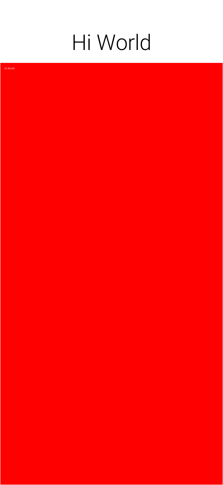

==== Painting with gradients

Solid colors are the starting point. `Graphics` also understands "paint" objects
that describe gradients and other patterns. You can pass an instance of
https://www.codenameone.com/javadoc/com/codename1/ui/Paint.html[`Paint`]
to `setColor(Paint)` in place of an integer color value to activate a gradient for
later fill and draw operations. The
https://www.codenameone.com/javadoc/com/codename1/ui/LinearGradientPaint.html[`LinearGradientPaint`]
class is the most common option and accepts a list of color stops along a line:

[source,java]
----
include::../demos/common/src/main/snippets/developer-guide/graphics.java.txt[tag=graphics-java-002,indent=0]
----

The `fillLinearGradient()` convenience methods (with optional `repeat` flag)
provide a shorthand when you need a two-color gradient without constructing
your own `Paint` object.

Radial gradients are equally straightforward using
`fillRadialGradient()` or `fillRectRadialGradient()`, which can render circular
and rectangular radial transitions respectively. These APIs accept the
inner/outer colors, focal point, and spread so you can combine them with linear
gradients to build sophisticated backgrounds and lighting effects.

For the full CSS gradient range, `Graphics` exposes a single `fillGradient`
method that consumes a `Gradient` value object. `Gradient` is a `Paint`
subclass with three concrete forms - `LinearGradient`, `RadialGradient`,
`ConicGradient` - following the same pattern as the `Shape` hierarchy:

[source,java]
----
include::../demos/common/src/main/snippets/developer-guide/graphics.java.txt[tag=graphics-java-003,indent=0]
----

`Gradient` carries the cycle method (`CYCLE_NONE` / `CYCLE_REPEAT` /
`CYCLE_REFLECT`) for repeating / reflected fills. Each port implements
`fillGradient` via the fastest native shader available - Java2D
`LinearGradientPaint` / `RadialGradientPaint` on the simulator,
`LinearGradient` / `RadialGradient` / `SweepGradient` shaders on Android - and
falls back to a software rasterizer that calls `Gradient#sampleArgb` per
pixel where no native shader exists.

==== Image blur

`Graphics.gaussianBlur(Image, float radius)` returns a blurred copy of an image
using the platform's fastest path (Core Image on iOS, RenderScript /
RenderEffect on Android, JHLabs `GaussianFilter` in the simulator). The same
blur is reachable from CSS via the `filter: blur(<length>)` and
`backdrop-filter: blur(<length>)` properties, which are stored on the
component's `Style` as `filterBlurRadius` and `backdropFilterBlurRadius`.

=== Glass pane

The `GlassPane `in Codename One is inspired by the Swing `GlassPane` & `LayeredPane` with a few twists.
You tried to imagine how Swing developers would have implemented the glass pane knowing what they do now about painters and Swings learning curve. But first: what's the glass pane?

A typical Codename One application is essentially composed of 3 layers (this is a gross simplification though),
the background painters are responsible for drawing the background of all components including the main form. The
component draws its own content (which might overrule the painter) and the glass pane paints last...

.Form layout graphic
image::img/perspective-form-layers.png[Form layout graphic,scaledwidth=20%]

Essentially the glass pane is a painter that allows you to draw an overlay on top of the Codename One application.

Overriding the paint method of a form isn't a substitute for `glasspane` as it would appear to work initially, when you enter a `Form`. For example, when modifying an element within the form that element gets repainted not the entire
`Form`!

If you have a form with a https://www.codenameone.com/javadoc/com/codename1/ui/Button.html[Button] and text drawn on top using the Form's paint method it would get erased whenever the button gets focus.

The glass pane is called whenever a component gets painted,
it paints within the clipping region of the component hence it won't break the rest of the components on the `Form` which weren't modified.

You can set a painter on a form using code like this:
[source,java]
----
include::../demos/common/src/main/snippets/developer-guide/graphics.java.txt[tag=graphics-java-004,indent=0]
----

Or you can use Java 8 lambdas to tighten the code a bit:

[source,java]
----
include::../demos/common/src/main/snippets/developer-guide/graphics.java.txt[tag=graphics-java-005,indent=0]
----

https://www.codenameone.com/javadoc/com/codename1/ui/painter/PainterChain.html[PainterChain] allows you to chain many painters together to perform different logical tasks
such as a validation painter coupled with a fade out painter. The sample below shows a crude validation panel
that allows you to draw error icons next to components while exceeding their physical bounds as is common in
many user interfaces

[source,java]
----
include::../demos/common/src/main/snippets/developer-guide/graphics.java.txt[tag=graphics-java-006,indent=0]
----

.The glass pane draws the warning sign on the border of the component peeking out
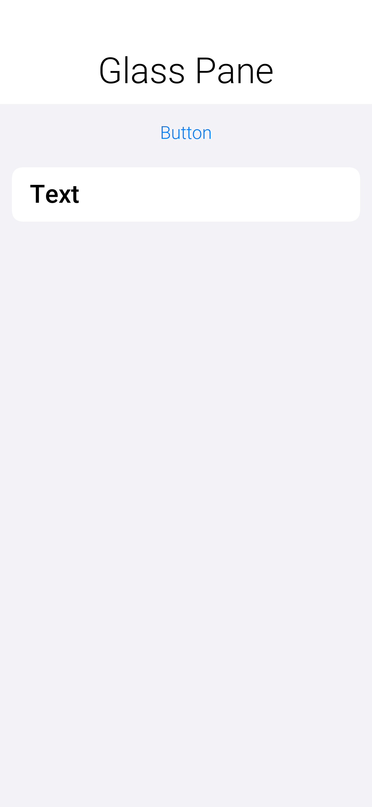

=== Shapes & transforms

The graphics API provides a high performance shape API that allows drawing arbitrary shapes by defining
paths and curves and caching the shape drawn in the GPU.

=== Device support

Shapes and transforms ship with all Codename One's actively maintained ports
(Android, iOS, JavaScript, and desktop/Simulator). Older platforms that
have reached end of life may lack these APIs, so keep the guard code shown below
if you still target them with legacy builds.

Notice that perspective transform is missing from the desktop/simulator port.
No real equivalent to perspective transform in Java SE that you could use.

=== A 2D drawing app

You can show shape drawing with a simple example of a drawing app, that allows the user to tap the screen to draw a contour picture.

The app works by keeping a https://www.codenameone.com/javadoc/com/codename1/ui/geom/GeneralPath.html[GeneralPath]
in memory, and adding points as Bézier curves. Whenever a point is added, the path is redrawn to the screen.

The center of the app is the `DrawingCanvas` class, which extends link:https://www.codenameone.com/javadoc/com/codename1/ui/Component.html[Component]:

[source,java]
----
include::../demos/common/src/main/snippets/developer-guide/graphics.java.txt[tag=graphics-java-007,indent=0]
----

Conceptually this is basic component. You will be overriding the
https://www.codenameone.com/javadoc/com/codename1/ui/Component.html#paintBackground(com.codename1.ui.Graphics)[`paintBackground()`]
method to draw the path. You keep a reference to a
link:https://www.codenameone.com/javadoc/com/codename1/ui/geom/GeneralPath.html[GeneralPath]
object (which is the concrete implementation of the https://www.codenameone.com/javadoc/com/codename1/ui/geom/Shape.html[Shape] interface in Codename One) to store each successive
point in the drawing. You also parametrize the stroke width and color.

The implementation of the `paintBackground()` method (shown above) should be straight forward. It creates
a stroke of the appropriate width, and sets the color on the graphics context. Then it calls `drawShape()` to render the path of points.

==== Implementing addpoint()

The addPoint method is designed to allow you to add points to the drawing. A simple implementation that uses
straight lines rather than curves might look like this:

[source,java]
----
include::../demos/common/src/main/snippets/developer-guide/graphics.java.txt[tag=graphics-java-008,indent=0]
----

You introduced a couple house-keeping member vars (`lastX` and `lastY`) to store the last point that was added
that you know whether this is the first tap or a later tap. The first tap triggers a `moveTo()` call, whereas
later taps trigger `lineTo()` calls, which draw lines from the last point to the current point.

A drawing might look like this:

[[linetoexample]]
.lineTo example
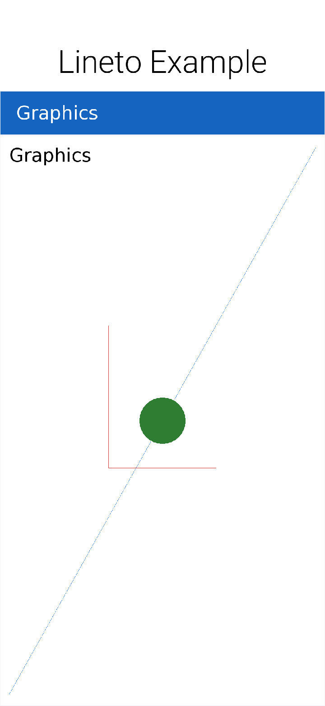

==== Using Bézier curves

Your previous implementation of addPoint() used lines for each segment of the drawing. Now make a change
to allow for smoother edges by using quadratic curves instead of lines.

Codename One's `GeneralPath` class includes two methods for drawing curves:

1. https://www.codenameone.com/javadoc/com/codename1/ui/geom/GeneralPath.html#quadTo(float,%20float,%20float,%20float)[`quadTo()`] :
 Appends a quadratic Bézier curve. It takes 2 points: a control point, and an end point.
2. link:https://www.codenameone.com/javadoc/com/codename1/ui/geom/GeneralPath.html#curveTo(float,%20float,%20float,%20float,%20float,%20float)[`curveTo()`] :
 Appends a cubic Bézier curve, taking 3 points: 2 control points, and an end point.

See the https://www.codenameone.com/javadoc/com/codename1/ui/geom/GeneralPath.html[General Path javadocs] for the full API.

You will make use of the link:https://www.codenameone.com/javadoc/com/codename1/ui/geom/GeneralPath.html#quadTo(float,%20float,%20float,%20float)[`quadTo()`]
method to append curves to the drawing as follows:

[source,java]
----
include::../demos/common/src/main/snippets/developer-guide/graphics.java.txt[tag=graphics-java-009,indent=0]
----

This change should be straight forward except, perhaps, the business with the `odd` variable. Since
quadratic curves require two points (also to the implied starting point), you can't take the last tap
point and the current tap point. You need a point between them to act as a control point. This is where you get
the curve from. The control point works by exerting a sort of "gravity" on the line segment, to pull the line towards
it. This results in the line being curved. The example uses the `odd` marker to alternate the control point between positions
above the line and below the line.

A drawing from the resulting app looks like:

.Result of quadTo example
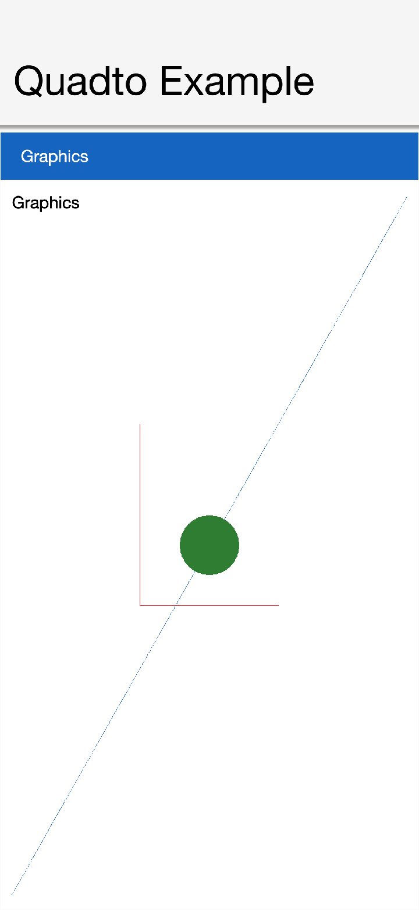

==== Detecting platform support

The `DrawingCanvas` example is a bit naive in that it assumes that the device supports the shape API. Running this code on a device that doesn't support the https://www.codenameone.com/javadoc/com/codename1/ui/geom/Shape.html[Shape] API would draw a blank canvas where the shape was
// vale-skip: Microsoft.Adverbs: "fall back gracefully" is a precise technical pattern (graceful degradation), not a softener.
expected to be drawn. You can fall back gracefully if you make use of the
https://www.codenameone.com/javadoc/com/codename1/ui/Graphics.html#isShapeSupported()[`Graphics.isShapeSupported()`] method. For example:

[source,java]
----
include::../demos/common/src/main/snippets/developer-guide/graphics.java.txt[tag=graphics-java-010,indent=0]
----

=== Transforms

The https://www.codenameone.com/javadoc/com/codename1/ui/Graphics.html[Graphics] class has included limited support for 2D transformations for some time now including scaling, rotation, and translation:

* `scale(x,y)` : Scales drawing operations by a factor in each direction.
* `translate(x,y)` : Translates drawing operations by an offset in each direction.
* `rotate(angle)` : Rotates about the origin.
* `rotate(angle, px, py)` : Rotates about a pivot point.

NOTE: `scale()` and `rotate()` methods are available on platforms that support Affine transforms. See table X for a compatibility list.

==== Device support

All current Codename One ports expose affine transforms (that's: `scale()` and
`rotate()`). Use the following table as a quick reference when deciding whether
you need a fallback path.

.Transforms Device Support
[cols="2*"]
|===
|Platform
|Affine Supported

| Simulator/Desktop
| Yes

| iOS
| Yes

| Android
| Yes

| JavaScript
| Yes

|===

You can check if a particular https://www.codenameone.com/javadoc/com/codename1/ui/Graphics.html[Graphics] context supports rotation and scaling using the `isAffineSupported()` method.

For example:

[source,java]
----
include::../demos/common/src/main/snippets/developer-guide/graphics.java.txt[tag=graphics-java-011,indent=0]
----

=== Example: Drawing an analog clock

The following sections implement an analog clock component. This will show three key concepts
in Codename One's graphics:

1. Using the `GeneralPath` class for drawing arbitrary shapes.
2. Using `Graphics.translate()` to translate your drawing position by an offset.
3. Using `Graphics.rotate()` to rotate your drawing position.

There are three separate things that need to be drawn in a clock:

1. **The tick marks**. For example: most clocks will have a tick mark for each second, larger tick marks for each hour, and
sometimes even larger tick marks for each quarter-hour.
2. **The numbers**. You will draw the clock numbers (1 through 12) in the appropriate positions.
3. **The hands**. You will draw the clock hands to point at the appropriate points to display the current time.

==== The AnalogClock Component

Your clock will extend the https://www.codenameone.com/javadoc/com/codename1/ui/Component.html[Component] class, and override the `paintBackground()` method to draw the clock as follows:

[source,java]
----
include::../demos/common/src/main/snippets/developer-guide/graphics.java.txt[tag=graphics-java-012,indent=0]
----

==== Setting up the parameters

Before you actually draw anything, take a moment to figure out what values you need to know to
draw an effective clock. Minimally, you need two values:

1. The center point of the clock.
2. The radius of the clock.

The clock also exposes the following parameters to help customize how it's rendered:

1. *The padding* (that's: the space between the edge of the component and the edge of the clock circle.
2. *The tick lengths*. The example uses 3 different lengths of tick marks on this clock. The longest ticks will be
 displayed at quarter points (that's: 12, 3, 6, and 9). Slightly shorter ticks will be displayed at the five-minute marks
 (that's: where the numbers appear), and the remaining marks (corresponding with seconds) will be short:

[source,java]
----
include::../demos/common/src/main/snippets/developer-guide/graphics.java.txt[tag=graphics-java-013,indent=0]
----

==== Drawing the tick marks

For the tick marks, you will use a single https://www.codenameone.com/javadoc/com/codename1/ui/geom/GeneralPath.html[GeneralPath] object, making use of the `moveTo()` and `lineTo()` methods
to draw each individual tick:

[source,java]
----
include::../demos/common/src/main/snippets/developer-guide/graphics.java.txt[tag=graphics-java-014,indent=0]
----

TIP: This example uses a little bit of trigonometry to calculate the `(x,y)` coordinates of the tick marks based on
the angle and the radius. If math isn't your thing, don't worry. This example makes use of the identities: `x=r*cosθ` and `y=r*sinθ`.

At this point your clock should include a series of tick marks orbiting a blank center as shown below:

.Drawing tick marks on the watch face
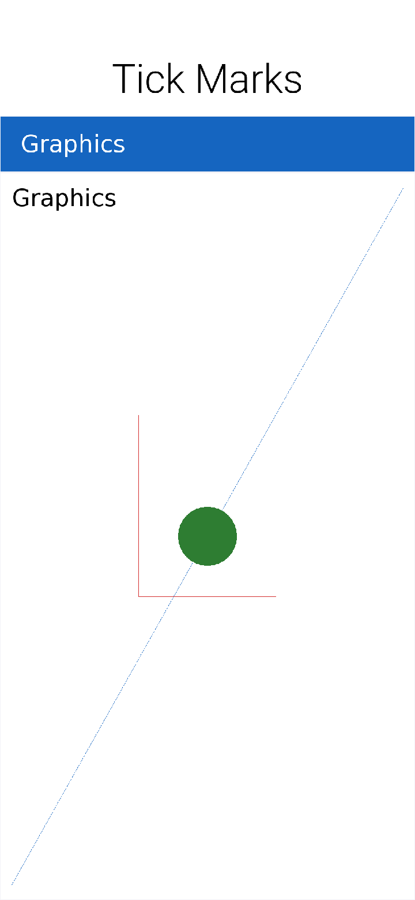

==== Drawing the numbers

The `Graphics.drawString(str, x, y)` method allows you to draw text at any point of a component. The tricky part
here is calculating the correct `x` and `y` values for each string so that the number appears in the correct location.

For the purposes of this tutorial, you will use the following strategy. For each number (1 through 12):

1. Use the `Graphics.translate(x,y)` method to apply a translation from the clock's center point to the point where the number should appear.
2. Draw number (using `drawString()`) at the clock's center. It should be rendered at the correct point due to your translation.
3. Invert the translation performed in step 1:

[source,java]
----
include::../demos/common/src/main/snippets/developer-guide/graphics.java.txt[tag=graphics-java-015,indent=0]
----

NOTE: This example is, admittedly, a little contrived to allow for a demonstration of the `Graphics.translate()` method.
You could have as passed the exact location of the number to `drawString()` rather than draw at the clock
center and translate to the correct location.

Now, you should have a clock with tick marks _and_ numbers as shown below:

.Drawing the numbers on the watch face
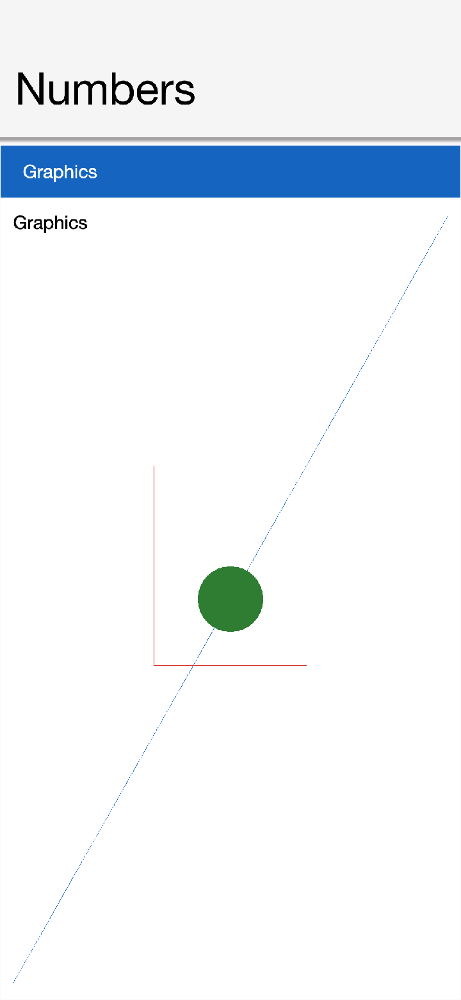

==== Drawing the hands

The clock will include three hands: Hour, Minute, and Second. You will use a separate https://www.codenameone.com/javadoc/com/codename1/ui/geom/GeneralPath.html[GeneralPath] object
for each hand. For the positioning/angle of each, use the following strategy:

1. Draw the hand at the clock center pointing toward `12` (straight up).
2. Translate the hand slightly down so that it overlaps the center.
3. Rotate the hand at the appropriate angle for the current time, using the clock center as a pivot point.

*Drawing the Second Hand*:

For the "second" hand, you will use a simple line from the clock center to the inside edge of the medium tick
mark at the 12 o'clock position:

[source,java]
----
include::../demos/common/src/main/snippets/developer-guide/graphics.java.txt[tag=graphics-java-016,indent=0]
----

And you will translate it down slightly so that it overlaps the center. This translation will be performed on the `GeneralPath` object directly rather than through the `Graphics` context:

[source,java]
----
include::../demos/common/src/main/snippets/developer-guide/graphics.java.txt[tag=graphics-java-017,indent=0]
----

*Rotating the Second Hand:*:

The rotation of the second hand will be performed in the `Graphics` context through the `rotate(angle, px, py)` method.
This requires you to calculate the angle. The `px` and `py` arguments constitute the pivot point of the rotation,
which, in your case will be the clock center.

WARNING: The rotation pivot point is expected to be in absolute screen coordinates rather than relative
coordinates of the component. You therefore need to get the absolute clock center position to perform the rotation:

[source,java]
----
include::../demos/common/src/main/snippets/developer-guide/graphics.java.txt[tag=graphics-java-018,indent=0]
----

NOTE: Remember to call `resetAffine()` after you're done with the rotation, or you will see some unexpected
results on your form.

*Drawing the Minute And Hour Hands*:

The mechanism for drawing the hour and minute hands is largely the same as for the minute hand, with a
couple of added complexities though:

1. You will make these hands trapezoidal, and almost triangular rather than using a simple line, which means the
`GeneralPath` construction will be slightly more complex.
2. Calculation of the angles will be slightly more complex because they need to consider many
parameters. For example: The hour hand angle is informed by both the hour of the day and the minute of the hour.

The remaining drawing code is as follows:

[source,java]
----
include::../demos/common/src/main/snippets/developer-guide/graphics.java.txt[tag=graphics-java-019,indent=0]
----

==== The final result

At this point, you have a complete clock as shown below:

.The final result - fully rendered watch face
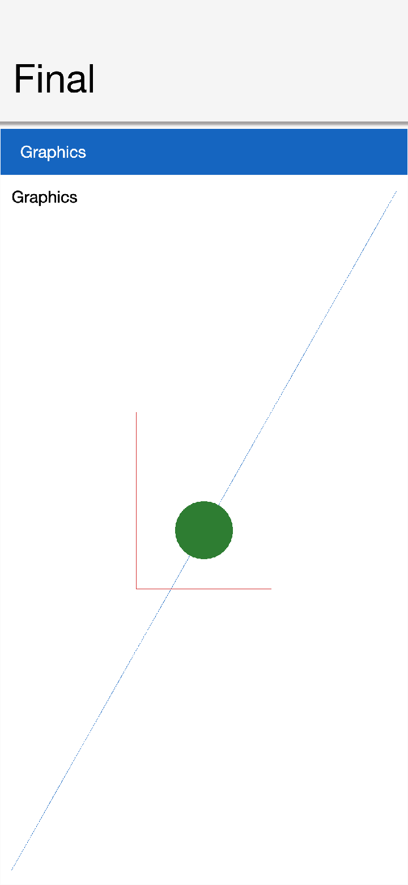

[[clock-animation-section]]
==== Animating the clock

The current clock component is cool, but it's static. It displays the time at the point the clock was created.
You discussed low-level animations in the animation section of the guide, here you will show a somewhat more elaborate
example.

To animate your clock so that it updates once per second, you need to do two things:

1. Implement the `animate()` method to show when the clock needs to be updated/re-drawn.
2. Register the component with the form so that it will receive animation "pulses."

The `animate()` method in the `AnalogClock` class:

[source,java]
----
include::../demos/common/src/main/snippets/developer-guide/graphics.java.txt[tag=graphics-java-020,indent=0]
----

This method will be invoked on each "pulse" of the EDT. It checks the last time the clock was rendered and returns
`true` if the clock hasn't been rendered in the current "time second" interval. Otherwise it returns false. This
ensures that the clock will be redrawn when the time changes.

=== Starting and stopping the animation

Animations can be started and stopped through the `Form.registerAnimated(component)` and
`Form.deregisterAnimated(component)` methods. You chose to encapsulate these calls in `start()` and `stop()`
methods in the component as follows:

[source,java]
----
include::../demos/common/src/main/snippets/developer-guide/graphics.java.txt[tag=graphics-java-021,indent=0]
----

The code to instantiate the clock, and start the animation would be something like:

[source,java]
----
include::../demos/common/src/main/snippets/developer-guide/graphics.java.txt[tag=graphics-java-022,indent=0]
----

=== Shape clipping

Clipping is one of the core tenants of graphics programming, you define the boundaries for drawing and when you exceed said boundaries things aren't drawn. Shape clipping allows you to clip based on any arbitrary `Shape` and not a rectangle, this allows some unique effects generated in runtime.

For example: this code allows you to draw a rather complex image of duke:

[source,java]
----
include::../demos/common/src/main/snippets/developer-guide/graphics.java.txt[tag=graphics-java-023,indent=0]
----

.Shape Clipping used to clip the image of duke within the given shape
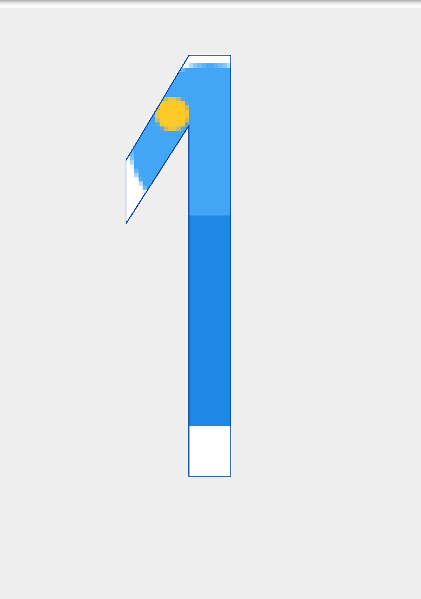

TIP: Notice that this functionality isn't available on all platforms so you need to test if shaped clipping is supported using https://www.codenameone.com/javadoc/com/codename1/ui/Graphics.html#isShapeClipSupported--[isShapeClipSupported()].

=== The coordinate system

The Codename One coordinate system follows the example of Swing (and many other - but not all-graphics
libraries) and places the origin in the upper left corner of the screen. X-values grow to the right, and Y-values
grow downward as illustrated below:

.The Codename One graphics coordinate space
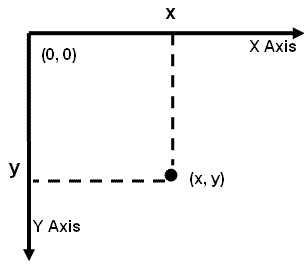

The screen origin is in the top left corner of the screen. Given this information, consider the method
call on the https://www.codenameone.com/javadoc/com/codename1/ui/Graphics.html[Graphics] context `g`:

[source,java]
----
include::../demos/common/src/main/snippets/developer-guide/graphics.java.txt[tag=graphics-java-024,indent=0]
----

Where would this rectangle be drawn on the screen?

If you answered something like "10 pixels from the top, and 10 pixels from the left of the screen,"
you _might_ be right. It depends on whether the graphics has a translation or transform applied to it. If there is
currently a translation of `(20,20)` (that's: 20 pixels to the right, and 20 pixels down), then the rectangle would be
rendered at `(30, 30)`.

You can always find out the current translation of the graphics context using the `Graphics.getTranslateX()`
and `Graphics.getTranslateY()` methods:

[source,java]
----
include::../demos/common/src/main/snippets/developer-guide/graphics.java.txt[tag=graphics-java-025,indent=0]
----

NOTE: This example glosses over issues such as clipping and transforms which may cause it to not work as you
expect. For example: When painting a component inside its `paint()` method, there is a clip applied to the context so that
 the content you draw within the bounds of the component will be seen.

If, also, there is a transform applied that rotates the context 45 degrees clockwise, then the rectangle will
be drawn at a 45-degree angle with its top left corner somewhere on the left edge of the screen.

You don't have to worry about the exact screen coordinates for the things you paint. Most of the
time, you will be concerned with relative coordinates.

==== Relative coordinates

Usually, when you're drawing onto a `Graphics` context, you're doing so within the context of a Component's
`paint()` method (or one of its variants). In this case, you don't care what the exact screen coordinates
are of your drawing. You're concerned with their relative location within the coordinate. You can leave
the positioning (and even sizing) of the coordinate up to Codename One. Thank you for reading.

To show this, create a simple component called https://www.codenameone.com/javadoc/com/codename1/ui/geom/Rectangle.html[Rectangle] component, that draws a
rectangle on the screen. You will use the component's position and size to dictate the size of the rectangle to be
drawn. And you will keep a 5 pixel padding between the edge of the component and the edge of your rectangle:

[source,java]
----
include::../demos/common/src/main/snippets/developer-guide/graphics.java.txt[tag=graphics-java-026,indent=0]
----

The result is as follows:

.The rectangle component
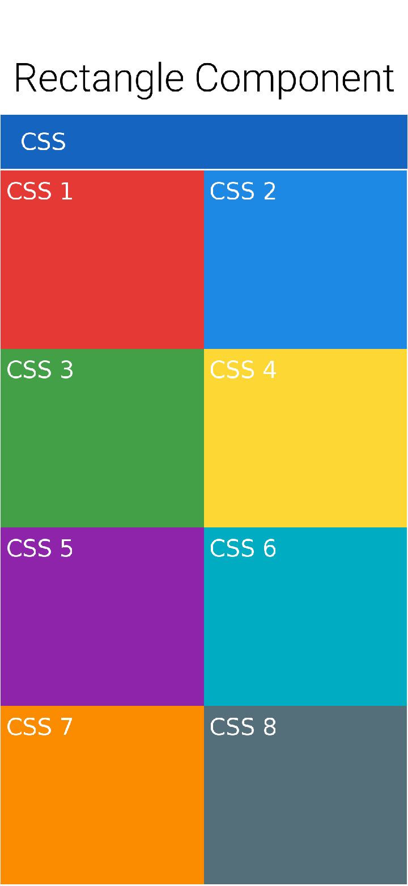

NOTE: The `x` and `y` coordinates that are passed to the `drawRect(x,y,w,h)` method are relative to the
component's _parent’s_ origin -- *not the component itself.. Its parent.* This is why you the _x_ position is `getX()+5`
and not _5_.

==== Transforms and rotations

Unlike the `Graphics` `drawXXX` primitives, methods for setting transformations, including `scale(x,y)` and
`rotate(angle)`, are always applied in screen coordinates. This can be confusing at first, because you
may be unsure whether to provide a relative coordinate or an absolute coordinate for a given method.

The general rule is:

1. *All coordinates passed to the drawXXX() and fillXXX() methods will be subject to the graphics context's
transform and translation settings*.
2. *All coordinates passed to the context's transformation settings are considered to be screen coordinates, and
aren't subject to current transform and translation settings*.

Take your `RectangleComponent` as an example. Suppose you want to rotate the rectangle by 45 degrees,
your first try might look something like:

[source,java]
----
include::../demos/common/src/main/snippets/developer-guide/graphics.java.txt[tag=graphics-java-027,indent=0]
----

TIP: When performing rotations and transformations inside a `paint()` method, always remember to revert your
transformations at the end of the method so that it doesn't pollute the rendering pipeline for later components.

The behavior of this rotation will vary based on where the component is rendered on the screen. To
show this, try to place five of these components on a form inside a https://www.codenameone.com/javadoc/com/codename1/ui/layouts/BorderLayout.html[BorderLayout] and see how it looks:

[source,java]
----
include::../demos/common/src/main/snippets/developer-guide/graphics.java.txt[tag=graphics-java-028,indent=0]
----

The result is as follows:

.Rotating the rectangle
image::img/rotation1.png[Rotating the rectangle,scaledwidth=20%]

This may not be an intuitive outcome since you drew 10 rectangle components, but you see a portion of one
rectangle. The reason is that the `rotate(angle)` method uses the screen origin as the pivot point for the rotation.
Components nearer to this pivot point will experience a less dramatic effect than components farther from it. In
your case, the rotation has caused all rectangles except the first one to be rotated outside the bounds of their
containing component, and are therefore being clipped. A more sensible solution for your component would be to place
the rotation pivot point somewhere inside the component. That way all the components would look the same.
Some possibilities would be:

Top Left Corner:

[source,java]
----
include::../demos/common/src/main/snippets/developer-guide/graphics.java.txt[tag=graphics-java-029,indent=0]
----

.Rotating the rectangle with wrong pivot point
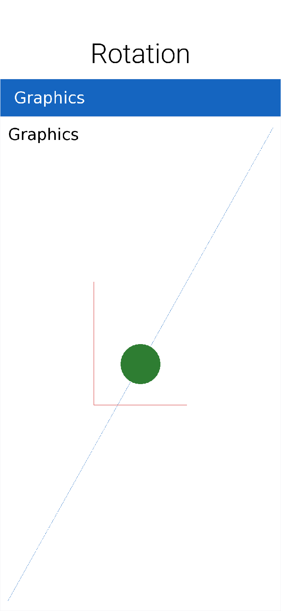

Center:

[source,java]
----
include::../demos/common/src/main/snippets/developer-guide/graphics.java.txt[tag=graphics-java-030,indent=0]
----

.Rotating the rectangle with the center pivot point
image::img/rotation3.png[Rotating the rectangle with the center pivot point,scaledwidth=20%]

You could also use the `Graphics.setTransform()` class to apply rotations and other complex transformations
(including 3D perspective transforms), but that belongs to its own topic as it's a little bit more complex.

==== Global alpha & Anti-Aliasing

Up to this point you've relied on the per-pixel alpha stored in images and gradients. `Graphics`
also lets you apply a global alpha multiplier to every draw call by using
`setAlpha(int)` or `concatenateAlpha(int)` after checking `isAlphaSupported()`.
Both methods accept values from `0` (fully transparent) to `255` (fully opaque)
and remain active until you change them again. `concatenateAlpha()` is
especially handy when you need to temporarily fade a component because it
returns the previous alpha so you can restore it later.

Anti-aliasing can likewise be toggled at runtime. Call `isAntiAliasingSupported()`
and `isAntiAliasedTextSupported()` to discover which hints the current port
exposes, then use `setAntiAliased(boolean)` and `setAntiAliasedText(boolean)` to
opt into smoother edges for shapes and glyphs respectively. These switches make
it easy to balance rendering quality versus speed depending on the type of
content you draw.

==== Event coordinates

The coordinate system and event handling are tied. You can listen for touch events on a component by
overriding the `pointerPressed(x,y)` method. The coordinates received in this method will be *absolute screen
coordinates*, so you may need to do some conversions on these coordinates before using them in your `drawXXX()`
methods.

For example: a `pointerPressed()` callback method can look like this:

[source,java]
----
include::../demos/common/src/main/snippets/developer-guide/graphics.java.txt[tag=graphics-java-031,indent=0]
----

In this case you translated these points so that they would be relative to the origin of the parent component.
This is because the `drawXXX()` methods for this component take coordinates relative to the parent component.

[[deep-into-images-section]]
=== Images

Codename One has a few image types: loaded, RGB (built-in), RGB (Codename One), Mutable,
EncodedImage, SVG, MultiImage, FontImage & Timeline. URLImage, FileEncodedImage, FileEncodedImageAsync,
and `StorageEncodedImage`/Async also exist, and are covered in the IO section.

All image types are seamless to use and will work with `drawImage` and various image related image
APIs for the most part with caveats on performance etc.

TIP: For animation images the code must invoke the `animate()` method on the image (this is done automatically by Codename One when placing the image as a background or as an icon! +
You need to do it if you invoke `drawImage` in code rather than use a built-in component).

Performance and memory wise you should read the section below and be aware of the image types you use.
The Codename One designer tries to conserve memory and be "clever" by using `EncodedImage`. While these are great for low memory you need to understand the complexities of image locking and be aware that you might pay a penalty if you don't.

Here are the pros/cons and logic behind every image type. This covers the logic of how it’s created:

[[loaded-image-section]]
==== Loaded Image

This is the basic image you get when loading an image from the jar or network using
https://www.codenameone.com/javadoc/com/codename1/ui/Image.html#createImage-java.lang.String-[Image.createImage(String)], https://www.codenameone.com/javadoc/com/codename1/ui/Image.html#createImage-java.io.InputStream-[Image.createImage(InputStream)] & https://www.codenameone.com/javadoc/com/codename1/ui/Image.html#createImage-byte:A-int-int-[Image.`createImage(byte[], int, int)`],...

TIP: Some other APIs might return this image type but those APIs do so explicitly!

In some platforms calling `getGraphics()` on an image like this will throw an exception as it's immutable). This is true for most other images as well.

This restriction might not apply for all platforms.

The image is stored in RAM based on device logic and should be reasonably efficient in drawing speed. For example, it takes up a lot of RAM.

To calculate the amount of RAM taken by a loaded image you use the following formula:

----
Image Width * Image Height * 4 = Size In RAM in Bytes
----

For example: a 50×100 image will take up 20,000 bytes of RAM.

The logic behind this is simple, every pixel contains 3 color channels and an alpha component hence 3 bytes for color and one for alpha.

NOTE: This isn't the case for all images but it's common and you prefer calculating for the worst case scenario. Even with JPEGs that don't include an alpha channel some OSes might require that more byte.

==== The RGB image's

There are two types of RGB constructed images that are different from one another but since they're both technically "RGB image's" you're bundling them under the same subsection.

===== Internal

This is a close cousin of the loaded image. This image is created using the method https://www.codenameone.com/javadoc/com/codename1/ui/Image.html#createImage-int:A-int-int-[Image.createImage(int array, int, int)] and receives the AARRGGBB data to form the image. It's more efficient than the Codename One RGB image but can't be modified, at least not on the pixel level.

The goal of this image type is to provide an easy way to render RGB data that isn't modified efficiently at platform native speeds. It's technically a <<loaded-image-section,standard "Loaded Image">> internally.

===== RGBImage class

https://www.codenameone.com/javadoc/com/codename1/ui/RGBImage.html[RGBImage] is effectively an AARRGGBB array that can be drawn by Codename One.

On most platforms this is inefficient but for some pixel level manipulations there is no other way.

An `RGBImage` is constructed with an `int` array (`int[]`) that includes `width*height` elements. You can then change the colors and alpha channel directly within the array and draw the image to any source using standard image drawing APIs.

TIP: This is inefficient in rendering speed and memory overhead. Only use this technique if there is absolutely no other way!

==== EncodedImage

https://www.codenameone.com/javadoc/com/codename1/ui/EncodedImage.html[EncodedImage] is the workhorse of Codename One. Images returned from resource files are `EncodedImage` and many APIs expect it.

The `EncodedImage` is effectively a <<loaded-image-section,loaded image>> that's "hidden" and extracted as needed to remove the memory overhead associated with loaded image. When creating an `EncodedImage` the PNG (or JPEG etc.) is loaded to an array in RAM. Such images are small (relatively) so they can be kept in memory without much overhead.

When image information is needed (pixels) the image is decoded into RAM and kept in a weak/sort reference. This allows the image to be cached for performance and allows the garbage collector to reclaim it when the memory becomes scarce.

Since the fully decoded image can be pretty big (`width X height X 4`) the ability to store the encoded image can be pretty stark. For example: taking your example above a 50×100 image will take up 20,000 bytes of RAM for a <<loaded-image-section,loaded image>> but an `EncodedImage` can reduce that to 1kb-2kb of RAM.

TIP: An `EncodedImage` might be more expensive than a <<loaded-image-section,loaded image>> as it will take up both the encoded size and the loaded size. The cost might be slightly bigger sometimes. It's main value is its ability to shrink.

When drawing an `EncodedImage` it checks the weak reference cache and if the image is cached then it's shown otherwise the image is loaded the encoded image cache it then drawn.

`EncodedImage` isn't final and can be derived to produce complex image fetching strategies for example: the https://www.codenameone.com/javadoc/com/codename1/ui/URLImage.html[URLImage] class that can dynamically download its content from the web.

`EncodedImage` can be instantiated through the create methods in the `EncodedImage` class. Pretty much any image can be converted into an `EncodedImage` through the https://www.codenameone.com/javadoc/com/codename1/ui/EncodedImage.html#createFromImage-com.codename1.ui.Image-boolean-[createFromImage(Image, boolean)] method.

.EncodedImage Locking
****
Loading the image is more expensive so you want the images that are on the current form to remain in cache (otherwise GC will thrash a lot). That's where `lock()` kicks in, when `lock()` is active you keep a hard reference to the actual native image so it won't get GC'd. This significantly improves performance!

Internally this is invoked automatically for background images, icons etc. which results in a huge performance boost. This
makes sense since these images are showing and they will be in RAM anyway. But, if you use a complex renderer or custom drawing UI you should `lock()` your images where possible!

To verify that locking might be a problem you can launch the performance monitor tool (accessible from the simulator menu), if you get log messages that show that an unlocked image was drawn you might have a problem.
****

==== MultiImage

Multi images don't physically exist as a concept within the Codename One API so there is no way to actually create them and they're in no way distinguishable from `EnclodedImage`.

The built-in support for multi images is in the resource file loading logic where a MultiImage is decoded and the version that matches the current DPI is physically loaded. From that point on user code can treat it like any other `EnclodedImage`.

The 9-image borders use multi images by default to keep their appearance more refined on the different DPI’s.

==== FontImage & Material design icons

https://www.codenameone.com/javadoc/com/codename1/ui/FontImage.html[FontImage] allows using an icon font as if it was an image. You can specify the character, color and size and then treat the `FontImage` as if its a regular image. The huge benefits are that the font image can adapt to platform conventions in color and scale to adapt to DPI.

You can generate icon fonts using free tools on the internet such as http://fontello.com/[this]. Icon fonts are a simple and powerful technique to create a small, modern applications.

Icon fonts can be created in 2 basic ways the first is explicitly by defining all the elements within the font:

[source,java]
----
include::../demos/common/src/main/snippets/developer-guide/graphics.java.txt[tag=graphics-java-032,indent=0]
----

.Icon font from material design icons created with the fixed size of display width
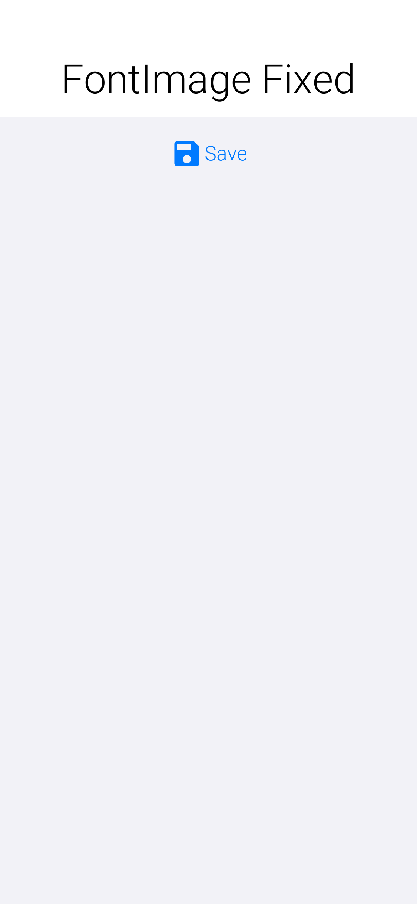

NOTE: The samples use the built-in material design icon font. This is for convenience so the sample will work out of the box, for everyone. For example you should be able to do this with any arbitrary icon font off the internet as long as its a valid TTF file.

A more common and arguably "correct" way to construct such an icon would be through the https://www.codenameone.com/javadoc/com/codename1/ui/plaf/Style.html[Style] object. The `Style` object can provide the color, size and background information needed by `FontImage`.

There are two versions of this method: the first one expects the `Style` object to have the correct icon font set to its font attribute. The second accepts a `Font` object as an argument. The latter is useful for a case where you want to reuse the same `Style` object that you defined for a general UI element for example: you can set an icon for a `Button` like this and it will take up the style of the `Button`:

[source,java]
----
include::../demos/common/src/main/snippets/developer-guide/graphics.java.txt[tag=graphics-java-033,indent=0]
----

.An image created from the Style object
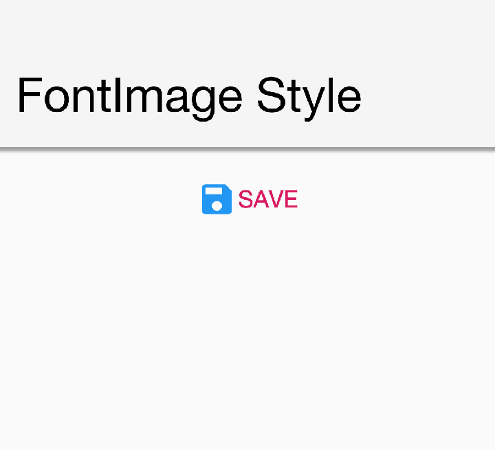

WARNING: Notice that for this specific version of the method the size of the font is used to determine the icon size. In the other methods for `FontImage` creation the size of the font is ignored!

===== Material design icons

There are many icon fonts on the web, but the field is rather volatile and constantly changing. For example, you wanted to have built-in icons that would allow you to create better looking demos and built-in components.

That's why you picked the material design icon font for inclusion in the Codename One distribution. It features a stable core set of icons, that aren't IP encumbered.

You can use the built-in font directly as demonstrated above but there are far better ways to create a material design icon. To find the icon you want you can check out the https://design.google.com/icons/[material design icon gallery]. For example: you used the save icon in the samples above.

To recreate the save icon from above you can do something like:

[source,java]
----
include::../demos/common/src/main/snippets/developer-guide/graphics.java.txt[tag=graphics-java-034,indent=0]
----

.Material save icon
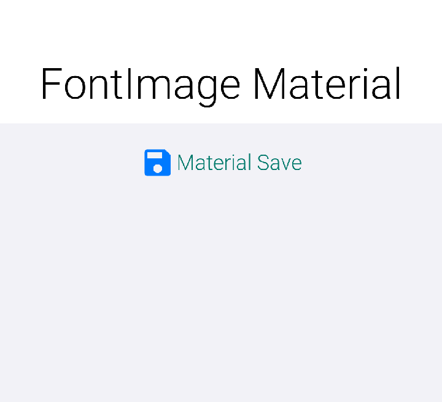

NOTE: Notice that the icon is smaller now as it's calculated based on the font size of the `Button` UIID.

You can even write the code in a more terse style using:

[source,java]
----
include::../demos/common/src/main/snippets/developer-guide/graphics.java.txt[tag=graphics-java-035,indent=0]
----

This will produce the same result for slightly shorter syntax.

TIP: `FontImage` can conflict with some complex APIs that expect a "real" image underneath. Some odd issues can often be resolved by using the `toImage()` or `toEncodedImage()` methods to convert the scaled `FontImage` to a <<loaded-image-section,loaded image>>.

==== Timeline

Timelines allow rudimentary animation and enable GIF importing using the Codename One Designer. Effectively a timeline is a set of images that can be moved rotated, scaled & blended to provide interesting animation effects. It can be created manually using the https://www.codenameone.com/javadoc/com/codename1/ui/animations/Timeline.html[Timeline] class.

==== Image masking

Image masking allows you to manipulate images by changing the opacity of an image according to a mask image. The mask image can be hardcoded or generated dynamically, it's then converted to a Mask object that can be applied to any image. Notice that the masking process is computationally intensive, it should be done once and cached/saved.

The code below can convert an image to a rounded image:

[source,java]
----
include::../demos/common/src/main/snippets/developer-guide/graphics.java.txt[tag=graphics-java-036,indent=0]
----

.Picture after the capture was complete and the resulted image was rounded. The background was set to red so the rounding effect will be more noticeable
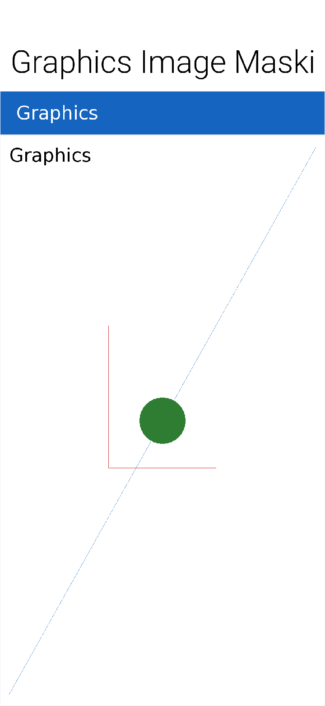

Notice that this example is simplistic to be self contained. You often recommend that developers ship "ready made" mask images with their application which can allow complex effects on the images.

==== URLImage

https://www.codenameone.com/javadoc/com/codename1/ui/URLImage.html[URLImage] is an image created with a URL, it implicitly downloads and adapts the image in the given URL while
caching it locally. The typical adapt process scales the image or crops it to fit into the same size which is a
hard restriction because of the way `URLImage` is implemented.

.How Does URLImage Work?
****
The reason for the size restriction lies in the implementation of `URLImage`. `URLImage` is physically an animated image and so the UI thread tries to invoke its `animate()` method to refresh. The `URLImage` uses that call to check if the image was fetched and if not fetches it asynchronously.

Once the image was fetched the `animate()` method returns true to refresh the UI. During the loading process the placeholder is shown, the reason for the restriction in size is that image animations can't "grow" the image. They're assumed to be fixed so the placeholder must match the dimensions of the resulting image.
****

The simple use case is pretty trivial:

[source,java]
----
include::../demos/common/src/main/snippets/developer-guide/graphics.java.txt[tag=graphics-java-037,indent=0]
----

Or you can use the similar `URLImage.createToFileSystem` method instead of the https://www.codenameone.com/javadoc/com/codename1/io/Storage.html[Storage] version.

This image can now be used anywhere a regular image will appear, it will initially show the placeholder image
and then seamlessly replace it with the file after it was downloaded and stored. Notice that if you make changes
to the image itself (for example: the `scaled` method) it will generate a new image which won't be able to fetch the actual
image.

TIP: Since https://www.codenameone.com/javadoc/com/codename1/ui/util/ImageIO.html[ImageIO] is used to perform the operations of the adapter interface its required that `ImageIO` will work.
it's working in Java SE, Android, iOS & Windows Phone.

If the file in the URL contains an image that's too big it will scale it to match the size of the placeholder precisely! +
An option also exists to fail if the sizes don't match. Notice that the image that will be saved is the scaled
image, this means you will have little overhead in downloading images that are the wrong size although you
will get some artifacts.

The last argument is powerful, its an interface called https://www.codenameone.com/javadoc/com/codename1/ui/URLImage.ImageAdapter.html[URLImage.ImageAdapter] and you can implement
it to adapt the downloaded image in any way you like. For example: you can use an image mask to automatically create a
rounded version of the downloaded image.

To do this you can override:

[source,java]
----
include::../demos/common/src/main/snippets/developer-guide/graphics.java.txt[tag=graphics-java-038,indent=0]
----

In the adapter interface and return the processed encoded image. If you do heavy processing (for example: rounded edge images)
you would need to convert the processed image back to an encoded image so it can be saved. You would then also want to show that this operation should run asynchronously through the appropriate method in the class.

If you need to download the file instantly and not wait for the image to appear before download initiates you can explicitly invoke the `fetch()` method which will asynchronously fetch the image from the network. Notice that the downloading will still take time so the placeholder is still required.

===== Authenticated image URLs — `RequestDecorator`

The standard `createToStorage` path doesn't expose the underlying
`ConnectionRequest`, so attaching an `Authorization` header (or any
other custom header / cookie / timeout) requires the `RequestDecorator`
hook. Two ways to install one:

[source,java]
----
include::../demos/common/src/main/snippets/developer-guide/graphics.java.txt[tag=graphics-java-039,indent=0]
----

For per-image overrides (for example one endpoint needs an extra API-version
header on top of the global bearer token), use the
`createToStorage(placeholder, key, url, adapter, RequestDecorator)`
overload. Per-instance decorators run *after* the global default so they
can override or augment whatever the default set:

[source,java]
----
include::../demos/common/src/main/snippets/developer-guide/graphics.java.txt[tag=graphics-java-040,indent=0]
----

When a decorator is installed (global or per-call), `URLImage` skips the
default `Util.downloadImageToStorage` path and builds a
`ConnectionRequest` inline so the decorator can inspect / mutate it
before it's queued. The legacy path remains the default for back-compat
when no decorator is set.

===== Mask adapter

A `URLImage` can be created with a mask adapter to apply an effect to an image. This allows you to round downloaded images or apply any sort of masking for example: you can adapt the round mask code above as such:

[source,java]
----
include::../demos/common/src/main/snippets/developer-guide/graphics.java.txt[tag=graphics-java-041,indent=0]
----

===== URLImage in lists

The biggest problem with image download service is with lists. You decided to attack this issue at the core by
integrating https://www.codenameone.com/javadoc/com/codename1/ui/URLImage.html[URLImage] support directly into https://www.codenameone.com/javadoc/com/codename1/ui/list/GenericListCellRenderer.html[GenericListCellRenderer] which means it will work with https://www.codenameone.com/javadoc/com/codename1/ui/list/MultiList.html[MultiList],
https://www.codenameone.com/javadoc/java/util/List.html[List] & https://www.codenameone.com/javadoc/com/codename1/ui/list/ContainerList.html[ContainerList]. To use this support define the name of the component (name not UIID) to end with
`_URLImage` and give it an icon to use as the placeholder. This is easy to do in the multilist by changing the
name of icon to `icon_URLImage` then using this in the data:

[source,java]
----
include::../demos/common/src/main/snippets/developer-guide/graphics.java.txt[tag=graphics-java-042,indent=0]
----

Make sure you also set a "real" icon to the entry in the GUI builder or in handcoded applications. This is important
since the icon will be implicitly extracted and used as the placeholder value. Everything else should be handled
automatically. You can use `setDefaultAdapter` & `setAdapter` on the generic list cell renderer to install adapters
for the images. The default is a scale adapter although you might change that to scale fill in the future:

[source,java]
----
include::../demos/common/src/main/snippets/developer-guide/graphics.java.txt[tag=graphics-java-043,indent=0]
----

The `createListEntry` method then looks like this:

[source,java]
----
include::../demos/common/src/main/snippets/developer-guide/graphics.java.txt[tag=graphics-java-044,indent=0]
----

.A URL image fetched dynamically into the list model
image::img/graphics-urlimage-multilist.png[A URL image fetched dynamically into the list model,scaledwidth=20%]

=== Charts

Codename One includes a charting toolkit in the `com.codename1.charts` package
that's designed to integrate with regular UI layouts. Charts are drawn by
creating an appropriate dataset and renderer pair, instantiating the matching
chart view class, and wrapping it in a
https://www.codenameone.com/javadoc/com/codename1/charts/ChartComponent.html[`ChartComponent`]
it can be added to a form:

[source,java]
----
include::../demos/common/src/main/snippets/developer-guide/graphics.java.txt[tag=graphics-java-045,indent=0]
----

The following classes are available for different kinds of visualisations:

[cols="1,1,2", options="header"]
|===
| Chart class
| Dataset & renderer
| Notes

| https://www.codenameone.com/javadoc/com/codename1/charts/views/BarChart.html[`BarChart`]
| `XYMultipleSeriesDataset` / `XYMultipleSeriesRenderer`
| Draws categorical data as vertical bars. The `Type` constructor parameter controls default, stacked, or heaped bars.

| https://www.codenameone.com/javadoc/com/codename1/charts/views/BubbleChart.html[`BubbleChart`]
| `XYMultipleSeriesDataset` containing `XYValueSeries` / `XYMultipleSeriesRenderer`
| Represents each data point as a circle whose size is proportional to a third value.

| https://www.codenameone.com/javadoc/com/codename1/charts/views/CombinedXYChart.html[`CombinedXYChart`]
| `XYMultipleSeriesDataset` / `XYMultipleSeriesRenderer`
| Combines several XY chart types in a single plot using `XYCombinedChartDef` to map series to chart implementations.

| https://www.codenameone.com/javadoc/com/codename1/charts/views/CubicLineChart.html[`CubicLineChart`]
| `XYMultipleSeriesDataset` / `XYMultipleSeriesRenderer`
| Smooths line series with cubic interpolation. Pass a smoothness factor to the constructor to control the curve.

| https://www.codenameone.com/javadoc/com/codename1/charts/views/DialChart.html[`DialChart`]
| `CategorySeries` / `DialRenderer`
| Renders one or more gauges on a dial, making it useful for KPI dashboards.

| https://www.codenameone.com/javadoc/com/codename1/charts/views/DoughnutChart.html[`DoughnutChart`]
| `MultipleCategorySeries` / `DefaultRenderer`
| Shows hierarchical proportions as concentric rings around a common center.

| https://www.codenameone.com/javadoc/com/codename1/charts/views/LineChart.html[`LineChart`]
| `XYMultipleSeriesDataset` / `XYMultipleSeriesRenderer`
| Connects series of points using straight line segments. Supports optional fill areas and point markers.

| https://www.codenameone.com/javadoc/com/codename1/charts/views/PieChart.html[`PieChart`]
| `CategorySeries` / `DefaultRenderer`
| Splits a circle into slices that are proportional to each category value.

| https://www.codenameone.com/javadoc/com/codename1/charts/views/RadarChart.html[`RadarChart`]
| `AreaSeries` / `DefaultRenderer`
| Draws a spider/web chart that compares multiple categories across the same set of axes.

| https://www.codenameone.com/javadoc/com/codename1/charts/views/RangeBarChart.html[`RangeBarChart`]
| `XYMultipleSeriesDataset` / `XYMultipleSeriesRenderer`
| Variation of `BarChart` that uses paired min/max values to render ranges.

| https://www.codenameone.com/javadoc/com/codename1/charts/views/RoundChart.html[`RoundChart`]
| `CategorySeries` / `DefaultRenderer`
| Abstract base class for circular charts. Use subclasses such as `PieChart`, `DoughnutChart`, or `DialChart` directly.

| https://www.codenameone.com/javadoc/com/codename1/charts/views/ScatterChart.html[`ScatterChart`]
| `XYMultipleSeriesDataset` / `XYMultipleSeriesRenderer`
| Plots unconnected X/Y points with configurable marker shapes.

| https://www.codenameone.com/javadoc/com/codename1/charts/views/TimeChart.html[`TimeChart`]
| `XYMultipleSeriesDataset` / `XYMultipleSeriesRenderer`
| Extends `LineChart` with date-aware labelling on the X axis for time series data.
|===
