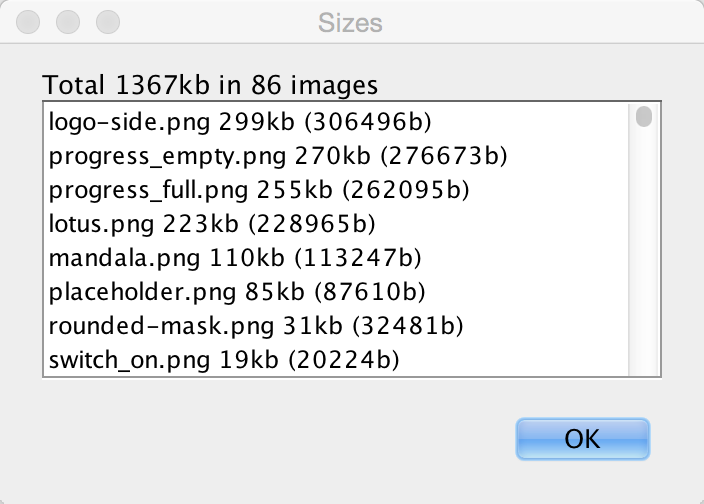
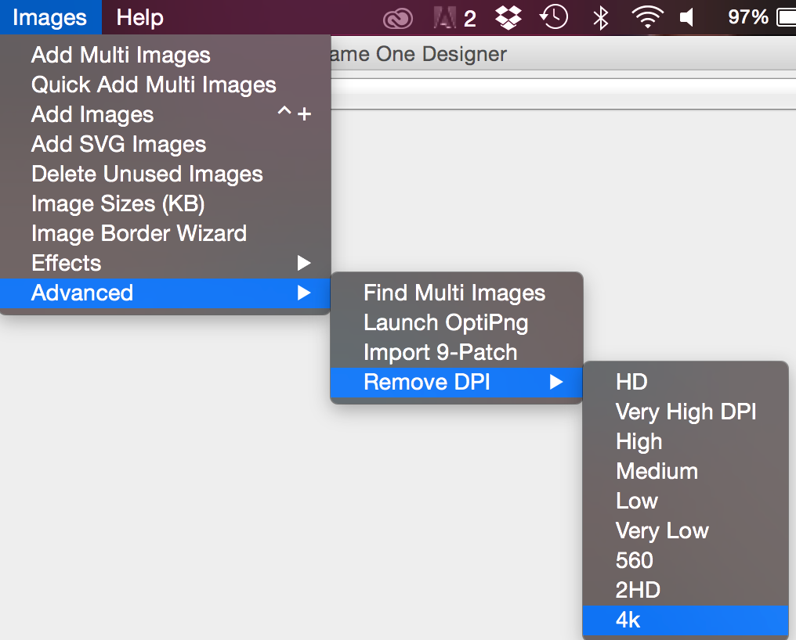
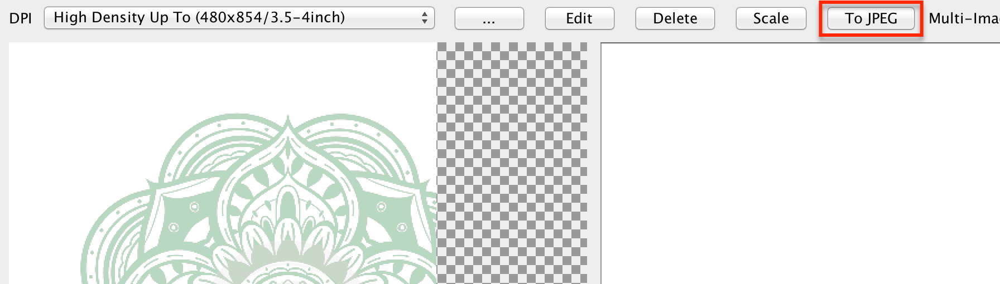
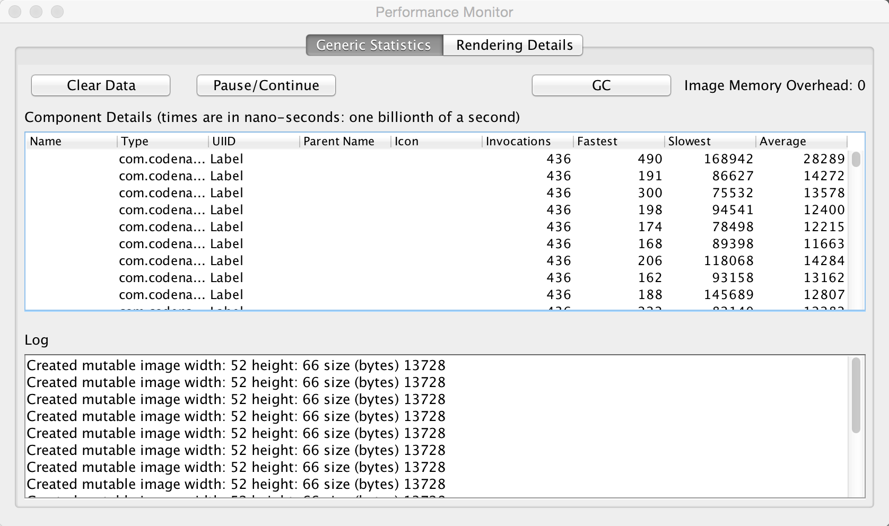
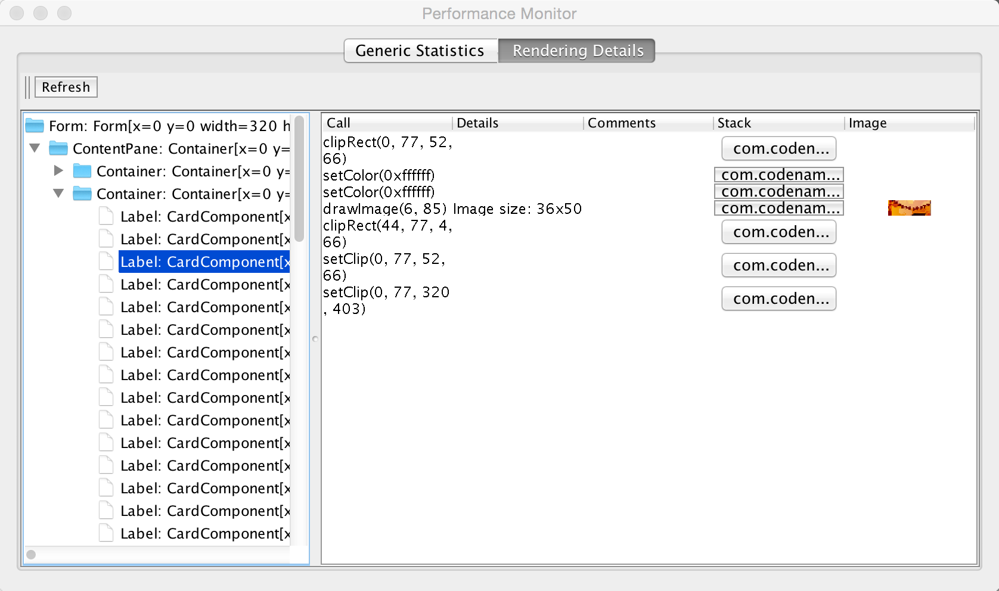
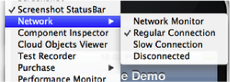
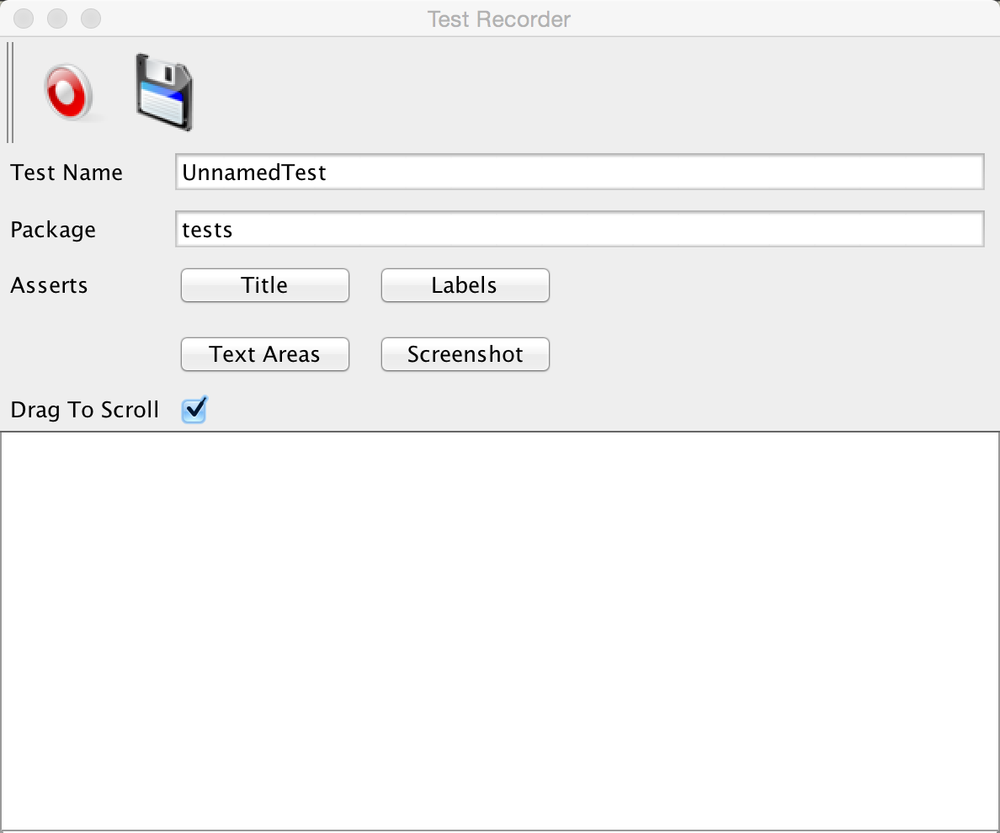
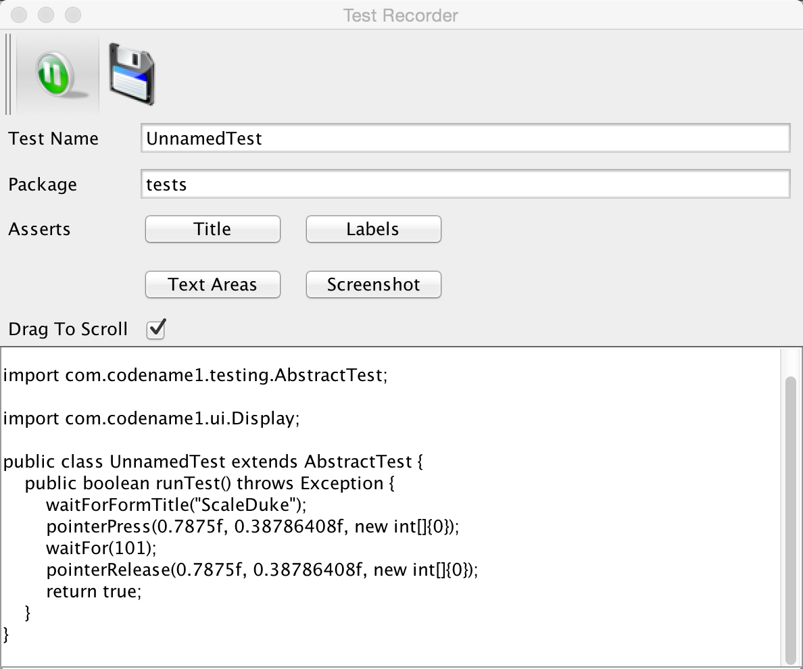
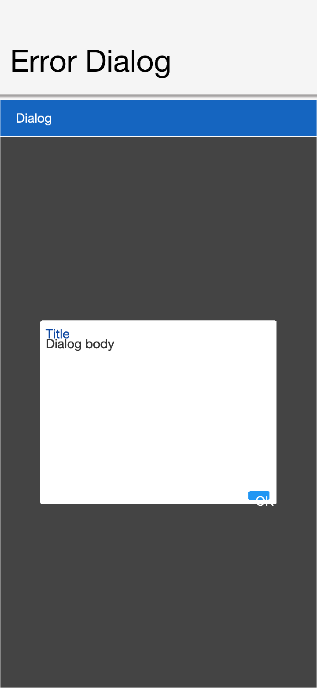

== Performance, size & debugging

=== Reducing resource file size

It’s easy to lose track of size/performance when you're working within the comforts of a visual tool like the Codename One Designer. When optimizing resource files you need to keep in mind one thing: it's all about image sizes.

TIP: Images will take up 95-99% of the resource file size; everything else pales in comparison.

Like every optimization the first rule is to reduce the size of the biggest images which will provide your biggest improvements, for this purpose Codename One provides the ability to see image sizes in kilobytes. To launch that feature use the menu item #Images# -> #Image Sizes (KB)# in the designer.

.Image sizes window that allows you to find the biggest impact on your RAM/Storage

This produces a list of images sorted by size with their sizes. Often the top entries will be multi-images, which include HD resolution values that can be pretty large. These high-resolution images take up a significant amount of space!

Just going to the multi-images, selecting the unnecessary resolutions & deleting these images can saves significant amounts of space:

.Removing unused DPI's

TIP: You can see the size in KB at the top right side in the designers image viewer

Applications using the old GUI builder can use the #Images# -> #Delete Unused Images# menu option (it’s also under the Images menu). This tool allows detecting and deleting images that aren’t used within the theme/GUI.

If you've a large image that's opaque you might want to consider converting it to JPEG and replacing the built in PNG’s. Notice that JPEG's work on all supported devices and are typically smaller.

.Convert a MultiImage to use JPEGs instead of PNGs

You can use the excellent http://optipng.sourceforge.net/[OptiPng] tool to optimize image files right from the Codename One designer. To use this feature you need to install OptiPng then select #Images# -> #Launch OptiPng# from the menu. Once you do that the tool will automatically optimize all your PNG's.

When faced with size issues make sure to check the size of your res file, if your JAR file is large open it with a tool such as 7-zip and sort elements by size. Start reviewing which element justifies the size overhead.

=== Improving performance

There are quite a few things you can do as a developer to improve the performance and memory footprint of a Codename One application. This sometimes depends on specific device behaviors but some tips here are true for all devices.

The simulator contains some tools to measure performance overhead of a specific component and also detect EDT blocking logic. Other than that follow these guidelines to create more performance code:

* *Avoid round rect borders* - they have a huge overhead on all platforms. Use image borders instead (counter intuitively they are MUCH faster)
* *Avoid Gradients* - they perform poorly on most OS's. Use a background image instead
* *Use larger images* when tiling or building image borders, using a 1 pixel (or event a few pixels) wide or high image and tiling it repeatedly can be expensive
* *Shrink resource file sizes* - Otherwise data might get collected by the garbage collector and reloading data might be expensive
* *Check that you don't have too many image lock misses* - this is discussed in the graphics section
* *On some platforms mutable images are slow* - mutable images are images you can draw on (using `getGraphics()`). On some platforms they perform quite badly (for example, iOS) and should be avoided. You can check if mutable images are fast in a platform using `Display.areMutableImagesFast()`
* * Make components either transparent or opaque * - a translucent component must paint it's parent every time. This can be expensive. An opaque component might have margins that would require that you paint the parent so there is often overdraw in such cases (overdraw means the same pixel being painted twice).

==== ParparVM native translation performance hints

For ParparVM-generated native code, Codename One now supports method-level optimization hints via annotations. These can provide good wins in hot code paths, but they come with tradeoffs and should be applied surgically.

===== Method-level codegen hints

* `@DisableDebugInfo` +
 Suppresses generated line/debug metadata for the annotated method.
 This can reduce generated C size and remove some per-instruction debug overhead.

* `@DisableNullChecksAndArrayBoundsChecks` +
 Suppresses generated null and array-bounds checks for the annotated method.
 This can reduce branch-heavy code in tight loops.

TIP: Use these on methods that are both performance-critical and well-covered by tests. These annotations intentionally trade runtime safety diagnostics for speed.

===== Class-level concrete implementation hints

For native ParparVM output (C/Objective-C), you can also provide a class-level hint that a base type always maps to a known concrete subclass at runtime:

* `@Concrete(name="fully.qualified.ConcreteClassName")` +
 Allows the translator to bypass virtual table lookup for `invokevirtual` calls on the annotated base class.
 The translator first attempts a direct call on the concrete class; if the method isn't implemented there, it falls back to the annotated base class implementation.

This is useful for platform abstraction classes where one implementation is guaranteed in the native pipeline.

For example, Codename One annotates:

[source,java]
----
@Concrete(name = "com.codename1.impl.ios.IOSImplementation")
public abstract class CodenameOneImplementation {
    // ...
}
----

NOTE: This hint is intended for ParparVM native translation and doesn't apply to the JavaScript back end.

===== Fast method-stack path

The translator can emit a fast method-stack prologue/epilogue (`DEFINE_METHOD_STACK_FAST_*` and `CN1_FAST_RETURN_RELEASE`) for methods that meet strict safety criteria.

In practice, this tends to help for:

* Small, hot methods.
* Methods without monitor usage / exception-heavy flow.
* Methods with straightforward control flow and low instruction complexity.

Tradeoffs:

* Overly broad fast-path eligibility can regress performance if extra branches or memory writes are introduced.
* Primitive- fast-frame variants may not always outperform a straightforward full clear on all targets/compilers.

TIP: Benchmark representative workloads after enabling fast-stack behavior. Keep eligibility conservative and expand where measurement shows consistent gains.

===== Base64-style hot-loop guidelines

For low-level loops (for example, Base64 encode/decode):

* Prefer simple loop bodies with predictable branches.
* Cache decode/lookup tables in primitive arrays (`int[]` lookup tables can reduce per-iteration conversion overhead).
* Avoid adding “defensive” branches in the inner-most loop unless they are required for correctness in production inputs.

===== Build configuration matters

When benchmarking translator output, ensure native projects are compiled with optimization enabled (for example, CMake `Release` builds). Debug/default builds can hide improvements or produce misleading regressions.

If you're using the integration test harness, make sure CMake is configured with:

[source]
----
-DCMAKE_BUILD_TYPE=Release
----

Without this setting, comparison between Java and ParparVM native output is often noisy and can lead to wrong optimization conclusions.

=== SIMD: Data-Parallel primitives

SIMD stands for *Single Instruction, Multiple Data*. It's a family of CPU
instructions that apply the same arithmetic or logical operation to several
values at once, packed together into a single wide register. On a 128-bit
NEON or SSE register you can hold sixteen bytes, eight 16-bit integers, four
32-bit integers, or four 32-bit floats, and a single instruction such as
`VADD` or `PADDD` then operates on every lane in parallel. For data-parallel
workloads—Base64 encode/decode, pixel blending, alpha-mask compositing,
colour-channel manipulation, table lookups—SIMD typically delivers a 3× to
10× speedup over scalar code.

Modern mobile and desktop CPUs expose several SIMD instruction sets:

* x86/x64—MMX, SSE, SSE2/3/4, AVX, AVX2, AVX-512
* ARM/ARM64—NEON (Advanced SIMD) and SVE

Codename One exposes those primitives as portable Java method calls on
https://www.codenameone.com/javadoc/com/codename1/util/Simd.html[`com.codename1.util.Simd`].
On ParparVM (iOS) the translator lowers them to NEON intrinsics; on Android
and the JavaSE simulator a pure-Java fallback in `JavaSESimd` provides the
same semantics so code written against `Simd` runs everywhere and simply
performs better where native SIMD is available.

==== When to use SIMD

SIMD is worth reaching for when *all* of the following hold:

* You are processing a buffer of at least dozens of elements at a time.
* The operation per element is simple (add, min, blend, table lookup,
  interleave/unpack) and identical across elements.
* Control flow is regular—no per-element early exit, no data-dependent
  branches that differ across lanes.
* Data is contiguous in a primitive array (`byte[]`, `int[]`, `float[]`).

Classic fits are image pixel passes, codecs (Base64, UTF-8 validation,
hex encoding), checksums, audio mixing, and vector arithmetic. Poor fits
are tight loops with pointer chasing, per-element branching on complex
state, or buffers smaller than a single SIMD register.

If you aren't sure whether your platform has a vectorized implementation
available, call `Simd.get().isSupported()`. The fallback path still returns
correct results; `isSupported()` only tells you whether you will see the
speedup.

==== Getting an instance

`Simd` is accessed as a singleton:

[source,java]
----
Simd simd = Simd.get(); // equivalent to CN.getSimd()
if (simd.isSupported()) {
    // native SIMD is wired up on this platform
}
----

The returned object is safe to cache in a field as long as the cache is
refreshed across simulator restarts (the simulator may swap the backing
implementation).

==== Allocation: alignment and provenance

SIMD load/store instructions prefer—and on some architectures require—
that the memory address they read from or write to be a multiple of the
register width (16 bytes on NEON and SSE). Misaligned access either throws
a hardware fault on strict platforms or costs extra cycles because
the CPU has to split the transaction across two cache lines. A JVM offers
no guarantee that `new byte[64]` is aligned to anything beyond the
platform's object-header convention, so the framework forbids passing
arbitrary `new`-allocated arrays to `Simd` primitives.

Every buffer used with a `Simd` primitive must so come from one of
the allocation helpers on `Simd`:

[source,java]
----
byte[]  bytes  = simd.allocByte(64);   // heap, 16-byte aligned, registered
int[]   ints   = simd.allocInt(32);    // heap, 16-byte aligned, registered
float[] floats = simd.allocFloat(32);  // heap, 16-byte aligned, registered
----

// vale-skip: write-good.TooWordy — 'minimum size' is a precise lower bound; 'least size' would be wrong.
All three methods enforce a minimum size of 16 elements and throw
// vale-skip: write-good.TooWordy — 'minimum' here refers to the numeric floor.
`IllegalArgumentException` for anything smaller; the minimum keeps each
buffer large enough to hold a full SIMD register and leaves room for
alignment padding.

WARNING: Don't construct SIMD buffers with `new byte[64]` and pass them
to `Simd`. The simulator enforces this at runtime (see _Simulator
Tracking_ below) and the iOS native path assumes alignment. Passing an
unregistered array yields either an `IllegalArgumentException` in the
simulator or undefined results on device.

==== A minimal End-to-End example

[source,java]
----
Simd simd = Simd.get();

byte[] a   = simd.allocByte(64);
byte[] b   = simd.allocByte(64);
byte[] out = simd.allocByte(64);

// fill a and b with your data (plain array writes are fine)
for (int i = 0; i < 64; i++) {
    a[i] = (byte) i;
    b[i] = (byte) (64 - i);
}

// saturating byte add, one vector instruction per 16 bytes on NEON
simd.add(a, b, out, 0, 64);
----

All `Simd` ops take explicit `offset` / `length` pairs so callers can
chunk a large buffer through a small scratch array without reallocating.
Many methods have interleaved variants—`unpackBytesInterleaved3/4`,
`packBytesInterleaved3/4`—designed for packed pixel formats (RGB, RGBA)
and fused operations like `blendByMaskTestNonzero` and
`replaceTopByteFromUnsignedBytes` that collapse common three- or
four-pass pixel pipelines into a single vector pass.

==== Scratch allocations: `alloca*`

A SIMD primitive often needs a short-lived working buffer: somewhere to
stage intermediate lanes, hold a temporary mask, or accumulate partial
results. Allocating a new `byte[]` per call via `allocByte` would dominate
the runtime of the primitive it was trying to accelerate—heap
allocation, zero-fill, and eventual GC reclamation all add up. The natural
solution is to let the compiler place these buffers on the call stack
where they cost nothing to create and are reclaimed automatically when the
method returns. This is what the `alloca*` family exposes:

[source,java]
----
byte[]  scratchB = simd.allocaByte(64);
int[]   scratchI = simd.allocaInt(32);
float[] scratchF = simd.allocaFloat(32);

// Deterministic initial contents:
byte[]  zeroed   = simd.allocaByteZeroed(64);
int[]   filled   = simd.allocaIntFilled(32, -1);
----

On the simulator (and on Android) these behave like heap allocations with
registration. On ParparVM the translator intercepts each `alloca*` call
and rewrites it into a C-level `__builtin_alloca` that carves a faux
`JavaArrayPrototype` out of the current C stack frame. The resulting
pointer masquerades as an ordinary Java array for the lifetime of the
enclosing method and is reclaimed on return.

The distinction between `allocByte` and `allocaByte` mirrors the
distinction between `new byte[N]` and C's `alloca(N)`:

[cols="1,3,3", options="header"]
|===
| | `alloc*` (heap) | `alloca*` (stack on ParparVM)
| Cost to assign | object header + zero fill + GC bookkeeping | register adjust, essentially free
| Lifetime | until last reference dropped | until enclosing method returns
| Can be stored in a field | yes | *no—use-after-free on device*
| Can be returned from the method | yes | *no*
| Can be passed to non-`Simd` methods | yes | *no*
| Initial contents | zero | undefined (use `*Zeroed` / `*Filled`)
| Size limit | heap | bounded by remaining stack
|===

NOTE: `alloca*` memory, like any stack memory, starts out containing
whatever the previous frame left behind. Callers that require predictable
initial contents should use `allocaByteZeroed` / `allocaIntZeroed` /
`allocaFloatZeroed`, or the `*Filled` variants that accept an explicit
initial value, rather than rolling their own loop.

==== Rules for `alloca*` scratch arrays

Because `alloca*` memory can't outlive its defining method on
ParparVM, the array it returns must be treated as method-local.
The framework enforces four rules at build and run time:

. Don't *return* an `alloca*` array from the method that allocated it.
. Don't *store* an `alloca*` array in an instance or static *field*, or
  into an *object array*.
. Don't pass an `alloca*` array to a method whose owner isn't `Simd`,
  `IOSSimd`, or `JavaSESimd`. Helper methods outside the SIMD package
  might themselves violate one of the other rules.
. Don't pass an `alloca*` array through `invokedynamic`; dynamic dispatch
  can't be analysed statically.

Inside the defining method you are free to pass the array to any number
of `Simd` primitives, copy values into and out of it, combine it with
other buffers, etc..

==== Build-Time verification

The Maven plugin ships a bytecode-compliance goal (`compliance-check`)
that walks every method in the application's compiled classes and
performs a dataflow pass whose only job is to track whether each value
on the operand stack or in a local variable was produced by an `alloca*`
call. The pass is an ASM `BasicInterpreter` subclass that taints every
value returned from a method on `Simd`, `IOSSimd`, or `JavaSESimd` whose
name begins with `alloca` followed by an upper-case letter. The taint
propagates through `DUP`, `ASTORE`/`ALOAD`, `CHECKCAST`, and every
control-flow merge, so a value keeps its provenance through any amount
of local plumbing.

The verifier fails the build if a tainted value reaches any of:

* `ARETURN`—"SIMD alloca value returned from method"
* `PUTFIELD` / `PUTSTATIC`—"SIMD alloca value stored into instance/static field"
* `AASTORE`—"SIMD alloca value stored into object array"
* `INVOKE*` whose owner isn't `Simd`, `IOSSimd`, or `JavaSESimd`
* `INVOKEDYNAMIC`: refused unconditionally

Every violation is reported with the offending class, method, and the
hint "Keep SIMD alloca scratch arrays method-local and only pass them to
Simd methods." Because this is wired into the Maven build, code that
would dereference freed stack memory on device can't ship.

A complementary guard lives inside the translator itself:
`CustomInvoke.appendSimdAllocaExpression` only performs stack lowering
when the length argument is a *compile-time constant*. A call like
`simd.allocaByte(n)` with a variable `n` falls through to the default
codegen and becomes a normal heap allocation, which avoids both
unbounded stack growth and an alloca whose size the translator can't
inspect.

==== Simulator tracking of aligned arrays

The JavaSE simulator runs on the desktop where there is no NEON, no
`__builtin_alloca`, and no guarantee that a given `byte[]` is 16-byte
aligned. To keep developer bugs from hiding on the desktop and
reappearing only on device, the simulator takes a strict stance: *only
arrays obtained from `Simd.alloc*` / `Simd.alloca*` are accepted as
inputs to SIMD primitives.*

Internally this is an identity-based registry. Every allocation helper
routes its result through a registration call that stores the array's
`System.identityHashCode`—the JVM's per-object identity hash, stable
for the object's lifetime regardless of GC movement. Every SIMD entry
point validates its array arguments against the same set and throws
`IllegalArgumentException` if a caller hands it a plain `new byte[64]`:

[source,text]
----
java.lang.IllegalArgumentException: SIMD array argument was not
allocated using Simd.alloc*(). objectId=…
----

Combined with the build-time verifier, both static analysis and dynamic
execution refuse to accept arrays that would not be 16-byte aligned on
device. On the device itself no such validation occurs—by that point
the build has already proved the invariant.

==== Built-In SIMD paths

You gain from SIMD without touching the API directly.
`com.codename1.util.Base64` detects `Simd.isSupported()` at encode/decode
entry points and routes the hot loop through `unpackLookupBytesInterleaved4`,
`lookupBytes`, `or`, and `shl` with cached per-call constant tables; the
bodies of `Image.applyMask`, `Image.modifyAlpha`, and `Image.removeColor`
use fused primitives like `replaceTopByteFromUnsignedBytes` and
`blendByMaskTestNonzero` to collapse multi-pass pixel pipelines into a
single vector loop.

If you are writing your own hot loop on a primitive buffer and the data
is already contiguous and aligned in a `Simd.alloc*` array, reach for the
`Simd` API before optimizing further with the ParparVM annotations
described above—vectorization and annotation hints compose, but
vectorization is the larger win.

=== Performance monitor

The Performance Monitor tool can be accessible via the #Simulator# -> #Performance Monitor# menu option in the simulator. This launches the following UI that can help you improve application performance:

.Main tab of the performance monitor: Logs and timings

The first tab of the performance monitor includes a table of the drawn components. Each entry includes the number of times it was drawn and the slowest/fastest and average drawing time. The toolbar across the top
includes Pause/Continue buttons so you can freeze the counters while you inspect
the current snapshot, a "Clear Data" action to reset the tables, and a "GC"
button that invokes the simulator's garbage collector so you can see how memory
usage changes.

This is useful if a `Form` is slow. You might be able to pinpoint it to a specific component using this tool.

The Log on the bottom includes debug related information. For example, it warns about the usage of mutable images which might be slow on some platforms. This also displays warnings when an unlocked image is drawn etc. A live
"Image Memory Overhead" meter summarizes how much native image memory the
current form consumes so you can correlate spikes with your drawing code.

.Rendering tree

The rendering tree view allows you to inspect the hierarchy painting. You can press the refresh button which will trigger the painting of the current `Form`. Every graphics operation is logged and so is the stack to it.

You can then inspect the hierarchy and see what was drawn by the various components. You can click the "stack" buttons to see the specific stack trace that lead to that specific drawing operation.

This is a powerful debugging tool as you can see "overdraw" within this tool. E.g if you see `fillRect` or similar API's invoked in the parent and then again and again in the children this could show a problem.

TIP: Android devices have a nice overdraw debugging tool

=== Network speed

.Network speed tool

This feature is actually more useful for general debugging but it's sometimes useful to simulate a slow/disconnected network to see how this affects performance.

For this purpose the Codename One simulator allows you to slow down networking or even fake a disconnected network to see how your application handles such cases.

=== Debugging Codename One sources

When you debug your app with your source code you can place breakpoints deep within Codename One and gain unique insight. You can also use the profilers and profile into Codename One to gain similar performance specific insight.

When you run into a bug or a missing feature you can push that feature/fix back to https://www.codenameone.com/[Codename One] using a pull request. Github makes that process trivial and in this new video and slides below you show you how.
The steps to use the code are:

. Signup for Github
. Fork http://github.com/codenameone/CodenameOne and
 http://github.com/codenameone/codenameone-skins
 (also star and watch the projects for good measure).
. Clone the git URL's from the projects into the IDE using the #Team# -> #Git# -> #Clone# menu option. Notice that you must deselect projects in the IDE for the menu to appear.

. Download the cn1-binaries project from github https://github.com/codenameone/cn1-binaries/archive/master.zip[here].
. Unzip the cn1-binaries project and make sure the directory has the name cn1-binaries. Verify that cn1-binaries, CodenameOne and codenameone-skins are within the same parent directory.
.In your own project remove the jars both in the build & run libraries section. Replace the build libraries with the `CodenameOne/CodenameOne` project. Replace the runtime libraries with the `CodenameOne/Ports/JavaSEPort` project.

This allows you to run the existing Codename One project with the Codename One source code and debug into Codename One. You can now also commit, push and send a pull request with the changes.

=== Device testing Framework/Unit testing

Codename One includes a built in testing framework and test recorder tool as part of the simulator. This allows developers to build both functional and unit test execution on top of Codename One. It even enables sending tests for execution on the device (pro- feature).

To get started with the testing framework, launch the application and open the test recorder in the simulator menu.

.The test recorder tool in the simulator

Once you press record a test will be generate for you as you use the application.

.Test recording in progress, when done press the save icon

You can build tests using the Codename One testing package to manipulate the Codename One UI programmatically and perform various assertions.

Unlike frameworks such as JUnit which assign a method per test, the Codename One test framework uses a class per test. This allows the framework to avoid reflection and thus allows it to work on the device.

=== EDT error handler and sendlog

Handling errors or exceptions in a deployed product is pretty difficult, most users would throw away your app and some would give it a negative rating without providing you with the opportunity to actually fix the bug that might have happened.

.Default error dialog

Google improved on this a bit by allowing users to submit stack traces for failures on Android devices but this requires the users approval for sending personal data which you might not need if you want to receive the stack trace and maybe some basic application state (without violating user privacy).

For quite some time Codename One had a powerful feature that allows you to both catch and report such errors, the error reporting feature uses the Codename One cloud which is exclusive for pro/enterprise users. In Codename One you catch all exceptions on the EDT (which is where most exceptions occur) and display an error to the user as you can see in the picture. This isn't helpful to you as developers who want to see the stack; furthermore you might prefer the user doesn't see an error message at all!

Codename One allows you to grab all exceptions that occur on the EDT and handle them using the method `addEdtErrorHandler` in the https://www.codenameone.com/javadoc/com/codename1/ui/Display.html[Display] class. Adding this to the Log's ability to report errors directly to you and you can get a powerful tool that will send you an email with information when a crash occurs!

This can be accomplished with a single line of code:

[source,java]
----
Log.bindCrashProtection(true);
----

You place this in the `init(Object)` method so all future on-device errors are emailed to you. Internally this method uses the `Display.getInstance().addEdtErrorHandler()` API to bind error listeners to the EDT. When an exception is thrown there it's swallowed (using `ActionEvent.consume()`). The `Log` data is then sent using `Log.sendLog()`.

If your crash handler runs while networking is unavailable or you want to avoid
blocking the EDT, use `Log.sendLogAsync()` instead. It performs the upload in a
background thread and is what Codename One's lifecycle helper falls back to when
regular error reporting fails.

You can also plug in your own crash reporting pipeline by calling
`Display.getInstance().setCrashReporter(CrashReport)`. The
https://www.codenameone.com/javadoc/com/codename1/system/CrashReport.html[`CrashReport`]
callback will receive the exception, device information, and log payload so you
can forward it to services like Firebase Crashlytics or your in-house tools.

To truly gain from this feature you need to use the `Log` class for all logging and exception handling instead of API's such as `System.out`.

To log standard printouts you can use the `Log.p(String)` method and to log exceptions with their stack trace you can use `Log.e(Throwable)`.

=== Kitchen sink case study

Performance is one of those vague subjects that's often taught by example.

While debugging the contacts demo (part of the new kitchen sink demo), its performance appeared sub-par. The initial assumption was that this was due to the implementation of `getAllContacts` and that there was nothing to do. Later, while debugging an unrelated issue, an anomaly was noticed during the loading of the contacts.

This led to the discovery that you're loading the same resource file over and over again for every single contact in the list!

In the new Contacts demo you've a share button for each contact, the code for constructing a `ShareButton` looks like this:

[source,java]
----
public ShareButton() {
    setUIID("ShareButton");
    FontImage.setMaterialIcon(this, FontImage.MATERIAL_SHARE);
    addActionListener(this);
    shareServices.addElement(new SMSShare());
    shareServices.addElement(new EmailShare());
    shareServices.addElement(new FacebookShare());
}
----

This seems reasonable until you realize that the constructors for `SMSShare`, `EmailShare` & `FacebookShare` load the icons for each of those...

These icons are in a shared resource file that you load and don't cache. The initial workaround was to cache this resource but a better solution was to convert this code:

[source,java]
----
public SMSShare() {
    super("SMS", Resources.getSystemResource().getImage("sms.png"));
}
----

Into this code:

[source,java]
----
public SMSShare() {
    super("SMS", null);
}

@Override
public Image getIcon() {
    Image i = super.getIcon();
    if(i == null) {
        i = Resources.getSystemResource().getImage("sms.png");
        setIcon(i);
    }
    return i;
}
----

This way the resource uses lazy loading as needed.

This small change boosted the loading performance and probably the general performance due to less memory fragmentation.

The lesson that you should learn every day is to never assume about performance...

==== Scroll performance - threads aren't magic

Another performance pitfall in this same demo came during scrolling. Scrolling was janky (uneven/unsmooth) right after loading finished would recover after a couple of minutes.

This relates to the images of the contacts.

To hasten the loading of contacts you load them all without images. You then launch a thread that iterates the contacts and loads an individual image for a contact. Then sets that image to the contact and replaces the placeholder image.

This performed well in the simulator but didn't do too well even on powerful mobile phones. You assumed this wouldn't be a problem because you used `Util.sleep()` to yield CPU time but that wasn't enough.

Often when you see performance penalty the response is: "move it to a separate thread." The problem is that this separate thread needs to compete for the same system resources and merge its changes back into the EDT. When you perform something intensive you need to make sure that the CPU isn't needed right now...

In this and past cases you solved this using a class member indicating the last time a user interacted with the UI.

Here you defined:

[source,java]
----
private long lastScroll;
----

Then you did this within the background loading thread:

[source,java]
----
// don't do anything while we are scrolling or animating
long idle = System.currentTimeMillis() - lastScroll;
while(idle < 1500 || contactsDemo.getAnimationManager().isAnimating() || scrollY != contactsDemo.getScrollY()) {
    scrollY = contactsDemo.getScrollY();
    Util.sleep(Math.min(1500, Math.max(100, 2000 - ((int)idle))));
    idle = System.currentTimeMillis() - lastScroll;
}
----

This effectively sleeps when the user interacts with the UI and loads the images if the user hasn't touched the UI in a while.

Notice that you also check if the scroll changes, this allows you to notice cases like the animation of scroll winding down.

All you need to do now is update the `lastScroll` variable whenever user interaction is in place. This works for user touches:

[source,java]
----
parentForm.addPointerDraggedListener(e -> lastScroll = System.currentTimeMillis());
----

This works for general scrolling:

[source,java]
----
contactsDemo.addScrollListener(new ScrollListener() {
    int initial = -1;
    @Override
    public void scrollChanged(int scrollX, int scrollY, int oldscrollX, int oldscrollY) {
        // scrolling is sensitive on devices...
        if(initial < 0) {
            initial = scrollY;
        }
        lastScroll = System.currentTimeMillis();
        ...
    }
});
----

NOTE: Due to technical constraints you can't use a lambda in this specific case...
