== Signing, certificates & provisioning

[[signing-section-top-heading]]
In this section you try to explain how to acquire certificates for the various platforms and how to set them up.

The good news is that this is a "one time issue" and once it's done the work becomes easier (except for the case of iOS where a provisioning profile should be maintained).

=== Common terms in signing & distribution

This section uses some terms that you might not be familiar with if you haven't used cryptography or built mobile apps before. Here is a quick "FAQ" covering some common terms/concepts in this section.

==== What's a certificate

Certificates use cryptographic principals to "sign" data (for example, an application). Think of them as you would think of a company stamp, you use them to sign an app so users know who it's from.

==== What's provisioning

Provisioning provides the hints/guidelines for the application install. For example, if an application needs some service from the OS such as push it can request that with provisioning.

In iOS provisioning is separate from the app and you need to also define the devices supported by the app during development.

==== What's a signing authority

Certificates are issued by a signing authority which is a body that certifies that you're who you say you are. Apple issues certificates for iOS and is in effect a signing authority.

Android uses self-signed certificates which don't use a signing authority so anyone can ship an Android app.

The logic with the Android approach is that a signature indicates that you're the same person who earlier shipped the app. Hence an app will be updated with the exact same certificate.

==== What's UDID

The UDID is the Universal Device Identifier. It identifies mobile devices uniquely, notice that some operating systems for example, iOS block access to this value due to privacy concerns.

You need the iOS device UDID value during development to add the device into the list of allowed devices.

IMPORTANT: Don't use an app to get the UDID! +
Most return the wrong value. Use the Finder device summary (macOS), Apple Configurator, or a trusted service such as http://get.udid.io/ which seems to work rather well

==== Should you reuse the same certificate for all apps

For iOS yes. It's designed to work in that way.

You would recommend it for all platforms for simplicity but some developers prefer creating per-application certificates for Android. The advantage here is that you can transfer ownership of the application later on without giving away what's effectively "your house keys."

[[certificate-wizard]]
=== Certificate Wizard

Codename One features a standalone Certificate Wizard to manage signing assets for Apple, Android and desktop targets. It replaces the old certificate wizard inside `CodenameOneSettings` and is launched as a Maven tool bound to the current project.

Run the wizard from a Codename One Maven project:

[source,bash]
----
include::../demos/common/src/main/snippets/developer-guide/signing.sh[tag=signing-bash-001,indent=0]
----

The Maven goal resolves the wizard artifact and its runtime dependencies from Maven, then launches it with the current project's settings path. The wizard uses the Codename One cloud signing API for Apple assets and local `keytool` for Android keystores. On a first run the overview shows that the App Store Connect API key isn't configured and links to the API key page. This is an Apple credential that allows the cloud service to create and manage certificates, bundle IDs, devices, provisioning profiles, APNs keys and Mac signing assets for your Apple Developer Program team.

==== Creating the App Store Connect API key

Open https://appstoreconnect.apple.com/access/integrations/api[App Store Connect > Users and Access > Integrations > App Store Connect API]. If this is the first time your team uses the API, App Store Connect asks you to request API access first. Click *Request Access*, accept the terms, and submit the request.

Once access is enabled, go to *Team Keys* and click *Generate API Key*. Give the key a recognizable name, such as `Codename One Signing`, and choose *Admin* access.

IMPORTANT: Use *Admin* access for the Certificate Wizard. The wizard needs to create and list signing certificates, bundle IDs, devices, and provisioning profiles. App Manager or Developer access may not be sufficient for these operations.

After creating the key, App Store Connect shows the *Issuer ID* above the table and the *Key ID* in the key row. Copy both values into the wizard. Download the API key file. Apple only allows the `.p8` file to be downloaded once, so store a backup in a secure location.

In the Codename One Certificate Wizard, fill these fields:

* *Key ID*: The value shown in the generated key row in App Store Connect. This isn't your Apple ID.
* *Issuer ID*: The UUID shown above the Team Keys table on the App Store Connect API page.
* *Private key .p8*: Click *Import .p8 file* to select the downloaded file with the native file chooser, or paste the full file contents, including the `BEGIN PRIVATE KEY` and `END PRIVATE KEY` lines.

The `.p8` private key is sent to the Codename One cloud signing service and isn't returned by the API later. If you delete the key from App Store Connect or lose the local `.p8` backup, generate and store a new API key.

When you download a generated `.p12` certificate from the wizard, the *P12 password* field is a new password that you choose for that downloaded file. It's not the App Store Connect Issuer ID, and it doesn't come from Apple.

==== Recommended fast path: Auto Setup

After the API key is stored, the top toolbar shows *Auto Setup* next to the API key status. This is the recommended path for a normal Codename One project. It creates the common Apple signing assets for the current project and installs the downloaded files into `codenameone_settings.properties`.

.Certificate wizard overview with mocked signing assets
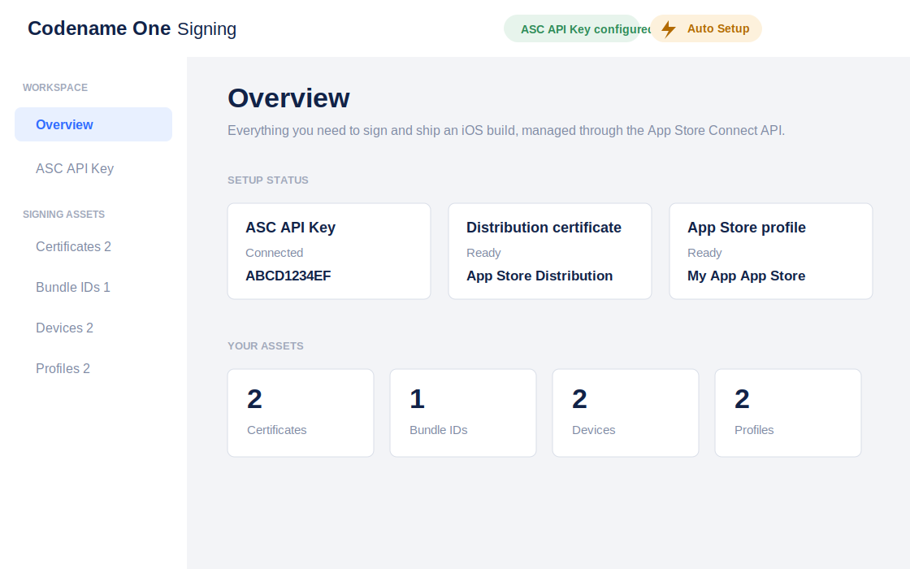

Click *Auto Setup*. The wizard reads the current project's `codenameone_settings.properties`, uses `codename1.packageName` as the bundle ID, uses `codename1.displayName` or `codename1.mainName` as the app name, enables push notifications for the bundle ID, and then creates or reuses the signing assets it needs.

The fast path creates the common Apple signing setup:

* A Bundle ID for the current project, if it doesn't already exist.
* An iOS Development certificate, if no compatible active certificate exists.
* An iOS Development provisioning profile, if at least one development device is registered.
* An iOS Distribution certificate, if no compatible active certificate exists.
* An App Store provisioning profile.
* Debug signing settings for the development certificate/profile pair.
* Release signing settings for the App Store certificate/profile pair.
* Mac App Store or Developer ID assets when you use the Mac Signing page.

Development provisioning requires at least one registered device. If no devices are registered, the wizard defers development profile creation and continues with the App Store signing assets. Register the device in the *Devices* section and run *Auto Setup* again to fill in the debug signing settings.

.Certificate wizard API key screen with mocked values
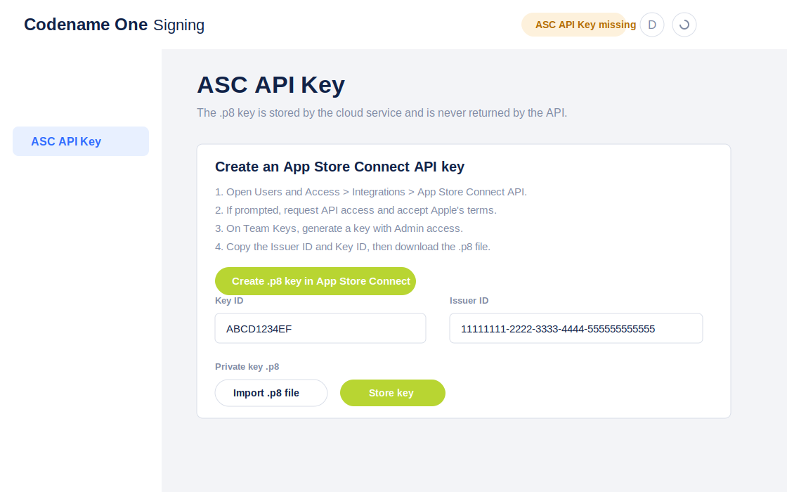

.Certificate wizard profiles screen with mocked values
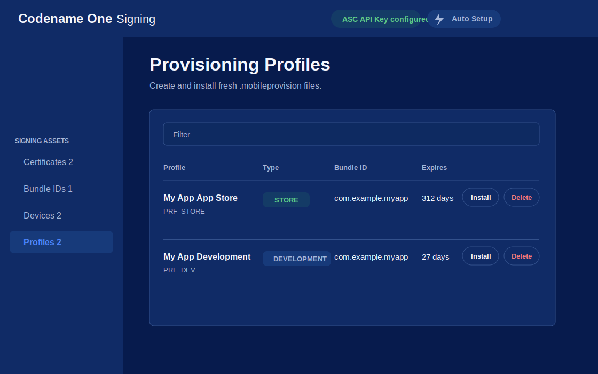

The wizard writes downloaded Apple `.p12`, `.mobileprovision` and Mac `.provisionprofile` files into the current project signing configuration. For a development iOS profile it updates the iOS debug settings. For an App Store iOS profile it updates the iOS release settings. For Mac profiles it updates `codename1.mac.certificate`, `codename1.mac.certificatePassword`, `codename1.mac.provision` and the relevant `macNative.*` hints.

==== Mac signing and notarization

The *Mac* section uses the same App Store Connect API key and the unified Apple signing API. It supports Mac App Store certificates/profiles and Developer ID certificates for direct distribution. Developer ID builds can use notarization credentials derived from the stored App Store Connect key when the build server performs notarization.

Mac native signing uses the project settings documented in the Mac native chapter:

* `codename1.mac.certificate`: The generated or imported Mac `.p12`.
* `codename1.mac.certificatePassword`: The password for that `.p12`.
* `codename1.mac.provision`: The Mac `.provisionprofile`.
* `codename1.arg.macNative.enabled=true`: Enables the Mac native signing path.
* `codename1.arg.macNative.distribution=appStore` or `developerID`: Chooses the signing channel.

==== Android signing

The *Android* section generates a local self-signed Android keystore using the JDK `keytool` executable. It stores the file under `androidCerts/KeyChain.ks` in the project by default and writes:

* `codename1.android.keystore`
* `codename1.android.keystoreAlias`
* `codename1.android.keystorePassword`

WARNING: Back up the generated keystore and password. Android apps already published with one certificate can't be updated with a different certificate.

==== Windows signing

The *Windows* section doesn't issue certificates. Windows Authenticode certificates must come from a code-signing certificate authority or a managed signing service such as Azure Trusted Signing, DigiCert KeyLocker, GlobalSign GCC, Sectigo, or another OV/EV provider. Once you have a `.pfx` or `.p12`, configure:

* `codename1.windows.signing.certificate`
* `codename1.windows.signing.password`
* `codename1.windows.signing.timestamp`

==== Clearing cached signing data

The *Clear Signing Data* section is a privacy tool, not a recommended part of normal signing setup or troubleshooting. Use it only when you need to delete cached signing data owned by the current Codename One account from the cloud signing service.

It clears stored Apple API credentials, generated certificate private keys, provisioning profile metadata, APNs keys and notarization data. It doesn't delete assets from Apple, but future cloud builds will need signing data to be regenerated or re-imported.

==== Manual asset management

Use the individual wizard sections when you need to inspect assets, register a device, sync certificates with Apple, create an ad-hoc or Mac profile, install a specific certificate/profile pair, generate an Android keystore, or delete/revoke an obsolete asset.

The asset tables are live-filterable and sortable. Click a row to show the values returned by the signing API. Existing Apple assets can't currently be edited through this API; for changes, create a new asset or delete/revoke the old one where Apple permits it. Destructive actions such as deleting a profile, deleting an APNs key, deleting the stored API key, or revoking a certificate prompt for confirmation.

==== Selecting devices

Development and ad-hoc provisioning profiles can only include devices that are registered on your Apple Developer account. In the standalone wizard, open the *Devices* section to register a device by name and UDID before creating a development or ad-hoc provisioning profile.

.Devices form
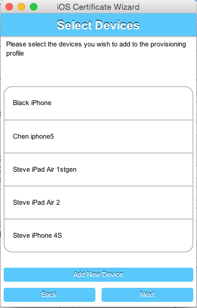

Select the ones that you want to include in your provisioning profile and click next.

NOTE: Apple allows up to 100 devices per device type (iPhone, iPad, Apple Watch, Apple TV, and Apple Vision) for testing purposes in each membership year. Make sure every device you intend to install builds on is registered here before you generate a new provisioning profile.

.After selecting devices
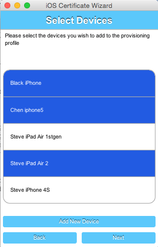

If you don't have any devices registered yet, you can click the "Add New Device" button, which will prompt you to enter the UDID for your device.

==== Decisions & edge cases

IMPORTANT: If you already have iOS P12 development/distribution certificates you should reuse them for all your apps from that account and you shouldn't regenerate them

After you click #Next# on the device form, the wizard checks to see if you already have a valid certificate. If your
project already has a valid certificate and it matches the one that's active in your Apple developer
account, then it will use the same certificate. If the certificate doesn't match the currently active one, or you
haven't provided a certificate, you will be prompted to overwrite the old certificate with a new one.

.Prompt to overwrite existing certificate
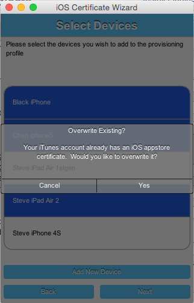

.Prompt to overwrite other certificate
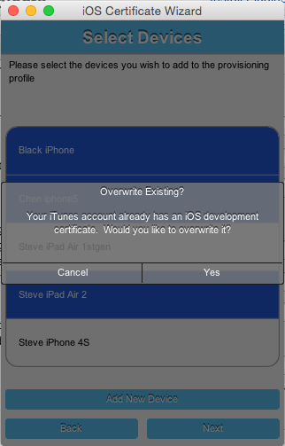

The same decision need to be made twice: Once for the development certificate, and once for the App Store distribution certificate.

TIP: Each Apple Developer account can have three active iOS Development certificates and three active iOS Distribution certificates at a time. Reuse existing certificates whenever possible to avoid hitting this limit.

TIP: You can revoke a certificate when you have an application in the store shipping with said certificate! +
This won't affect the shipping app see http://stackoverflow.com/questions/6320255/if-i-revoke-an-existing-distribution-certificate-will-it-mess-up-anything-with[this].

.Why Two Certificates?
****
A typical iOS app has at least two certificates:

- Development - this is used during development and can't be shipped to 3rd parties. An application signed with this certificate can only be installed on one of the up to 100 devices listed above.

- Distribution - this is used when you're ready to upload your app to App Store Connect whether for final shipping or beta testing. Notice that you can't install a distribution build on your own device. You need to upload it to App Store Connect.

- Two push certificates exist, separate from the signing certificates. Don't confuse them! +
They're used to authenticate with Apple when sending push messages.
****

==== App IDs and provisioning profiles

The next form in the wizard asks for your app's bundle ID. This should have been pre-filled, but you can change
the app ID to a wildcard ID if you prefer.

.Enter the app bundle ID
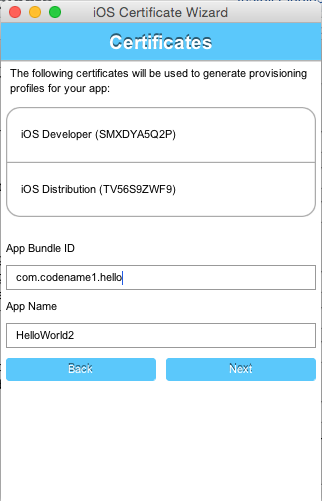

.Wildcard Card Provisioning
****
Wildcard IDs such as `com.mycompany.*` or even `*` allow one generic development profile to cover multiple applications. The standalone Certificate Wizard can reuse an existing wildcard profile, but wildcard apps can't use capabilities such as push notifications and aren't suitable for App Store distribution.
****

==== Installing files locally

Once the wizard is finished generating your provisioning profiles, you should click `Install Locally`, which will
open a file dialog for you to navigate to a folder in which to store the generated files.

.Install files locally
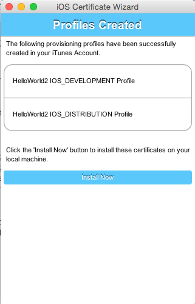

.Select directory to save files in
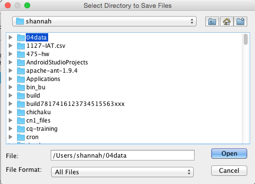

.Final Done Message

TIP: You can see the password for the P12 files in the `codenameone_settings.properties` file. You can use the values defined there when creating a new application

==== Building your app

After selecting your local install location, and closing the wizard, you should see the fields of the "iOS Signing"
properties panel filled in. You should now be able to send iOS debug or App Store builds without the usual hassles.

.Filled in signing panel after wizard complete
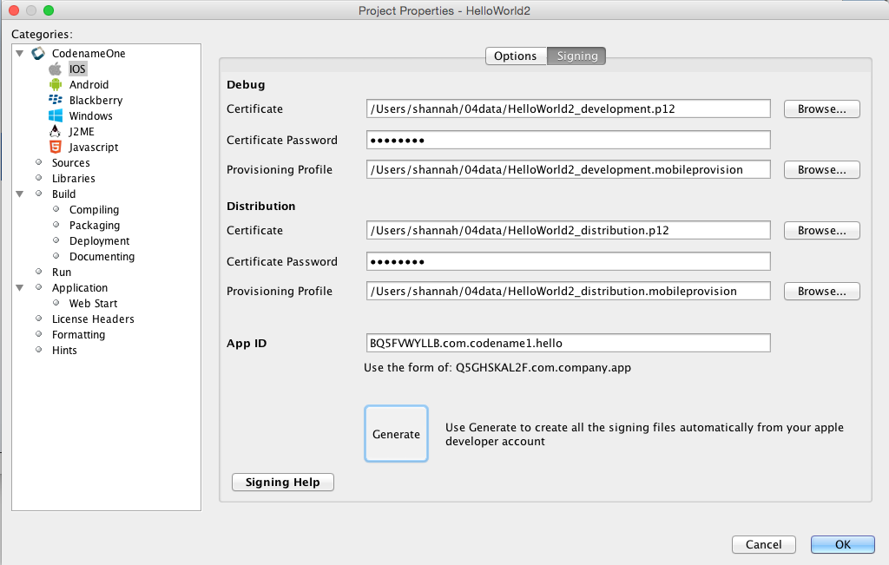

=== Advanced iOS signing

WARNING: You should use the Certificate Wizard, if you don't have a Mac. This section is here for reference and edge cases that don't work with the Certificate Wizard

iOS signing has two distinct modes: App Store signing which is valid for distribution via App Store Connect (you won't be able to run the resulting application without submitting it to Apple) and development mode signing.

You've two major files to keep track of:

1. *Certificate* - your signature
2. *Provisioning Profile* - details about the application and who is allowed to execute it

You need two versions of each file (4 total files) one pair is for development and the other pair is for uploading to App Store Connect.

IMPORTANT: You need to use a Mac to create a certificate file for iOS

The first step you need to do is signing up as a developer to http://developer.apple.com/[Apple's iOS development program], even for testing on a device this is required! +
This step requires that you pay Apple on an annual basis.

The Apple website will guide you through the process of applying for a certificate at the end of this process you should have a distribution and development certificate pair. After that point you can log in to the https://developer.apple.com/ios/manage/overview/index.action[iOS provisioning portal] where there are plenty of videos and tutorials to guide you through the process. Within the iOS provisioning portal you need to create an application ID and register your development devices.

You can then create a provisioning profile which comes in two flavors:

- Distribution - for building the release version of your application
- Development - the development provisioning profile needs to contain the devices on which you want to test.

You can then configure the 4 files in the IDE and start sending builds to the Codename One cloud.

=== Provisioning profile & certificates visual guide

One of the hardest parts in developing for iOS is the certificate & provisioning process. In this step-by-step guide you walk over the manual certificate generation process. Notice that the UI for the Apple website changes occasionally but the basic process remains the same...

Start by logging in to the iOS-provisioning portal

[[login-ios-provisioning]]
.Login for the iOS provisioning portal
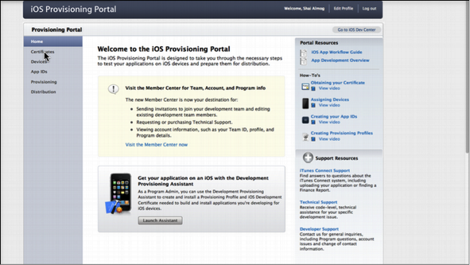

In the certificates section you can download your development and distribution certificates.

[[download-dev-provisioning-profile]]
.Download development provisioning profile
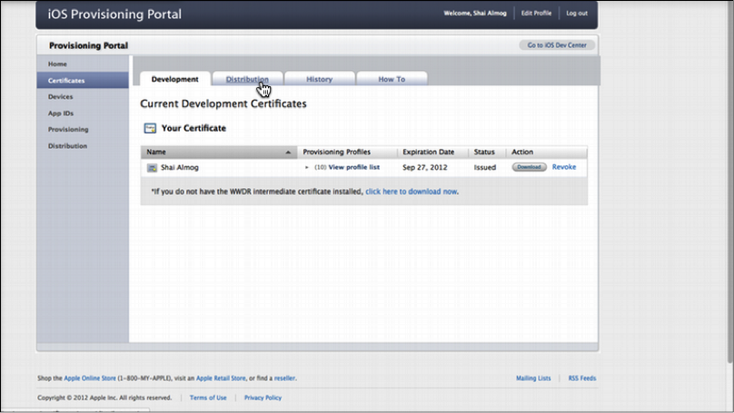

[[download-dist-provisioning-profile]]
.Download distribution provisioning profile
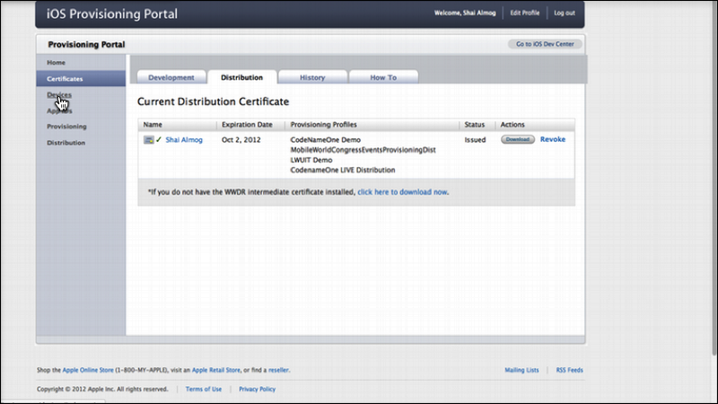

In the devices section add device ids for the development devices you want to support. Notice no more than 100 devices are supported!

[[ios-add-devices]]
.Add devices
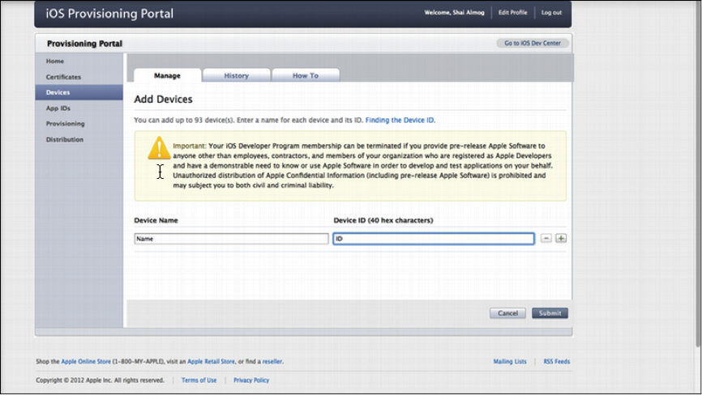

Create an application ID; it must match the package identifier of your application exactly!

.Create application ID
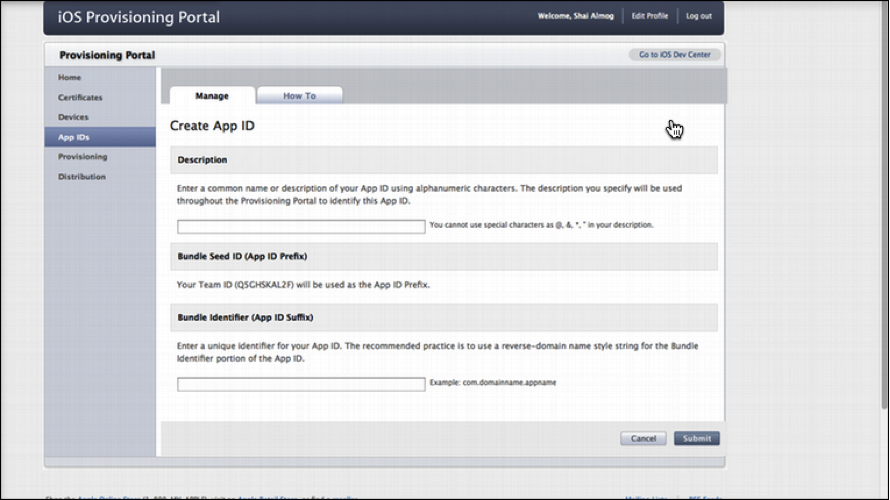

Create a provisioning profile for development, make sure to select the right app and make sure to add the devices you want to use during debug.

.Create provisioning profile step 1
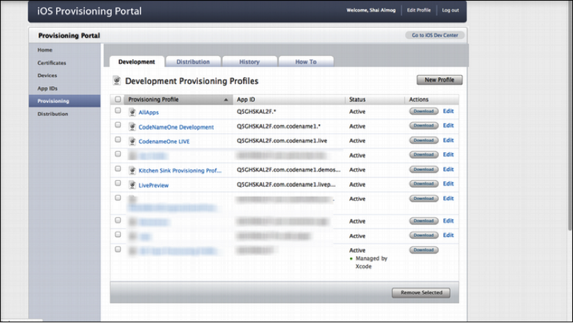

.Create provisioning profile step 2
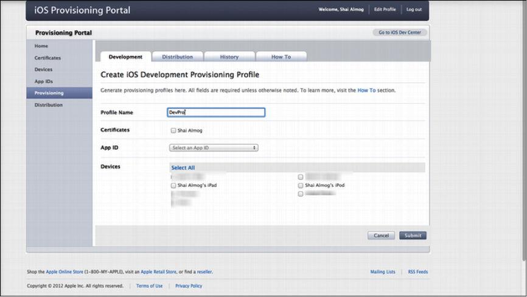

Refresh the screen to see the profile you created and press the download button to download your development provisioning profile.

.Create provisioning profile step 3
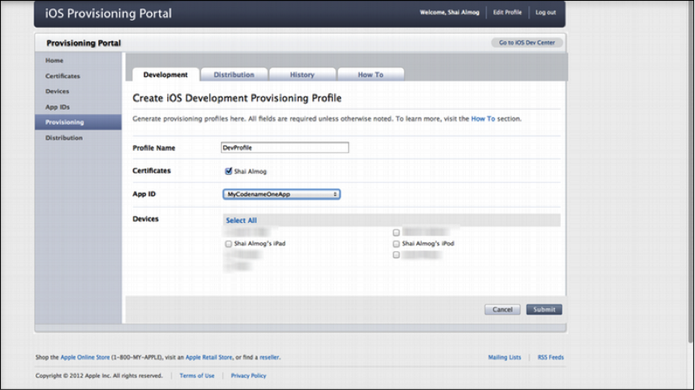

Create a distribution provisioning profile; it will be used when uploading to the App Store. No need to specify devices here.

.Create distribution provisioning profile
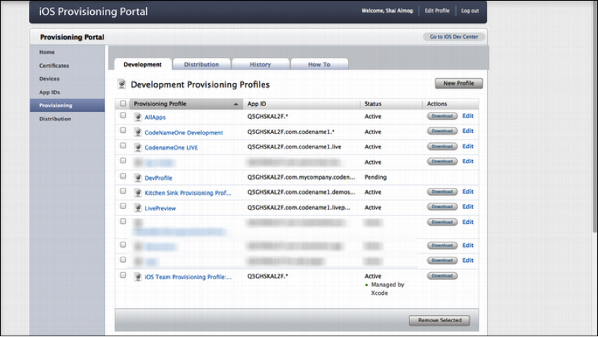

Download the distribution provisioning profile.

.Download distribution provisioning profile
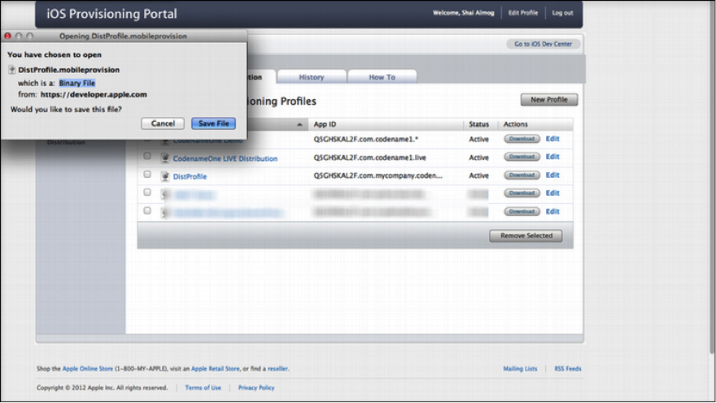

You can now import the cer files into the Keychain tool on a Mac by double clicking the file, on Windows the process is slightly more elaborate

.Import cer files
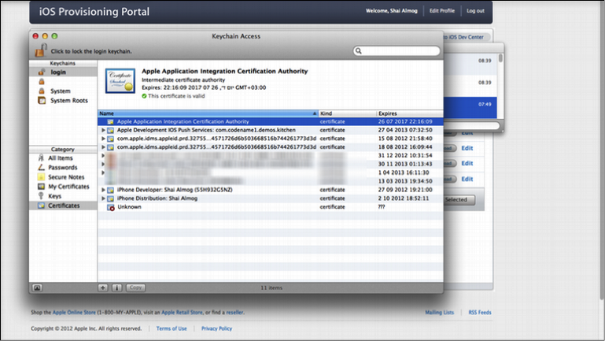

You can export the p12 files for the distribution and development profiles through the keychain tool

.Export p12 files
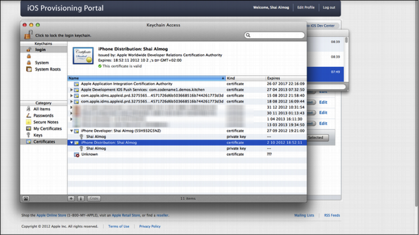

In the IDE you enter the project settings, configure your provisioning profile, the password you typed when exporting and the p12 certificates. It's now possible to send the build to the server.

.IOS Project Settings
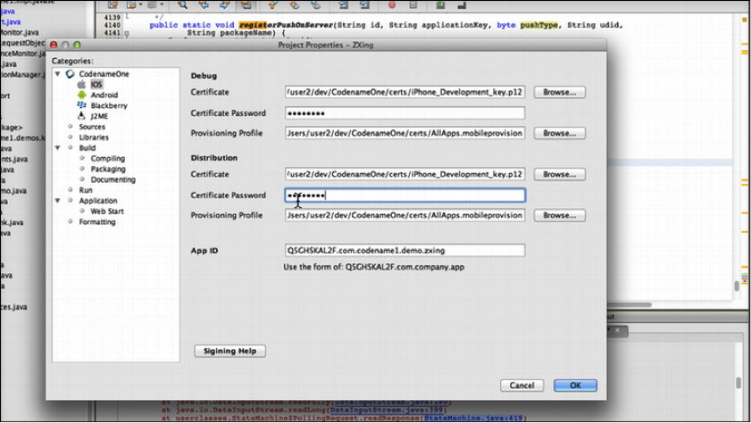

==== Configuring `codenameone_settings.properties` for manual signing

The Codename One build servers read signing assets from `codenameone_settings.properties`. When you bypass the Certificate Wizard, populate the following keys manually so the packaging process can locate your certificates, provisioning profiles, and keystores:

*iOS*

* `codename1.ios.debug.certificate` / `codename1.ios.debug.certificatePassword` / `codename1.ios.debug.provision`: Development P12 and provisioning profile for device/debug builds.
* `codename1.ios.release.certificate` / `codename1.ios.release.certificatePassword` / `codename1.ios.release.provision`: Distribution P12 and provisioning profile for App Store/TestFlight builds.
* `codename1.ios.certificate`, `codename1.ios.certificatePassword`, and `codename1.ios.provision`: Legacy/global defaults. The IDE uses these as fallbacks when the debug/release-specific properties are blank, so keep them aligned with your preferred certificates.
* `codename1.ios.appext.<Name>.provision`: Provisioning profile for an embedded app extension (for example the generated `CN1Widgets` widget extension), used for both build types. Add `codename1.ios.debug.appext.<Name>.provision` / `codename1.ios.release.appext.<Name>.provision` to use the development profile for device/debug builds and the distribution profile for release builds; the variant matching the build target wins and the unqualified key is the fallback.

Paths may be absolute or relative to the project directory. The passwords must match the values you used when exporting the P12 files from Keychain Access.

*Android*

* `codename1.android.keystore`: Path to the Android keystore (`.ks` or `.keystore`).
* `codename1.android.keystorePassword`: Password protecting the keystore and key entry.
* `codename1.android.keystoreAlias`: Alias of the keypair used to sign the APK/AAB.

If the keystore fields are empty the Maven and Ant builders will create a default keystore, but production apps should commit the real paths and credentials so reproducible builds use your long-lived signing key.

==== iOS code signing failure checklist

Below is a list of common issues when singing and a set of suggestions for things to check. Notice that some of these signing failures will sometimes manifest themselves during build and sometimes will manifest during the installation of the application.

TIP: Most of these issues aren't applicable when using the wizard for example, a Mac isn't required for the Certificate Wizard as it uses the Codename One cloud

-	*You must use a Mac to generate P12 certificates manually*. The workaround you found is the Certificate Wizard!
+
Notice that this is something you need to do once a year (generate P12), you will also need a Mac to upload your final app to the store now.

-	When exporting the P12 certificate *make sure that you selected BOTH the public and the private keys* as illustrated here. If you see one entry (no private key) then you created the CSR (singing request) on a different machine than the one where you imported the resulting CER file.
+
.p12 export
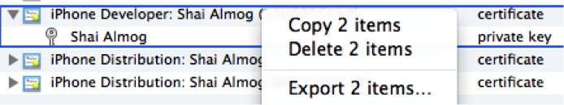

-	Launch Codename One Settings with `mvn cn1:settings` and make sure the *Package Name* in *Basic* matches the App ID used by the provisioning profile.

-	Make sure the App ID prefix in the provisioning profile matches the prefix assigned by Apple. The standalone Certificate Wizard handles this automatically for profiles it creates.

-	Make sure your provisioning profile's app ID matches your package name or is a * provisioning profile. Both are sampled in the pictures below, notice that you would need an actual package name for push/in-app purchase support as well as for app store distribution.
+
.The star (*) Provisioning Profile
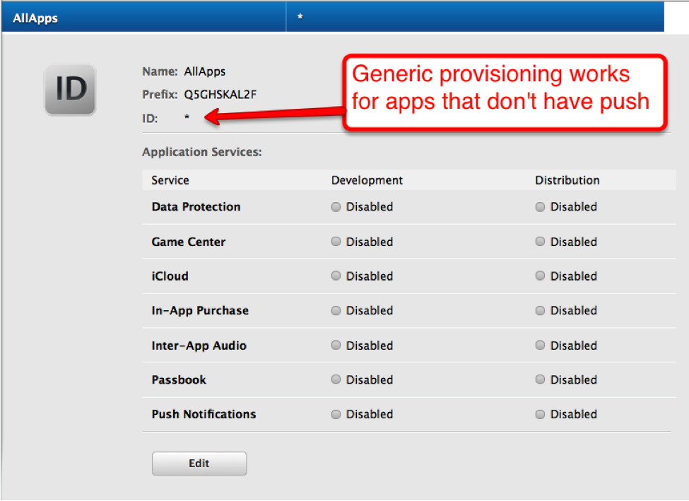
+
.Provisioning Profile with app ID
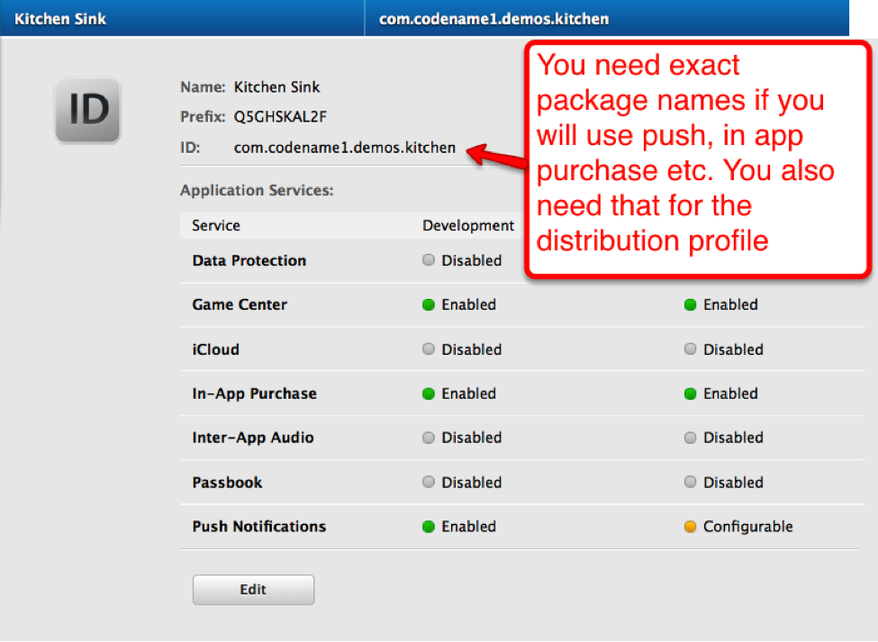

-	Make sure the certificate and provisioning profile are from the same source (if you work with multiple accounts), notice that provisioning profiles and certificates expire so you will need to regenerate provisioning when your certificate expires or is revoked.

-	If you declare push in the provisioning profile then `ios.includePush` (in the build arguments) MUST be set to true, otherwise it *MUST* be set to false (see pictures below). Notice that this should be configured via the UI in the iOS section. The build server automatically enables the notification entitlement when your project uses `LocalNotification`, even if `ios.includePush` is false, so don't try to disable the entitlement manually to "fix" warning messages from App Store Connect.
+
.Include push build hint
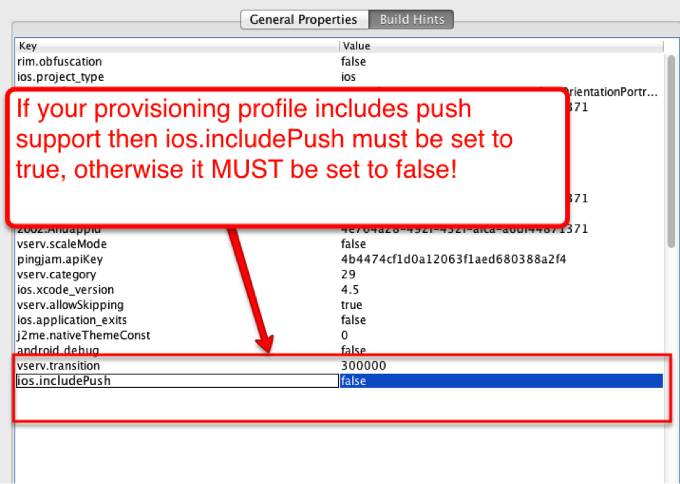

=== Android

Signing Android applications is trivial when compared to the pain of iOS signing.

The NetBeans and Eclipse plugins have a simple wizard to generate the certificate that you can launch by pressing this button:

.Android keystore generation wizard
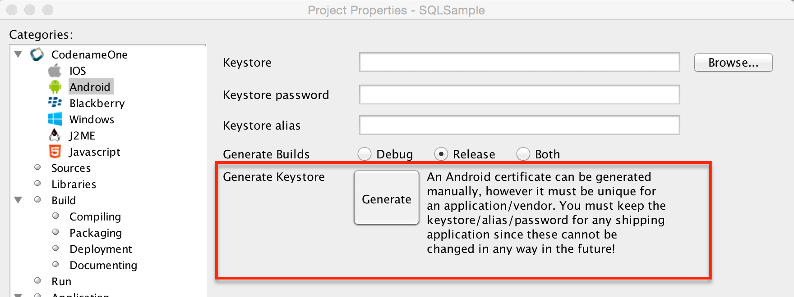

Then fill out your details and password in the form:

.UI for Android certificate details
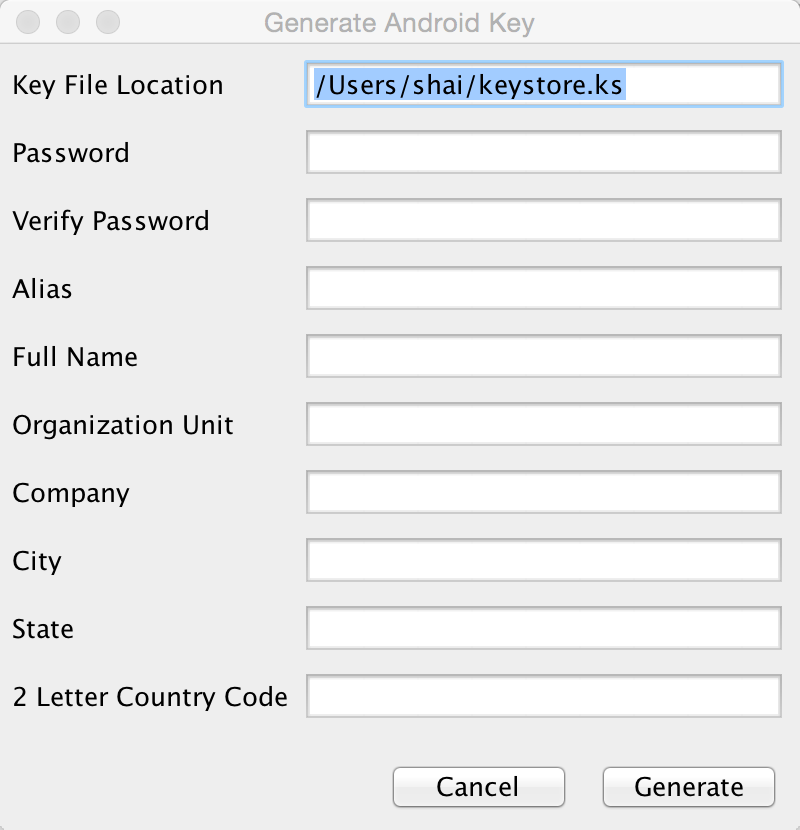

This will seamlessly generate a certificate for your project, you can reuse it for other projects as well.

==== Generating an Android certificate manually

You need the JDK's keytool executable (it should be under the JDK's bin directory) and execute the following command:

----
keytool -genkey -keystore Keystore.ks -alias [alias_name] -keyalg RSA -keysize 2048 -validity 15000 -dname "CN=[full name], OU=[ou], O=[comp], L=[City], S=[State], C=[Country Code]" -storepass [password] -keypass [password]
----

The elements in the brackets should be filled up based on this:

----
Alias: [alias_name] (just use your name/company name without spaces)
Full name: [full name]
Organizational Unit: [ou]
Company: [comp]
City: [City]
State: [State]
CountryCode: [Country Code]
Password: [password] (we expect both passwords to be identical)
----

Executing the command produces a `Keystore.ks` file in that directory. Keep it safe: if you lose it, you can no longer publish upgrades signed with the same identity. Enter its path, alias, and passwords in `common/codenameone_settings.properties`, or use the *Android* page in the standalone Certificate Wizard (`mvn cn1:certificatewizard`) to generate and install a keystore.

For more details see http://developer.android.com/guide/publishing/app-signing.html
