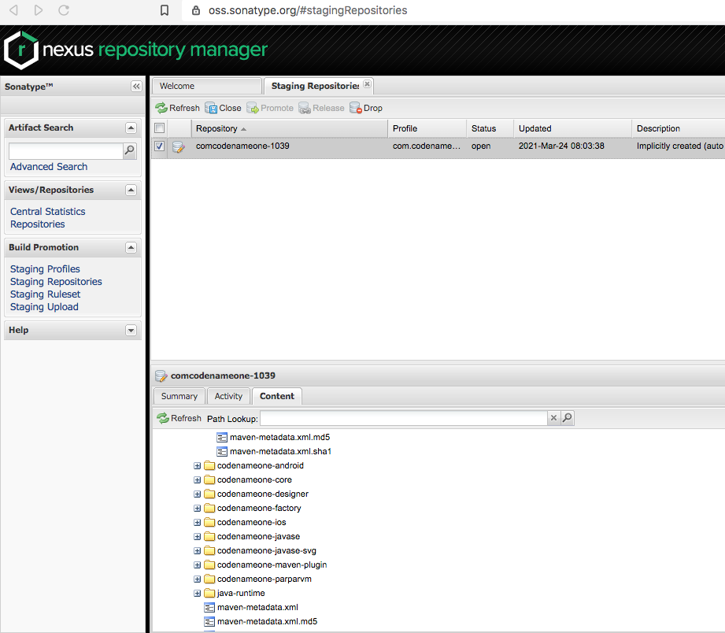

= Codename One Maven Support

This folder contains Maven projects for building Codename One.

Use the https://start.codenameone.com[Codename One initializr] to generate a Maven Codename one project.

For information about using Codename One's Maven support see https://shannah.github.io/codenameone-maven-manual/[The Codename One Maven Manual].

== Building From Source

=== Building the Main Codename One Project

[source, bash]
----
git clone https://github.com/codenameone/CodenameOne
cd CodenameOne/maven
mvn install
----

=== Building Archetype Projects
[source, bash]
----
git clone https://github.com/shannah/cn1-maven-archetypes
cd cn1-maven-archetypes
mvn install
----

=== Deploying to Maven Central

NOTE: SNAPSHOT versions will not trigger a deploy to Maven central.

==== Step 1:  Update Version to New Release Version

[source,bash]
----
# change to the version number you want to deploy
NEWVERSION=7.0.15

cd maven
bash update-version.sh $NEWVERSION && git push && git push --tags
----

Then check the build log on Github to make sure that the https://github.com/codenameone/CodenameOne/actions/workflows/sonatype.yml[Deploy to Maven Central] workflow completes succesfully.

If it completes successfully, then update to the next snapshot version:

==== Step 2: Update Version to New Snapshot Version

[source,bash]
----
NEXTVERSION=7.0.16-SNAPSHOT
bash update-version.sh $NEXTVERSION && git push
----

==== Step 3: Checkout cn1-maven-archetypes Repository

Then do the same for the https://github.com/shannah/cn1-maven-archetypes[cn1-maven-archetypes] repository.

[source, bash]
----
git clone https://github.com/shannah/cn1-maven-archetypes
cd cn1-maven-archetypes
mvn update-version.sh $NEWVERSION && git push && git push --tags
----

Then check the build log on Github to make sure that the https://github.com/shannah/cn1-maven-archetypes/actions/workflows/sonatype.yml[Deploy to Maven Central] workflow completes successfully.

If this was successful, update the cn1-maven-archetypes version to the new snapshot version.

[source, bash]
----
mvn update-version.sh 7.0.16-SNAPSHOT && git push && git push --tags
----

==== Step 4: Close and Release Staging Repository

If these steps complete succesfully, then a staging repository has been created on Sonatype.  Log into the https://oss.sonatype.org/#stagingRepositories[Nexus Repository Manager] and click on "Staging Repositories".

It will look something like:

Select the "codenameone-xxx" repository in the main frame in the "Staging Repositories" tab.  Inspect the content of the repository in the "Content" tab of the south frame.  It it all looks good, then press the "Close" button on the toolbar.

This will intiate a process that will take a minute or two.  Press "refresh" in a couple of minutes to see if it succeeded.  If successful, then press the "Release" button on the toolbar.

It usually takes between 1 and 8 hours before the new release is available on Maven central.

